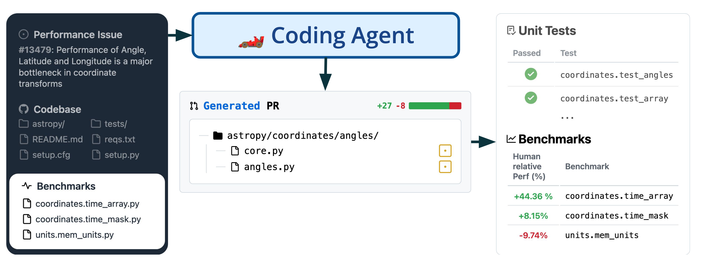
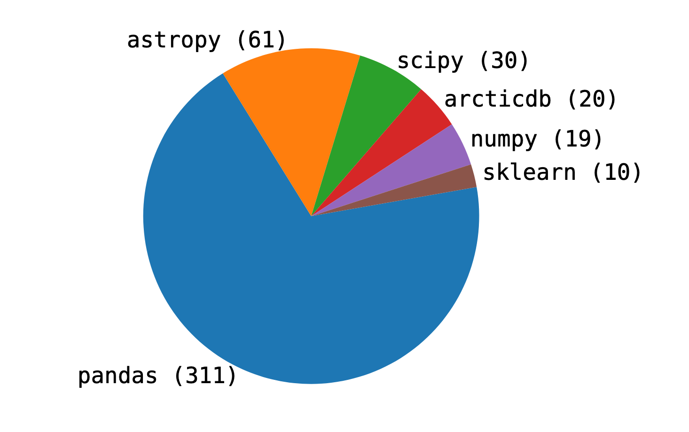
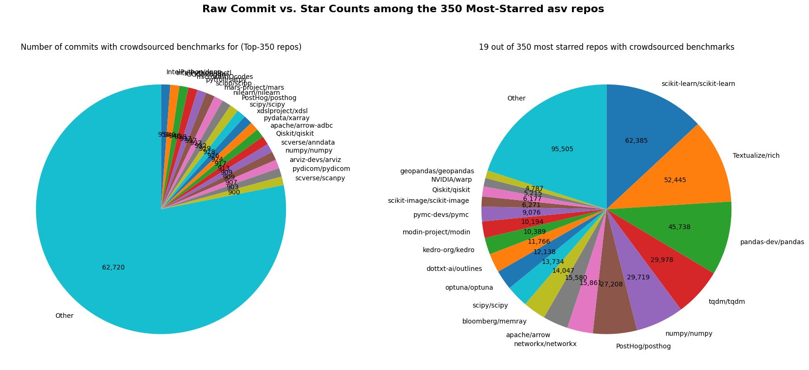

# FormulaCode - DataSmith 🔨

[](https://img.shields.io/github/v/release/formula-code/datasmith)
[](https://github.com/formula-code/datasmith/actions/workflows/main.yml?query=branch%3Amain)
[](https://codecov.io/gh/formula-code/datasmith)
[](https://img.shields.io/github/commit-activity/m/formula-code/datasmith)
[](https://img.shields.io/github/license/formula-code/datasmith)

This is a Python codebase for preparing and analyzing the huggingface dataset for FormulaCode Lite (5 repositories; ~440 performance improving commits) and FormulaCode (701 repositories; ??? performance improving commits).



FormulaCode is designed to benchmark the capabilities of large language models (LLMs) to optimize the performance of real-world codebases. It is designed to _complement_ existing benchmarks (e.g. SWE-Bench) by using the same API and methodology as SWE-Bench.
<!-- , but offers four key improvements:

1. Human-relative metric. FormulaCode scores the ability of an LLM to optimize a codebase relative to the speedup achieved by human developers. This makes it harder to "saturate" FormulaCode as simply memorizing the performance improvements doesn't enable _better_ than human performance.

2. Higher granularity feedback. Test cases streamline constrain coding agents to a pass/fail reward that is too sparse  a signal for fostering iterative optimizations (like those necessary for RL-based agents or evolutionary algorithms like AlphaEvolve). Performance benchmarking and profilers provide more more nuanced feedback, allowing LLMs to learn from the performance characteristics of the codebase and make more informed decisions about how to optimize it.

3. Performance benchmarks v.s Unit Tests. Unit test suites are designed to protect against edge cases and common bugs. This makes them susceptible to overfitting, where an LLM can achieve high scores by simply memorizing the test cases without actually improving the codebase. Performance benchmarks, on the other hand, are designed to measure the performance of a codebase under realistic workloads for the most common use cases.

4. Real-world Benchmarking. An LLM that achieves better than human performance on FormulaCode for a particular problem is likely the best available solution for that problem. If well-documented, a good solution can be used by other developers to improve their own codebases. -->


## Building the dataset

### 1. Set up the development environment

You will need to download and install uv to set up Datasmith. The rest of the process is automated using `make` commands.

```bash
$ curl -LsSf https://astral.sh/uv/install.sh | sh
# Install dev environment and pre-commit hooks
$ make install
# Resolve initial formatting issues.
$ uv run pre-commit run -a
$ make check
```

For querying github and codecov, we need to set up a few environment variables. You can do this by creating a `tokens.env` file in the root of the repository with the following content.

```bash
$ cat tokens.env
GH_TOKEN=github_pat_???
COVERALLS_TOKEN=XdK???
CODECOV_TOKEN=54c6???
CACHE_LOCATION=/home/???/formulacode/datasmith/cache.db
```

## FormulaCode-Lite

FormulaCode Lite is a small dataset of 5 repositories with ~440 performance improving commits that was presented in the workshop paper. These repositories have a combined 157,000+ GitHub stars and 200,000+ academic citations and each repository uses Airspeed Velocity for regression testing. FormulaCode Lite was an initial proof-of-concept for the methodology used to build the larger FormulaCode dataset.




### 1. Scrape online dashboards

Each of these repositories has a publicly accessible perpetually updating dashboard (e.g. Astropy's dashboard lives [here](https://spacetelescope.github.io/bench/astropy-benchmarks)) that tracks the performance of each commit against various benchmarks. These dashboards were manually curated and placed in a file called `raw_datasets/online_dashboards.jsonl`.

```json
{"url": "https://pv.github.io/scipy-bench/", "output_dir": "raw_datasets/downloads/scipy"}
{"url": "https://pandas-dev.github.io/asv-runner/", "output_dir": "raw_datasets/downloads/pandas"}
{"url": "https://scikit-learn.org/scikit-learn-benchmarks/", "output_dir": "raw_datasets/downloads/sklearn"}
{"url": "https://spacetelescope.github.io/bench/astropy-benchmarks/", "output_dir": "raw_datasets/downloads/astropy"}
{"url": "https://pv.github.io/numpy-bench/", "output_dir": "raw_datasets/downloads/numpy"}
```
As all these dashboards have the same structure, we developed an ethical scraper that can scrape these dashboards and download the performance data in a structured format. The scraper is invoked using `scripts/download_dataset.py` and can be run as follows:

```bash
$ python scripts/download_dataset.py --force --dashboards raw_datasets/online_dashboards.jsonl
```

This should create a directory called `raw_datasets/downloads` that contains the downloaded data for each repository. The data is stored in a structured format that can be easily processed later.


### 2. Detect performance improving commits

To detect performance improving commits, we provide two methods:
1. **asv's internal regression detection**: Airspeed Velocity maintains a built-in regression detection mechanism that is finetuned to detect changes in performance when the underlying data is noisy.
2. **rupture's RBF kernel**: This is a more general-purpose method that detects changes in the performance data using a kernel-based change point detection algorithm.

Either method can be used by passing `--method 'asv'` or `--method 'rbf'` to the script. The `rupture` method is enabled by default as we might not have mean + standard deviation data for all commits in the dataset (that is required by `asv.step_detect`).

```bash
$ python scripts/detect_breakpoints.py --build-reports --method 'rbf' --compute-coverage --dataset raw_datasets/downloads/astropy
# Saved break-points to 'raw_datasets/downloads/astropy/breakpoints/breakpoints.csv'.
# Saved reports to 'raw_datasets/downloads/astropy/breakpoints/reports'.
# Saved merged data to 'raw_datasets/downloads/astropy/breakpoints/merged.csv'.
```

These files (`breakpoints.csv`, `reports`, and `merged.csv`) contain the detected performance improving commits, a markdown report for each commit (with useful hints for the optimizer), and a merged CSV file that contains the performance data for all commits in the repository. These files can then be used in the evaluation harness for benchmarking the performance of an optimizer `[@TODO:link_formula-code/swebench-evaluation-harness]`.


## FormulaCode

FormulaCode is a larger dataset of 701 repositories with ??? performance improving commits that is being prepared for a future publication. The dataset is built using the same methodology as FormulaCode Lite, but with a larger set of repositories and more quality-of-life features improvements.



### 1. Scrape Github for asv-compatible repositories

We start by collecting all repositories that use Airspeed Velocity (asv) for benchmarking. We developed two scripts for this purpose:

1. Google BigQuery: Google maintains a public dataset of GitHub repositories that can be queried using SQL. We use this to find all repositories that have a `asv.conf.json` file in their root directory.

2. Github Search API: We use the GitHub Search API to find all repositories that have a `asv.conf.json` file in their root directory. This is a more comprehensive search that can find repositories that are not indexed by Google BigQuery. _This version is implemented here._

To run the script, you need to have a GitHub token with `repo` and `read:org` permissions. You can create a token by following the instructions [here](https://docs.github.com/en/authentication/keeping-your-account-and-data-secure/creating-a-personal-access-token).


The scraper can be run using the following command:
```bash
$ python scripts/scrape_repositories.py --outfile raw_datasets/asv_benchmarks.csv
# Writes raw_datasets/asv_benchmarks.csv and raw_datasets/asv_benchmarks_filtered.csv
```

The `asv_benchmarks_filtered.csv` file contains a subset of the repositories that aren't forks / reuploads / pass other sanity checks. We found around 700 filtered repositories for this dataset.


### 4. Collect relevant commits for all repositories

Given the list of repositories, we find the subset of commits that have already been closed and merged into the main branch. We use the `collect_commits.py` script to do this. The `filter_commits.py` script then filters out those commits that primarily modified the benchmarking files (e.g. `asv.conf.json`) or were not relevant to the benchmarks (e.g. documentation changes). The script also limits the number of repositories to a maximum of 350 to ensure we don't burden the GitHub API with too many requests. The scripts can be run as follows:

```bash
$ python scripts/collect_commits.py --dashboards raw_datasets/asv_benchmarks_filtered.csv --outfile raw_datasets/benchmark_commits_merged.jsonl --max-pages 100
$ python scripts/filter_commits.py --filtered-benchmarks-pth raw_datasets/asv_benchmarks_filtered.csv --merged-commits-pth raw_datasets/benchmark_commits_merged.jsonl --output-pth raw_datasets/benchmark_commits_filtered.jsonl --max-repos 350 --threads 8 --procs 8
```
### 5. Benchmark all commits

> [!IMPORTANT]
> We haven't finished benchmarking all commits yet. The resources required to benchmark all commits (initially) is very large. We present a basic, scalable benchmarking script that can be used to benchmark all commits in parallel (without any of the code needed to deploy to AWS/GCP/SLURM/etc.)

Once we've collected the relevant commits, we can benchmark their performance using `asv`. `asv` includes many quality-of-life features to ensure that benchmarks are robust to noise and that the results are reproducible. Our script benchmarks multiple commits in parallel. Proper benchmarking requires some system tuning. Refer to the [asv tuning guidelines](https://asv.readthedocs.io/en/latest/tuning.html) for more details.

```bash
# in a root shell:
(sudo) $ export OPENBLAS_NUM_THREADS=1
(sudo) $ export MKL_NUM_THREADS=1
(sudo) $ export OMP_NUM_THREADS=1
(sudo) $ sudo python -m pyperf system tune
# in userspace:
$ python scripts/benchmark_commits.py --filtered-commits raw_datasets/benchmark_commits_filtered.jsonl --max-concurrency 15 --num-cores 4 --asv-args "--interleave-rounds --append-samples -a rounds=2 -a repeat=2" --output-dir benchmark_results/
```

Generally, each benchmark takes ~2 minutes to run, so benchmarking 70,000 commits on 16 dedicated 4-core machines takes around 6 days. The script will create a directory called `benchmark_results/` that contains the results of the benchmarks for each commit. The results are stored in a structured format that can be easily processed later.

### 6. Analyze benchmark results

```bash
$ python scripts/analyze_benchmark_results.py --results-dir benchmark_results/results --output-dir analysis/ --commit-metadata raw_datasets/benchmark_commits_filtered.jsonl --default-machine-name "docker"
```

### 7. Find breakpoints in benchmark results


```bash
$ python scripts/detect_breakpoints.py --build-reports --method 'rbf' --compute-coverage --dataset analysis/html/scikit-learn_scikit-learn --output-dir analysis/breakpoints/scikit-learn_scikit-learn
# Saved break-points to 'analysis/breakpoints/scikit-learn_scikit-learn/breakpoints.csv'.
# Saved reports to 'analysis/breakpoints/scikit-learn_scikit-learn/reports'.
# Saved merged data to 'analysis/breakpoints/scikit-learn_scikit-learn/merged.csv'.

```


### Replication experiment.


## TODOs

- [X] FormulaCode Lite: Add ethical scraper.
- [X] FormulaCode: Add script to find and filter all asv repositories.
- [X] FormulaCode: Large scale benchmarking for all commits in the dataset
- [ ] FormulaCode: Parameter tuning for large scale benchmarking scripts.
- [ ] FormulaCode: `asv` supports profiling the benchmarking function. We should collect such profiling data for all commits in the dataset.
- [ ] FormulaCode: In `search_commits` replace the endpoint with `"/search/issues?q=type:pr+is:merged+repo:{repo_name}&per_page={per_page}&page={page}&advanced_search=true` endpoint to use each query more efficiently.
- [ ] FormulaCode: Make an object oriented API for the dataset. Do not rely on a folder structure.
