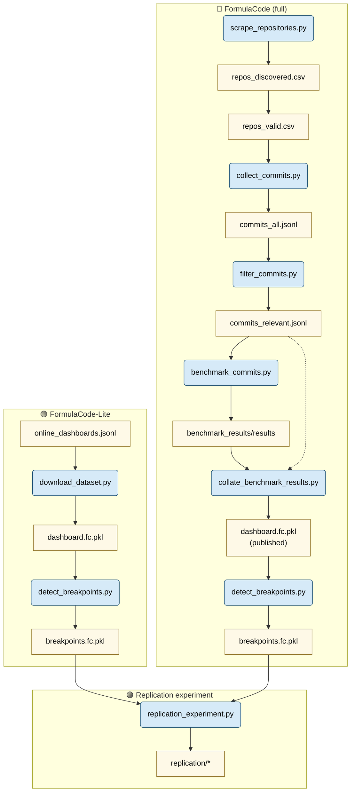

# FormulaCode - DataSmith 🔨

[](https://img.shields.io/github/v/release/formula-code/datasmith)
[](https://github.com/formula-code/datasmith/actions/workflows/main.yml?query=branch%3Amain)
[](https://codecov.io/gh/formula-code/datasmith)
[](https://img.shields.io/github/commit-activity/m/formula-code/datasmith)
[](https://img.shields.io/github/license/formula-code/datasmith)

This is a Python codebase for preparing and analyzing the Hugging Face dataset for **FormulaCode Lite** (5 repositories; \~440 performance‑improving commits) and **FormulaCode** (701 repositories; ??? performance‑improving commits).


FormulaCode is designed to benchmark the capabilities of large language models (LLMs) to optimize the performance of real‑world codebases. It is designed to *complement* existing benchmarks (e.g. SWE‑Bench) by using the same API and methodology as SWE‑Bench.

### Key improvements

1. **Human‑relative metric** – FormulaCode scores an optimizer relative to the speed‑up achieved by the human author of the original commit, preventing “memorize‑and‑saturate” tactics.
2. **Finer‑grained feedback** – Performance measurements provide a dense reward signal that helps RL or evolutionary algorithms iterate more effectively than binary pass/fail unit tests.
3. **Performance benchmarks vs. unit tests** – Unit tests protect against functional regressions but can be over‑fit; realistic workload benchmarks capture the critical performance hot‑paths developers actually care about.
4. **Real‑world impact** – When an LLM outperforms the human baseline on a FormulaCode task, the resulting patch is often state‑of‑the‑art and can be upstreamed directly to the library.

## Data layout
The general layout of the artifacts is as follows:
```bash
artifacts/
├── raw/                        # Raw downloads & lists produced by scripts
│   ├── downloads/              # Per‑repo dashboard archives
│   ├── online_dashboards.jsonl # Updated config for dashboard scraper
│   ├── repos_discovered.csv      # Candidates from GitHub search
│   ├── repos_valid.csv
│   ├── commits_all.jsonl
│   └── commits_filtered.jsonl
├── benchmark_results/          # asv run outputs
│   ├── results/                # Individual asv JSON files
│   └── published/              # Collated *.fc.pkl & HTML dashboards
├── replication/                # Outputs of replication_experiment.py
├── cache.db                    # See `CACHE_LOCATION` env var
└── backup/                     # Optional BACKUP_DIR for long‑term storage
```


## Dataset building

### Installation

You will need to download and install uv to set up Datasmith. The rest of the process is automated using `make` commands.

```bash
$ curl -LsSf https://astral.sh/uv/install.sh | sh
# Install dev environment and pre-commit hooks
$ make install
# Resolve initial formatting issues.
$ uv run pre-commit run -a
$ make check
```

For querying github and codecov, we need to set up a few environment variables. You can do this by creating a `tokens.env` file in the root of the repository with the following content.

```bash
$ cat tokens.env
GH_TOKEN=github_pat_???
COVERALLS_TOKEN=XdK???
CODECOV_TOKEN=54c6???
CACHE_LOCATION=/home/???/formulacode/datasmith/artifacts/cache.db
BACKUP_DIR=/home/???/formulacode/backup/
```

## FormulaCode-Lite

FormulaCode Lite is a small dataset of 5 repositories with ~440 performance improving commits that was presented in the workshop paper. These repositories have a combined 157,000+ GitHub stars and 200,000+ academic citations and each repository uses Airspeed Velocity for regression testing. FormulaCode Lite was an initial proof-of-concept for the methodology used to build the larger FormulaCode dataset.


### Scrape online dashboards

Each of these repositories has a publicly accessible perpetually updating dashboard (e.g. Astropy's dashboard lives [here](https://spacetelescope.github.io/bench/astropy-benchmarks)) that tracks the performance of each commit against various benchmarks. These dashboards were manually curated and placed in a file called `artifacts/raw/online_dashboards.jsonl`.

```json
{"url": "https://pv.github.io/scipy-bench/", "output_dir": "artifacts/raw/downloads/scipy"}
{"url": "https://pandas-dev.github.io/asv-runner/", "output_dir": "artifacts/raw/downloads/pandas"}
{"url": "https://scikit-learn.org/scikit-learn-benchmarks/", "output_dir": "artifacts/raw/downloads/sklearn"}
{"url": "https://spacetelescope.github.io/bench/astropy-benchmarks/", "output_dir": "artifacts/raw/downloads/astropy"}
{"url": "https://pv.github.io/numpy-bench/", "output_dir": "artifacts/raw/downloads/numpy"}
```
As all these dashboards have the same structure, we developed an ethical scraper that can scrape these dashboards and download the performance data in a structured format. The scraper is invoked using `scripts/download_dataset.py` and can be run as follows:

```bash
$ python scripts/download_dataset.py \
       --force \
       --dashboards artifacts/raw/online_dashboards.jsonl
# machines: 100%|██████████████████████████████████████| 7/7 [00:56<00:00,  8.05s/it]
# Collected 46,143 rows from 805 benchmark files.
# summaries: 100%|█████████████████████████████████| 115/115 [00:09<00:00, 12.56it/s]
# Saved 46,143 benchmark rows and 22,577 summary rows -> /home/???/formulacode/datasmith/artifacts/raw/downloads/sklearn/dashboard.fc.pkl
# Data downloaded to artifacts/raw/downloads/sklearn
# ...
```

This should create a directory called `artifacts/raw/downloads` that contains the downloaded data for each repository. The data is stored in a structured format that can be easily processed later. More information about the format is available in `datasmith/benchmark/collection.py`.


### 2. Detect performance improving commits

To detect performance improving commits, we provide two methods:
1. **asv's internal regression detection**: Airspeed Velocity maintains a built-in regression detection mechanism that is finetuned to detect changes in performance when the underlying data is noisy.
2. **rupture's RBF kernel**: This is a more general-purpose method that detects changes in the performance data using a kernel-based change point detection algorithm.

Either method can be used by passing `--method 'asv'` or `--method 'rbf'` to the script. The `rupture` method is enabled by default as we might not have mean + standard deviation data for all commits in the dataset (that is required by `asv.step_detect`).

```bash
$ python scripts/detect_breakpoints.py \
       --build-reports \
       --method rbf \
       --compute-coverage \
       --dataset artifacts/raw/downloads/astropy/dashboard.fc.pkl
# Found 1,085 potential downward shifts.
# Codecov: 100%|███████████████████████████████| 119/119 [08:50<00:00,  4.46s/commit]
# Building GitHub commit reports and merged dataframe ...
# Reports: 100%|█████████████████████████████████| 40/40 [02:55<00:00,  4.38s/commit]
# Enriched breakpoints saved to '/home/???/formulacode/datasmith/artifacts/raw/downloads/astropy/breakpoints.fc.pkl'.
```

The `breakpoints.fc.pkl` collection contains all the information about the detected performance improving commits, a markdown report for each commit with useful hints for the optimizer, and a merged CSV file that contains the performance data for all commits in the repository. These files can then be used in the evaluation harness for benchmarking the performance of an optimizer `[@TODO:link formula-code/evaluation-harness]`.


## FormulaCode

FormulaCode is a larger dataset of 701 repositories with ??? performance improving commits that is being prepared for a future publication. The dataset is built using the same methodology as FormulaCode Lite, but with a larger set of repositories and more quality-of-life features improvements.


### 1. Scrape Github for asv-compatible repositories

We start by collecting all repositories that use Airspeed Velocity (asv) for benchmarking. We developed two scripts for this purpose:

1. Google BigQuery: Google maintains a public dataset of GitHub repositories that can be queried using SQL. We use this to find all repositories that have a `asv.conf.json` file in their root directory.

2. Github Search API: We use the GitHub Search API to find all repositories that have a `asv.conf.json` file in their root directory. This is a more comprehensive search that can find repositories that are not indexed by Google BigQuery. _This version is implemented here._

To run the script, you need to have a GitHub token with `repo` and `read:org` permissions. You can create a token by following the instructions [here](https://docs.github.com/en/authentication/keeping-your-account-and-data-secure/creating-a-personal-access-token).


The scraper can be run using the following command:
```bash
$ python scripts/scrape_repositories.py \
       --outfile artifacts/raw/repos_discovered.csv \
       --filtered-outfile artifacts/raw/repos_valid.csv
# Writes artifacts/raw/repos_discovered.csv and artifacts/raw/repos_valid.csv
```

The `artifacts/raw/repos_valid.csv` file contains a subset of the repositories that aren't forks / reuploads / pass other sanity checks. We found ~700 filtered repositories for this dataset.


### 4. Collect relevant commits for all repositories

Given the list of repositories, we find the subset of commits that have already been closed and merged into the main branch (the top 5000 PRs, sorted by popularity). We use the `collect_commits.py` script to do this. The `filter_commits.py` script then filters out those commits that primarily modified the benchmarking files (e.g. `asv.conf.json`) or were not relevant to the benchmarks (e.g. documentation changes). The script also limits the number of repositories to a maximum of 350 to ensure we don't burden the GitHub API with too many requests. The scripts can be run as follows:

```bash
# 50 pages * 100 (PRs per page) = 5000 PRs max per repo.
$ python scripts/collect_commits.py \
       --dashboards artifacts/raw/repos_valid.csv \
       --outfile    artifacts/raw/commits_all.jsonl \
       --max-pages  50
$ python scripts/filter_commits.py \
       --filtered-benchmarks-pth artifacts/raw/repos_valid.csv \
       --merged-commits-pth     artifacts/raw/commits_all.jsonl \
       --output-pth             artifacts/raw/commits_filtered.jsonl \
       --max-repos 350 \
       --threads   8   \
       --procs     8
```
### 5. Benchmark all commits

> [!IMPORTANT]
> We haven't finished benchmarking all commits yet. The resources required to benchmark all commits (initially) is very large. We present a basic, scalable benchmarking script that can be used to benchmark all commits in parallel (without any of the code needed to deploy to AWS/GCP/SLURM/etc.)

Once we've collected the relevant commits, we can benchmark their performance using `asv`. `asv` includes many quality-of-life features to ensure that benchmarks are robust to noise and that the results are reproducible. Our script benchmarks multiple commits in parallel. Proper benchmarking requires some system tuning. Refer to the [asv tuning guidelines](https://asv.readthedocs.io/en/latest/tuning.html) for more details.

```bash
# in a root shell:
(sudo) $ export OPENBLAS_NUM_THREADS=1
(sudo) $ export MKL_NUM_THREADS=1
(sudo) $ export OMP_NUM_THREADS=1
(sudo) $ sudo python -m pyperf system tune
# in userspace:
$ python scripts/benchmark_commits.py \
       --filtered-commits artifacts/raw/commits_filtered.jsonl \
       --max-concurrency 15 \
       --num-cores       4  \
       --asv-args "--interleave-rounds --append-samples -a rounds=2 -a repeat=2" \
       --output-dir      artifacts/benchmark_results/
```

Generally, each benchmark takes ~2 minutes to run, so benchmarking 70,000 commits on 16 dedicated 4-core machines takes around 6 days. The script will create a directory called `artifacts/benchmark_results/` that contains the results of the benchmarks for each commit. The results are stored in a structured format that can be easily processed later.

### 6. Collate benchmark results

This step aggregates the benchmark results and generates the `*.fc.pkl` file. The `detect_breakpoints.py` script can then be used unchanged to detect performance improving commits. The script can be run as follows:

```bash
$ python scripts/collate_benchmark_results.py \
       --results-dir     artifacts/benchmark_results/results \
       --output-dir      artifacts/benchmark_results/published/ \
       --commit-metadata artifacts/raw/commits_filtered.jsonl \
       --default-machine-name "docker"
# machines: 100%|██████████████████████████████████████████████| 1/1 [00:00<00:00,  1.53it/s]
# Collected 53,705 rows from 115 benchmark files.
# summaries: 100%|████████████████████████████████████████| 115/115 [00:00<00:00, 234.43it/s]
# Saved 53,705 benchmark rows and 35,765 summary rows -> /home/???/formulacode/datasmith/benchmark_results/published/html/scikit-learn_scikit-learn/dashboard.fc.pkl
# Benchmark results aggregated and saved to /home/???/formulacode/datasmith/benchmark_results/published/html.
$ python scripts/detect_breakpoints.py \
       --build-reports \
       --method rbf \
       --compute-coverage \
       --dataset artifacts/benchmark_results/published/html/scikit-learn_scikit-learn/dashboard.fc.pkl
# ...
```

The generated `breakpoints.fc.pkl` file contains all the information about the detected performance improving commits, a markdown report for each commit with useful hints for the optimizer, and a merged CSV file that contains the performance data for all commits in the repository. These files can then be used in the evaluation harness for benchmarking the performance of an optimizer `[@TODO:link formula-code/evaluation-harness]`.

### Replication Experiment

How closely do our benchmarked metrics match the original performance improvements? We can answer this question by running the `scripts/replication_experiment.py` script. This script takes in two `breakpoints.fc.pkl` files, ensures that they point to the same repository, finds the common set of commits, and then computes the correlation between the performance improvements in the two datasets as well as some basic statistics and plots about the performance improvements. The script can be run as follows:

```bash
$ python scripts/replication_experiment.py \
       --dataset1 artifacts/benchmark_results/published/html/scikit-learn_scikit-learn/breakpoints.fc.pkl \
       --dataset2 artifacts/raw/downloads/sklearn/breakpoints.fc.pkl \
       --output-dir artifacts/replication/
```
### Pipeline flowchart




## TODOs

- [X] FormulaCode Lite: Add ethical scraper.
- [X] FormulaCode: Add script to find and filter all asv repositories.
- [X] FormulaCode: Large scale benchmarking for all commits in the dataset
- [ ] FormulaCode: Parameter tuning for large scale benchmarking scripts.
- [ ] FormulaCode: `asv` supports profiling the benchmarking function. We should collect such profiling data for all commits in the dataset.
- [ ] FormulaCode: In `search_commits` replace the endpoint with `"/search/issues?q=type:pr+is:merged+repo:{repo_name}&per_page={per_page}&page={page}&advanced_search=true` endpoint to use each query more efficiently.
- [ ] FormulaCode: Make an object oriented API for the dataset. Do not rely on a folder structure.
