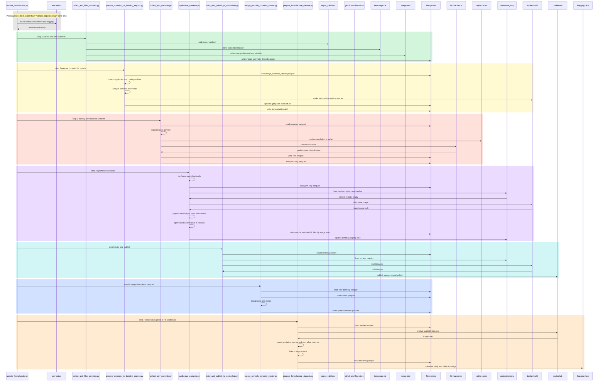

<p align="center">
 <a href="https://formula-code.github.io/">
    
  </a>
  <a href="https://huggingface.co/papers/2603.16011">
    
  </a>
  <a href="https://formula-code.github.io/leaderboard/">
    
  </a>
</p>

[FormulaCode](https://formula-code.github.io/) is a *live*  benchmark for evaluating  the holistic ability of LLM agents to optimize codebases. FormulaCode consists of two parts: a [pipeline](https://github.com/formula-code/datasmith) to construct performance optimization tasks, and an [execution harness](https://github.com/formula-code/terminal-bench) that connects a language model to our terminal sandbox. _This repository contains the task generation pipeline._

`datasmith` is a python package for automatically curating and managing [FormulaCode](https://formula-code.github.io/) tasks. After installation, `datasmith` is designed to run as a monthly CRON job that updates the FormulaCode dataset with new commits and repositories.

# Table of Contents

# Installation

## Step 1: Install `datasmith` and set up the environment

Install [uv](https://astral.sh/uv/) and set up the development environment:
```bash
# Install uv
$ curl -LsSf https://astral.sh/uv/install.sh | sh
# Clone the repository.
$ git clone https://github.com/formula-code/datasmith.git
$ cd datasmith
# Installs pre-commit hooks and dev dependencies.
$ make install
# Resolve initial formatting issues.
$ uv run pre-commit run -a
$ make check
# Run tests to verify installation.
$ make test
```

## Step 2: Configure environment variables

Make a `tokens.env` file with your environment variables. You'll need:

*  A [GitHub token](https://docs.github.com/en/authentication/keeping-your-account-and-data-secure/creating-a-personal-access-token) with `repo` and `read:org` permissions to read repositories and commit.
* An OpenAI API key or local LLM endpoint (recommended) for synthesizing reproducible containers and for performance classification.
* A DockerHub token with `write:packages` permissions if you want to publish images to DockerHub for easier sharing and distribution.


<details>
<summary>Click to reveal a sample <code>tokens.env</code> file.</summary>

```bash
# Cache and backup locations
CACHE_LOCATION=/home/???/formulacode/datasmith/scratch/artifacts/cache.db
BACKUP_DIR=/home/???/formulacode/backup/

# Scraping tokens
GH_TOKENs=github_pat_???,github_pat_???
CODECOV_TOKEN=54c6???

# LLM configuration for context synthesis
DSPY_MODEL_NAME=openai/meta-llama/Llama-3.3-70B-Instruct
DSPY_URL=http://localhost:30000/v1
DSPY_API_KEY=local
DSPY_TEMPERATURE=0.7

# For DockerHub publishing (dataset verification)
DOCKERHUB_NAMESPACE=formulacode          # Required for dataset verification
DOCKERHUB_USERNAME=myuser                # Required for dataset verification
DOCKERHUB_TOKEN=dckr_pat_xxxxx          # Required for dataset verification

# For Hugging Face dataset uploads
HF_TOKEN=hf_xxxxx                     # Required for --upload-to-hf

# Depends on the system.
#DOCKER_USE_BUILDX=0
DOCKER_NETWORK_MODE=host
```
</details>


## Step 3: Set up CRON job for monthly updates

Set up a CRON job to run the `update_formulacode.py` script on the 25th of every month. This will keep the FormulaCode dataset up to date with new repositories and commits.

```bash
$ crontab -l
# Edit this file to introduce tasks to be run by cron.
#
# Each task to run has to be defined through a single line
# indicating with different fields when the task will be run
# and what command to run for the task
#
# To define the time you can provide concrete values for
# minute (m), hour (h), day of month (dom), month (mon),
# and day of week (dow) or use '*' in these fields (for 'any').
#
# Notice that tasks will be started based on the cron's system
# daemon's notion of time and timezones.
#
# Output of the crontab jobs (including errors) is sent through
# email to the user the crontab file belongs to (unless redirected).
#
# For example, you can run a backup of all your user accounts
# at 5 a.m every week with:
# 0 5 * * 1 tar -zcf /var/backups/home.tgz /home/
#
# For more information see the manual pages of crontab(5) and cron(8)
#
# m h  dom mon dow   command

# Clean up Docker containers every day at midnight
0 * * * * /usr/bin/docker container prune -f

# Clean up dangling Docker images every week
0 0 * * 0 /usr/bin/docker image prune -f

# Run FormulaCode update script on the 25th day of every month at 2am
0 2 25 * * flock -n /tmp/update_formulacode.lock /home/???/formulacode/datasmith/.venv/bin/python /home/???/formulacode/datasmith/scratch/scripts/update_formulacode.py --start-date "$(date -d '-1 month' +\%Y-\%m-01)" --end-date "$(date +\%Y-\%m-01)" >> /home/???/formulacode/datasmith/scratch/logs/update_formulacode_$(date +\%Y\%m\%d).log 2>&1
$ crontab -e
# <Make the necessary edits>
```

# Package Organization

## Module Structure

```
src/datasmith/
├── agents/        # LLM agent orchestration for build tasks and context synthesis
├── benchmark/     # Benchmark collection from ASV (Airspeed Velocity) configs
├── collation/     # Benchmark result collation and aggregation
├── core/          # Shared infra: API clients, caching, Git integration, data models
├── detection/     # Performance breakpoint and regression detection
├── docker/        # Docker image building, validation, DockerHub publishing
├── execution/     # Commit collection, filtering, and performance analysis
├── notebooks/     # Jupyter notebook utilities and context-registry updates
└── scrape/        # Web scraping, report building, LLM-based classification
```

Pipeline scripts live in `scratch/scripts/`. The monthly orchestrator is `update_formulacode.py`; individual steps can also be run standalone.

## Pipeline Overview

The diagram below summarizes how `scratch/scripts/update_formulacode.py` orchestrates the monthly update pipeline.


```mermaid
sequenceDiagram
    participant U as update_formulacode.py
    participant ENV as env setup
    participant C1 as collect_and_filter_commits.py
    participant C2 as prepare_commits_for_building_reports.py
    participant C3 as collect_perf_commits.py
    participant C4 as synthesize_contexts.py
    participant C5 as build_and_publish_to_dockerhub.py
    participant C6 as merge_perfonly_commits_master.py
    participant C7 as prepare_formulacode_dataset.py
    participant CSV as repos_valid.csv
    participant GH as github or offline store
    participant TMP as temp repo dir
    participant MI as merge info
    participant FS as file system
    participant LLM as llm backends
    participant SQL as sqlite cache
    participant CR as context registry
    participant DOCK as docker build
    participant DH as dockerhub
    participant HF as hugging face

    %% Orchestrator setup (grey)
    rect rgb(230,230,230)
        Note over U,ENV: Prerequisite: collect_commits.py / scrape_repositories.py (one-time)
        U->>ENV: step 0 setup environment and logging
        ENV->>U: environment ready
    end

    %% Step 1 collect_and_filter_commits.py (green)
    rect rgb(210,245,220)
        U->>C1: step 1 collect and filter commits
        C1->>CSV: read repos_valid.csv
        C1->>TMP: clone repo into temp dir
        C1->>MI: collect merge shas and commit info
        C1->>FS: write merge_commits_filtered parquet
    end

    %% Step 2 prepare_commits_for_building_reports.py (yellow)
    rect rgb(255,250,210)
        U->>C2: step 2 prepare commits for reports
        C2->>FS: read merge_commits_filtered parquet
        C2->>C2: tokenize patches and crude perf filter
        C2->>C2: analyze commits in threads
        C2->>DOCK: make tasks with container names
        C2->>FS: optional get patch from diff url
        C2->>FS: write parquet with patch
    end

    %% Step 3 collect_perf_commits.py (red-ish)
    rect rgb(255,225,220)
        U->>C3: step 3 classify performance commits
        C3->>FS: read prepared parquet
        C3->>C3: report builder per row
        C3->>SQL: cache completion in sqlite
        C3->>LLM: call llm backends
        LLM->>C3: performance classification
        C3->>FS: write raw parquet
        C3->>FS: write perf only parquet
    end

    %% Step 4 synthesize_contexts.py (purple)
    rect rgb(235,220,255)
        U->>C4: step 4 synthesize contexts
        C4->>C4: configure agent backends
        C4->>FS: load perf only parquet
        C4->>CR: load context registry and update
        CR->>C4: context registry ready
        C4->>DOCK: build base image
        DOCK->>C4: base image built
        C4->>C4: prepare task list per repo and commit
        C4->>C4: agent build and validate in threads
        C4->>FS: write results jsonl and all files by image json
        C4->>CR: update context_registry json
    end

    %% Step 5 build_and_publish_to_dockerhub.py (teal)
    rect rgb(210,245,245)
        U->>C5: step 5 build and publish
        C5->>FS: read perf only parquet
        C5->>CR: load context registry
        C5->>DOCK: build images
        DOCK->>C5: built images
        C5->>DH: publish images to dockerhub
    end

    %% Step 6 merge_perfonly_commits_master.py (blue)
    rect rgb(210,225,255)
        U->>C6: step 6 merge into master parquet
        C6->>FS: read new perfonly parquet
        C6->>FS: read master parquet
        C6->>C6: deduplicate and merge
        C6->>FS: write updated master parquet
    end

    %% Step 7 prepare_formulacode_dataset.py (orange)
    rect rgb(255,235,210)
        U->>C7: step 7 enrich and upload to HF (optional)
        C7->>FS: read master parquet
        C7->>DH: resolve available images
        DH->>C7: image map
        C7->>C7: derive container names and normalize columns
        C7->>C7: filter to key columns
        C7->>FS: write enriched parquet
        C7->>HF: upload monthly and default configs
    end
```

<details>
<summary><strong>Prerequisites</strong> (one-time setup)</summary>

Scrape GitHub for ASV-compatible repositories using `collect_commits.py` or `scrape_repositories.py`. These are **not** part of the monthly orchestrator — run them once to build `repos_valid.csv`.

```bash
$ python scratch/scripts/collect_commits.py \
       --repos      scratch/artifacts/pipeflush/repos_valid.csv \
       --outfile    scratch/artifacts/pipeflush/commits_all.jsonl \
       --max-pages  50
```

The output `repos_valid.csv` contains repositories that aren't forks/reuploads, have at least a minimum number of stars, and pass other sanity checks (~700 repositories).

</details>

### Step 1: Collect and filter commits — `collect_and_filter_commits.py`

Given the list of repositories, find merged PRs and filter out commits that only modified benchmarking files, were documentation-only, or could not be installed.

```bash
$ python scratch/scripts/collect_and_filter_commits.py \
       --filtered-benchmarks-pth scratch/artifacts/pipeflush/repos_valid.csv \
       --output-pth scratch/artifacts/pipeflush/merge_commits_filtered.parquet \
       --threads 8 \
       --procs   32 \
       --since   2025-10-01 \
       --until   2025-11-01
```

### Step 2: Prepare commits for report building — `prepare_commits_for_building_reports.py`

Tokenize patches, apply a crude performance filter, and optionally fetch full patch text from the GitHub diff API.

```bash
$ python scratch/scripts/prepare_commits_for_building_reports.py \
       --input  scratch/artifacts/pipeflush/merge_commits_filtered.parquet \
       --output scratch/artifacts/pipeflush/merge_commits_filtered_with_patch.parquet \
       --max-workers 200 \
       --filter-repos \
       --fetch-patches
```

### Step 3: Classify performance commits — `collect_perf_commits.py`

Build a structured report for each commit, call LLM backends for performance classification, and write a filtered parquet of performance-only commits.

```bash
$ python scratch/scripts/collect_perf_commits.py \
       --commits  scratch/artifacts/pipeflush/merge_commits_filtered_with_patch.parquet \
       --outfile  scratch/artifacts/pipeflush/perfonly_commits \
       --max-workers -1
# Produces perfonly_commits.raw.parquet and perfonly_commits.parquet
```

### Step 4: Synthesize Docker contexts — `synthesize_contexts.py`

Each context is a (repo, commit) pair with an associated `build_env.sh` script. Contexts that fail to build are filtered out. Common failure reasons:

1. Commit couldn't be checked out
2. Commit didn't have an `asv.conf.json` file
3. ASV environment could not be built
4. A quick `asv run` did not succeed

```bash
$ python scratch/scripts/synthesize_contexts.py \
       --commits scratch/artifacts/pipeflush/perfonly_commits.parquet \
       --output-dir scratch/artifacts/pipeflush/results_synthesis/ \
       --context-registry scratch/artifacts/pipeflush/context_registry.json \
       --max-workers 32 \
       --max-attempts 3 \
       --max-steps 10 \
       --max-similar-candidates 5 \
       --ignore-exhausted \
       --push-to-dockerhub
```

### Step 5: Build and publish images — `build_and_publish_to_dockerhub.py`

Rebuild Docker images and publish them to DockerHub. Credentials are read from environment variables configured in `tokens.env` (see Installation).

```bash
$ python scratch/scripts/build_and_publish_to_dockerhub.py \
       --commits scratch/artifacts/pipeflush/perfonly_commits.parquet \
       --context-registry scratch/artifacts/pipeflush/context_registry.json \
       --namespace formulacode \
       --max-workers 5 \
       --skip-existing
```

### Step 6: Merge into master parquet — `merge_perfonly_commits_master.py`

Deduplicate and append this month's performance commits into the cumulative master parquet.

```bash
$ python scratch/scripts/merge_perfonly_commits_master.py \
       --new-perfonly scratch/artifacts/pipeflush/perfonly_commits.parquet \
       --master      scratch/artifacts/pipeflush/perfonly_commits_master.parquet
```

### Step 7: Enrich and upload to Hugging Face — `prepare_formulacode_dataset.py`

Derive container names, resolve Docker Hub images, normalize difficulty/classification, generate task IDs, and upload the enriched dataset to Hugging Face with monthly configs. Only key columns (task metadata, patch, instructions) are uploaded.

```bash
$ python scratch/scripts/prepare_formulacode_dataset.py \
       --input  scratch/artifacts/pipeflush/perfonly_commits_master.parquet \
       --output scratch/artifacts/pipeflush/perfonly_enriched.parquet \
       --dockerhub-repository formulacode/all \
       --upload-to-hf formulacode/formulacode-all \
       --hf-verified-filter /path/to/valid_tasks.json
```

> Requires `HF_TOKEN` in `tokens.env`. The upload creates `default`, `verified`, and per-month (`YYYY-MM`) configs on Hugging Face.

### Evaluation

Evaluation is done in FormulaCode's fork of the [terminal-bench](https://github.com/formula-code/terminal-bench) evaluation framework.
