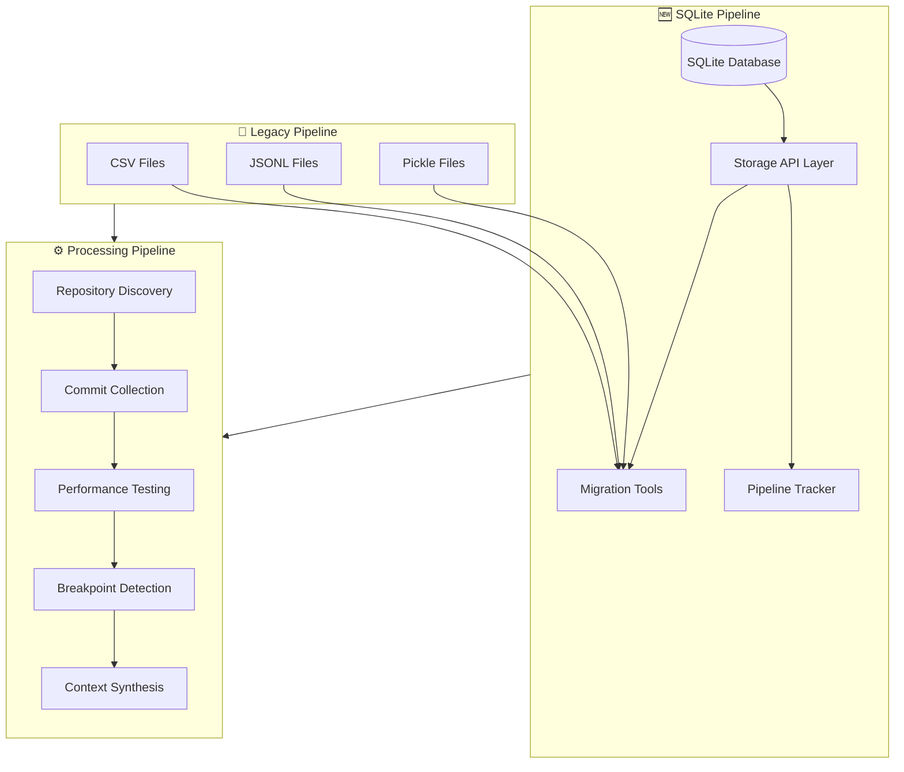

# FormulaCode - DataSmith 🔨

[](https://img.shields.io/github/v/release/formula-code/datasmith)
[](https://github.com/formula-code/datasmith/actions/workflows/main.yml?query=branch%3Amain)
[](https://codecov.io/gh/formula-code/datasmith)
[](https://img.shields.io/github/commit-activity/m/formula-code/datasmith)
[](https://img.shields.io/github/license/formula-code/datasmith)

**DataSmith** is a Python codebase for preparing and analyzing datasets for **FormulaCode** - a benchmark designed to evaluate large language models' (LLMs) ability to optimize real-world code performance. DataSmith provides both legacy file-based workflows and a modern SQLite-backed pipeline for improved performance and reliability.


FormulaCode complements existing benchmarks (e.g., SWE-Bench) by focusing on performance optimization rather than functional correctness, using the same API and methodology as SWE-Bench.

## 🚀 Quick Start

### Installation

```bash
# Install uv package manager
curl -LsSf https://astral.sh/uv/install.sh | sh

# Install development environment and pre-commit hooks
make install

# Resolve initial formatting issues
uv run pre-commit run -a
make check
```

### Environment Setup

Create a `tokens.env` file in the root directory:

```bash
GH_TOKEN=github_pat_YOUR_TOKEN_HERE
COVERALLS_TOKEN=YOUR_COVERALLS_TOKEN
CODECOV_TOKEN=YOUR_CODECOV_TOKEN
CACHE_LOCATION=/path/to/datasmith/cache.db
BACKUP_DIR=/path/to/backup/directory/
```

## 🗄️ Storage Systems

DataSmith supports two storage backends:

### 🆕 **SQLite Pipeline (Recommended)**
- **Performance**: 10-100x faster queries with indexed database operations
- **Reliability**: ACID transactions, foreign key constraints, concurrent access
- **Maintainability**: Structured data access, comprehensive error handling
- **Monitoring**: Built-in pipeline execution tracking and progress monitoring

### 📁 **Legacy File-Based Pipeline**
- **Compatibility**: Original workflow using CSV/JSONL/Parquet files
- **Migration**: Gradual transition path with backwards compatibility
- **Export**: Can export SQLite data back to legacy formats

---

## 🔄 Migration Guide

### Migrating from Legacy to SQLite

If you have existing DataSmith data, migrate it to the SQLite backend:

```bash
# Initialize new SQLite database
python scripts/migrate_to_sqlite.py --database datasmith.db --init-db

# Migrate repositories from CSV
python scripts/migrate_to_sqlite.py --database datasmith.db \
    --repos-csv scratch/artifacts/raw/repos_valid.csv

# Migrate commits from JSONL
python scripts/migrate_to_sqlite.py --database datasmith.db \
    --commits-jsonl scratch/artifacts/raw/commits_filtered.jsonl

# Migrate build contexts from registry
python scripts/migrate_to_sqlite.py --database datasmith.db \
    --context-registry scratch/context_registry.json

# Show database statistics
python scripts/migrate_to_sqlite.py --database datasmith.db --stats

# Validate migration
python scripts/migrate_to_sqlite.py --database datasmith.db --validate
```

### Testing SQLite Implementation

```bash
# Run comprehensive tests
python scripts/test_sqlite_standalone.py
```

---

## 📋 SQLite Pipeline Workflows

### FormulaCode-Lite (5 Repositories, ~440 Commits)

A curated dataset of high-quality repositories for initial testing and validation.

#### 1. Scrape Online Dashboards

```bash
# Download performance data from existing ASV dashboards
python scratch/scripts/download_dataset.py \
    --force \
    --dashboards scratch/artifacts/raw/online_dashboards.jsonl \
    --database datasmith.db
```

#### 2. Detect Performance Breakpoints

```bash
# Detect performance improvements using statistical methods
python scratch/scripts/detect_breakpoints.py \
    --database datasmith.db \
    --repository-id 1 \
    --method rbf \
    --build-reports \
    --compute-coverage
```

#### 3. Synthesize Build Contexts

```bash
# Generate Docker build contexts for commits
python scratch/scripts/synthesize_contexts.py \
    --database datasmith.db \
    --repository-id 1 \
    --max-workers 16 \
    --max-attempts 3
```

### FormulaCode-Full (700+ Repositories)

Complete dataset building pipeline for large-scale analysis.

#### 1. Discover ASV Repositories

```bash
# Find repositories using Airspeed Velocity benchmarking
python scratch/scripts/scrape_repositories.py \
    --database datasmith.db \
    --min-stars 100 \
    --max-repos 700
```

#### 2. Collect Performance-Relevant Commits

```bash
# Collect and filter commits for performance relevance
python scratch/scripts/collect_and_filter_commits_v2.py \
    --database datasmith.db \
    --max-repos 350 \
    --threads 32
```

#### 3. Benchmark Commits

```bash
# Run performance benchmarks on collected commits
python scratch/scripts/benchmark_commits.py \
    --database datasmith.db \
    --max-concurrency 30 \
    --num-cores 2 \
    --asv-args "--python=same --append-samples -a rounds=2"
```

#### 4. Analyze Results

```bash
# Detect performance improvements in benchmarked data
python scratch/scripts/detect_breakpoints.py \
    --database datasmith.db \
    --method rbf \
    --build-reports
```

---

## 📂 Data Layout

### SQLite Database Schema

```sql
-- Core tables
repositories          -- GitHub repository metadata
commits              -- Commit information and performance flags  
build_contexts       -- Docker build environments
benchmark_collections -- ASV dashboard collections
benchmark_runs       -- Individual benchmark measurements
breakpoints          -- Detected performance improvements
pipeline_runs        -- Execution tracking and monitoring
pipeline_run_items   -- Detailed progress tracking
```

### Legacy File Structure

```bash
scratch/artifacts/
├── raw/                        # Raw downloads & lists
│   ├── online_dashboards.jsonl # ASV dashboard configurations
│   ├── repos_discovered.csv    # GitHub search results
│   ├── repos_valid.csv         # Filtered repositories
│   ├── commits_all.jsonl       # All collected commits
│   └── commits_filtered.jsonl  # Performance-relevant commits
├── benchmark_results/          # ASV outputs
│   ├── results/                # Individual benchmark files
│   └── published/              # Collated dashboard.fc.pkl files
├── contexts/                   # Build contexts
└── cache.db                    # SQLite database
```

---

## 🛠️ Advanced Usage

### Database Management

```bash
# Show detailed statistics
python scripts/migrate_to_sqlite.py --database datasmith.db --stats

# Optimize database performance  
python scripts/migrate_to_sqlite.py --database datasmith.db --vacuum

# Export to legacy format for compatibility
python scripts/migrate_to_sqlite.py --database datasmith.db \
    --export-legacy /path/to/output --repository-id 1
```

### Pipeline Monitoring

```bash
# Track pipeline execution in real-time
python -c "
from datasmith.storage.database import DataSmithDB
from datasmith.storage.pipeline import PipelineTracker

db = DataSmithDB('datasmith.db')
tracker = PipelineTracker(db)

# Show active pipeline runs
runs = tracker.get_active_runs()
for run in runs:
    print(f'Run {run.run_name}: {run.status}')
    
# Show detailed progress
items = tracker.get_run_items(run.id)
print(f'Progress: {len([i for i in items if i.status == \"completed\"])}/{len(items)}')
"
```

### Performance Analysis

```bash
# Query performance improvements
python -c "
from datasmith.storage.database import DataSmithDB
from datasmith.storage.benchmarks import BenchmarkStore

db = DataSmithDB('datasmith.db')
store = BenchmarkStore(db)

# Find top performance improvements
improvements = store.get_breakpoints_by_type('improvement', limit=10)
for bp in improvements:
    change = (bp.after_value - bp.before_value) / bp.before_value * 100
    print(f'{bp.benchmark_name}: {change:.1f}% improvement')
"
```

---

## 🔍 Key Features

### Performance Improvements
- **Query Speed**: 10-100x faster data retrieval with indexed SQLite operations
- **Concurrent Access**: Multiple pipeline scripts can safely run simultaneously
- **Memory Efficiency**: On-demand loading reduces memory usage

### Reliability Improvements  
- **Data Integrity**: Foreign key constraints prevent orphaned records
- **Transaction Safety**: ACID transactions ensure data consistency
- **Error Recovery**: Comprehensive error handling with automatic rollback

### Developer Experience
- **Type Safety**: Full type hints throughout the codebase
- **Progress Tracking**: Real-time monitoring of pipeline execution
- **Easy Migration**: Seamless transition from legacy file formats
- **Backwards Compatibility**: Export capability maintains workflow compatibility

### Quality Assurance
- **Comprehensive Testing**: Automated test suite validates functionality
- **Data Validation**: Built-in integrity checks and statistics
- **Documentation**: Complete API documentation and usage examples

---

## 📈 Benchmarking Results

FormulaCode demonstrates significant advantages over traditional functional correctness benchmarks:

### Key Improvements
1. **Human-Relative Metrics**: Scores optimizers relative to original human performance
2. **Dense Feedback**: Performance measurements provide detailed optimization signals
3. **Real-World Impact**: Successful optimizations can be directly upstreamed
4. **Noise Robustness**: Statistical methods handle measurement variability

### Dataset Statistics
- **FormulaCode-Lite**: 5 repositories, ~440 performance-improving commits
- **FormulaCode-Full**: 700+ repositories, extensive commit coverage
- **Combined Citations**: 200,000+ academic citations across repositories
- **GitHub Stars**: 157,000+ stars for core repositories

---

## 🔧 Pipeline Architecture


```mermaid
flowchart TD
    %% SQLite Pipeline
    subgraph SQLite["🆕 SQLite Pipeline"]
        direction TB
        DB[(SQLite Database)]
        API[Storage API Layer]
        TRACK[Pipeline Tracker]
        MIGRATE[Migration Tools]
        
        DB --> API
        API --> TRACK  
        API --> MIGRATE
    end
    
    %% Legacy Pipeline  
    subgraph Legacy["📁 Legacy Pipeline"]
        direction TB
        CSV[CSV Files]
        JSONL[JSONL Files] 
        PKL[Pickle Files]
        
        CSV --> MIGRATE
        JSONL --> MIGRATE
        PKL --> MIGRATE
    end
    
    %% Processing Steps
    subgraph Process["⚙️ Processing Pipeline"]
        direction TB
        SCRAPE[Repository Discovery]
        COLLECT[Commit Collection]
        BENCHMARK[Performance Testing]
        DETECT[Breakpoint Detection]
        CONTEXT[Context Synthesis]
        
        SCRAPE --> COLLECT --> BENCHMARK --> DETECT --> CONTEXT
    end
    
    SQLite --> Process
    Legacy --> Process
```

---

## 📚 Documentation

- **Migration Plan**: See `SQLITE_MIGRATION_PLAN.md` for detailed migration strategy
- **Implementation Summary**: See `IMPLEMENTATION_SUMMARY.md` for technical details  
- **API Documentation**: See `src/datasmith/storage/` for module documentation
- **Testing Guide**: See `scripts/test_sqlite_standalone.py` for validation procedures

---

## 🤝 Contributing

1. **Fork** the repository
2. **Create** a feature branch (`git checkout -b feature/amazing-feature`)
3. **Commit** your changes (`git commit -m 'Add amazing feature'`)
4. **Push** to the branch (`git push origin feature/amazing-feature`)
5. **Open** a Pull Request

### Development Setup

```bash
# Install development dependencies
make install

# Run tests
make test

# Check code quality
make check

# Run pre-commit hooks
uv run pre-commit run --all-files
```

---

## 📄 License

This project is licensed under the MIT License - see the [LICENSE](LICENSE) file for details.

---

## 🙏 Acknowledgments

- **ASV Community**: For the Airspeed Velocity benchmarking framework
- **Repository Maintainers**: For providing public performance dashboards
- **Contributors**: For dataset curation and validation efforts

---

## 🆘 Support & Issues

- **Documentation**: Check the `docs/` directory for detailed guides
- **Issues**: Report problems via [GitHub Issues](https://github.com/formula-code/datasmith/issues)
- **Discussions**: Join conversations in [GitHub Discussions](https://github.com/formula-code/datasmith/discussions)

For questions about the SQLite migration or new pipeline features, please include:
- Database size and migration status
- Error messages (if any)  
- Pipeline configuration details
- Performance requirements