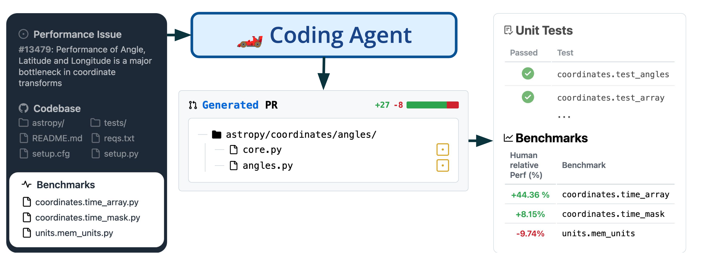

# FormulaCode - DataSmith 🔨

[](https://img.shields.io/github/v/release/formula-code/datasmith)
[](https://github.com/formula-code/datasmith/actions/workflows/main.yml?query=branch%3Amain)
[](https://codecov.io/gh/formula-code/datasmith)
[](https://img.shields.io/github/commit-activity/m/formula-code/datasmith)
[](https://img.shields.io/github/license/formula-code/datasmith)

This is a Python codebase for preparing and analyzing the Hugging Face dataset for **FormulaCode** (67 repositories; 964+ performance‑improving commits) and **FormulaCode-V** (?? Repositories; 200 performance-improving commits with manually verified pytest benchmarks).



FormulaCode is designed to benchmark the capabilities of large language models (LLMs) to optimize the performance of real‑world codebases. It is designed to *complement* existing benchmarks (e.g. SWE‑Bench) by using the same API and methodology as SWE‑Bench.

## Key improvements

1. **Human‑relative metric** – FormulaCode scores an optimizer relative to the speed‑up achieved by the human author of the original commit, preventing “memorize‑and‑saturate” tactics.
2. **Finer‑grained feedback** – Performance measurements provide a dense reward signal that helps RL or evolutionary algorithms iterate more effectively than binary pass/fail unit tests.
3. **Performance benchmarks vs. unit tests** – Unit tests protect against functional regressions but can be over‑fit; realistic workload benchmarks capture the critical performance hot‑paths developers actually care about.

4. **Real‑world impact** – FormulaCode uses a library's _pre-defined_ performance categorization workloads. As such, if an LLM statistically outperforms the human baseline on a FormulaCode task, the resulting patch is often state‑of‑the‑art and can be upstreamed to the library. However, this is contingent on the patch being thoroughly validated after manual verification, of course.


## Installation
Make a `tokens.env` file with your GitHub and Codecov credentials.
```bash
# Cache and backup locations
CACHE_LOCATION=/home/???/formulacode/datasmith/scratch/artifacts/cache.db
BACKUP_DIR=/home/???/formulacode/backup/

# Scraping tokens
GH_TOKENs=github_pat_???,github_pat_???
CODECOV_TOKEN=54c6???

# LLM configuration for context synthesis
DSPY_MODEL_NAME=openai/meta-llama/Llama-3.3-70B-Instruct
DSPY_URL=http://localhost:30000/v1
DSPY_API_KEY=local
DSPY_TEMPERATURE=0.7

# For ECR access
AWS_REGION=us-east-1

# Depends on the system.
#DOCKER_USE_BUILDX=0
DOCKER_NETWORK_MODE=host
```

Then, install [uv](https://astral.sh/uv/) and set up the development environment:
```bash
$ curl -LsSf https://astral.sh/uv/install.sh | sh
# Installs pre-commit hooks and dev dependencies.
$ make install
# Resolve initial formatting issues.
$ uv run pre-commit run -a
$ make check
# Run tests to verify installation.
$ make test
```

Ensure your machine can run CRON tasks. This will be necessary for updating FormulaCode every month.

```bash
$ crontab -l
# Edit this file to introduce tasks to be run by cron.
#
# Each task to run has to be defined through a single line
# indicating with different fields when the task will be run
# and what command to run for the task
#
# To define the time you can provide concrete values for
# minute (m), hour (h), day of month (dom), month (mon),
# and day of week (dow) or use '*' in these fields (for 'any').
#
# Notice that tasks will be started based on the cron's system
# daemon's notion of time and timezones.
#
# Output of the crontab jobs (including errors) is sent through
# email to the user the crontab file belongs to (unless redirected).
#
# For example, you can run a backup of all your user accounts
# at 5 a.m every week with:
# 0 5 * * 1 tar -zcf /var/backups/home.tgz /home/
#
# For more information see the manual pages of crontab(5) and cron(8)
#
# m h  dom mon dow   command

# Clean up Docker containers every day at midnight
0 * * * * /usr/bin/docker container prune -f

# Clean up dangling Docker images every week
0 0 * * 0 /usr/bin/docker image prune -f

# Run FormulaCode update script on the 25th day of every month at 2am
0 2 25 * * cd /home/???/formulacode/datasmith && ./.venv/bin/python scratch/scripts/update_formulacode.py >> scratch/logs/update_formulacode_{date +\%Y\%m\%d}.log 2>&1
$ crontab -e
# <Make the necessary edits>
```


## Data layout
The general layout of the artifacts is as follows:
```bash
scratch/artifacts
├── cache.db                    # See `CACHE_LOCATION` env var
├── raw/                        # Raw downloads & lists produced by scripts
│   ├── downloads/              # Per‑repo dashboard archives
│   ├── online_dashboards.jsonl # Updated config for dashboard scraper
│   ├── repos_discovered.csv      # Candidates from GitHub search
│   ├── repos_valid.csv
└── processed/.                 # Outputs of various processing scripts
```


## Dataset building

### Installation

You will need to download and install uv to set up Datasmith. The rest of the process is automated using `make` commands.

```bash
$ curl -LsSf https://astral.sh/uv/install.sh | sh
# Install dev environment and pre-commit hooks
$ make install
# Resolve initial formatting issues.
$ uv run pre-commit run -a
$ make check
```

For querying github and codecov, we need to set up a few environment variables. You can do this by creating a `tokens.env` file in the root of the repository with the following content.

```bash
$ cat tokens.env
GH_TOKEN=github_pat_???
COVERALLS_TOKEN=XdK???
CODECOV_TOKEN=54c6???
CACHE_LOCATION=/home/???/formulacode/datasmith/scratch/artifacts/cache.db
BACKUP_DIR=/home/???/formulacode/backup/
```


## FormulaCode


FormulaCode is a dataset of 101 repositories with 4M+ PRs with an automated pipeline to scrape, filter, benchmark, and analyze performance-improving commits in open-source repositories that use Airspeed Velocity (asv) for benchmarking. To update formulacode simply run:

```
$ python scratch/scripts/update_formulacode.py --start-date 2025-10-01 --end-date 2025-11-01
```

The next sections describe each step of the pipeline in detail.

### 1. Scrape Github for asv-compatible repositories

We start by collecting all repositories that use Airspeed Velocity (asv) for benchmarking. This can be done in one of two ways:

1. Google BigQuery: Google maintains a public dataset of GitHub repositories that can be queried using SQL.

2. Github Search API: We use the GitHub Search API to find all repositories that have a `asv.conf.json` file in their root directory. This is a more comprehensive search that can find repositories that are not indexed by Google BigQuery. _This version is implemented here._

To run the script, you need to have a GitHub token with `repo` and `read:org` permissions. You can create a token by following the instructions [here](https://docs.github.com/en/authentication/keeping-your-account-and-data-secure/creating-a-personal-access-token).

Run:
```bash
$ python scratch/scripts/collect_commits.py \
       --dashboards scratch/artifacts/pipeflush/repos_valid.csv \
       --outfile    scratch/artifacts/pipeflush/commits_all.jsonl \
       --max-pages  50
# Writes scratch/artifacts/processed/repos_discovered.csv and scratch/artifacts/processed/repos_valid.csv
```

The `scratch/artifacts/processed/repos_valid.csv` file contains a subset of the repositories that aren't forks / reuploads / has atleast {min-stars} stars / pass other sanity checks. We found ~700 filtered repositories for this dataset.


### 2. Collect relevant commits for all repositories

Given the list of repositories, we find the subset of commits that have already been closed and merged into the main branch and then filters out those commits that primarily modified the benchmarking files (e.g. `asv.conf.json`) or were not relevant to the benchmarks (e.g. documentation changes) or could not be installed (e.g. runnning `uv pip install -e .` causes issues).

```bash
$ python scratch/scripts/collect_and_filter_commits.py \
       --filtered-benchmarks-pth scratch/artifacts/pipeflush/repos_valid.csv \
       --output-pth scratch/artifacts/pipeflush/merge_commits_filtered.parquet \
       --threads   8 \
       --procs     32

$ python scratch/scripts/prepare_commits_for_building_reports.py \
       --input scratch/artifacts/pipeflush/merge_commits_filtered.parquet \
       --output scratch/artifacts/pipeflush/merge_commits_filtered_with_patch.parquet \
       --max-workers 200 \
       --filter-repos \
       --fetch-patches

$ python scratch/scripts/collect_perf_commits.py \
       --commits  scratch/artifacts/processed/merge_commits_filtered_numpy_with_patch.parquet \
       --outfile    scratch/artifacts/processed/perfonly_commits_numpy_with_patch.parquet \
       --max-workers -1
```

### 3. Build contexts for all commits

Each context is a (repo, commit) pair with an associated build_env.sh script to install dependencies. Some reasons a context might fail to build (and get filtered out):

1. Commit couldn't be checked out
2. Commit didn't have an asv.conf.json file
3. We could not build the asv environment for the commit.
4. We could not run a quick asv run to ensure that the benchmarks run.

```bash
$ python scratch/scripts/synthesize_contexts.py \
       --commits scratch/artifacts/pipeflush/commits_perfonly.parquet \
       --output-dir scratch/artifacts/pipeflush/results_synthesis/ \
       --context-registry scratch/artifacts/pipeflush/context_registry.json \
       --max-workers 32 \
       --max-attempts 3 \
       --max-steps 10 \
       --max-similar-candidates 5 \
       --ignore-exhausted \
       --push-to-ecr
```

### 4. Upload to AWS ECR

We rebuild the Docker images from scratch and then upload them to AWS ECR for later use.

```bash
$ python scratch/scripts/build_and_publish_to_ecr.py \
       --commits scratch/artifacts/processed/perfonly_commits_with_patch_final.parquet \
       --context-registry scratch/artifacts/pipeflush/context_registry.json \
       --max-workers 5 \
       --skip-existing
```


### 5. Evaluate all commits

This is done in FormulaCode's fork of the terminal-bench evaluation framework.


## License

This project is licensed under the MIT License. See the [LICENSE](LICENSE) file for details.
