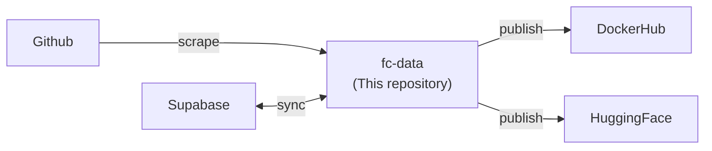

<p align="center">
 <a href="https://formula-code.github.io/">
    
  </a>
  <a href="https://huggingface.co/papers/2603.16011">
    
  </a>
  <a href="https://formula-code.github.io/leaderboard/">
    
  </a>
  <a href="https://formula-code.github.io/datasmith/">
    
  </a>
  <a href="https://datasmith-grafana.atharvas.net/">
    
  </a>
</p>

[FormulaCode](https://formula-code.github.io/) is a *continually updating*  benchmark for evaluating  the holistic ability of LLM agents to optimize codebases. FormulaCode consists of two parts: a [pipeline](https://github.com/formula-code/datasmith) to construct performance optimization tasks, and an [execution harness](https://github.com/formula-code/terminal-bench) that connects a language model to our terminal sandbox. _This repository contains the task generation pipeline._

`fc-data` is a python package for automatically curating and managing [FormulaCode](https://formula-code.github.io/) tasks. After installation, fc-data is designed to run as a monthly CRON job that updates the FormulaCode dataset with new commits and repositories.

## High level overview


```mermaid
graph LR
    A --->|scrape| B
    A2 <-->|sync| B
    B -->|publish| C
    B -->|publish| D

    A[Github]
    A2[Supabase]
    B["`fc-data
    (This repository)`"]
    C[DockerHub]
    D[HuggingFace]
```

## Use cases

`fc-data` is designed primarily to enable continual dataset updates for FormulaCode. After [installation](#installation), the monthly update is a single command:

```bash
$ pip install fc-data
$ fc-data --start-date 2026-02-01 --end-date 2026-03-01
```

This runs six stages in order: scrape repos, scrape commits, classify PRs, resolve packages, synthesize Docker images, and publish the docker images to DockerHub and the PRs to HuggingFace The dataset is versioned by month (e.g. `formulacode@2026-03`). In our servers, this command runs as a monthly CRON job.


However, this isn't the only use case for `fc-data`. We've designed `fc-data` to helps you manage your custom github-centric benchmark. Each benchmark contains a task which revolves around a GitHub Issue (or Pull request; which is just an issue with extra details). We include some helpful properties to start off:

```python
from datasmith.github import PR, GitHubClient
from datasmith.utils import TokenPool

# Every task starts with a PR.
pr = PR(repository="astropy/astropy", issue_number=16222)

# PRs are frozen Pydantic v2 models — immutable after creation.
pr.merge_commit_sha   # the merge commit sha
pr.base_sha           # base branch commit
pr.cache_key          # "astropy/astropy:16222" — used for Supabase caching

# Or fetch a fully-hydrated PR (tries Supabase first, then GitHub API):
pr = await PR.fetch("astropy/astropy", 16222)
pr.merge_commit_sha   # now populated from the database or API
```

You can also fetch live data from GitHub using the async client directly:
```python
pool = TokenPool()   # reads GH_TOKENS env var, rotates tokens on rate-limit
gh = GitHubClient(pool)

# Fetch a PR from the GitHub API.
pr = await gh.get_pr("pandas-dev", "pandas", 16222)

# Fetch the diff as a string.
diff = await gh.get_diff("pandas-dev", "pandas", 16222)

# Fetch the timeline of events.
events = await gh.get_timeline("pandas-dev", "pandas", 16222)
```

Want to extract structured information from the PR? Use our built-in agents or define your own!
```python
from datasmith.github import render_problem_statement, scrape_links

# Render a problem statement from the PR and its linked issues.
statement = render_problem_statement(pr, anonymize=True)

# You can also scrape for linked issues via BFS.
issues = await scrape_links(pr, gh.get_issue, depth=2, only_issues=True, limit=6)

# Then pass them into the renderer for richer context.
statement = render_problem_statement(pr, issues=issues, repo_description="pandas is a data analysis library")
```


Don't like the current set of operations? Define your own!

```python
# You can register custom hooks for dataset-specific operations.
from datasmith.github import HookRegistry

from dspy import ChainOfThought
summarizer = ChainOfThought("document -> summary")

def summarize(pr):
    doc = render_problem_statement(pr, anonymize=True)
    return summarizer(doc).summary

HookRegistry.register("summarize", summarize)   # auto-wrapped with @supabase_cached

# Now use it:
pr = PR(repository="astropy/astropy", issue_number=16222)
HookRegistry.call("summarize", pr)   # first call: hits LLM
HookRegistry.call("summarize", pr)   # second call: reads from Supabase cache. No cost!
```

Almost all our supported operations can be run asynchronously. Here's how to run some FormulaCode-specific operations at scale:
```python
from datasmith.runners import ClassifyPRsRunner
from datasmith.agents import PerfClassifier, ClassifyJudge

runner = ClassifyPRsRunner(PerfClassifier(), ClassifyJudge(), n_concurrent=64)
await runner.run(pr_items)
# Progress tracked in Supabase runner_progress table.
# Per-item failures logged in runner_failures — the runner never aborts.
```

By default, each operation is cached in Supabase so you don't keep hitting expensive hooks.

A pull request is useless if you cannot build a reproducible environment for it. fc-data supports building docker images for any pull request using a three-tier hierarchy:

```python
from datasmith.docker import ImageManager, MultiObjVerifier, SmokeVerifier, ProfileVerifier

mgr = ImageManager()
mgr.build_base_image()                                # formulacode/base:latest (uses the default Dockerfile.base)
mgr.build_repo_image("pandas-dev", "pandas",)        # formulacode/pandas-dev-pandas:latest (Look up Dockerfile.repo for pandas-dev/pandas that should be stored in supabase or fallback to the default Dockerfile.repo)
mgr.build_pr_image("pandas-dev", "pandas", 16222,)    # formulacode/pandas-dev-pandas:16222 (Look up Dockerfile.pr for pandas-dev/pandas:16222 that should be stored in supabase or fallback to the default Dockerfile.pr)


# Alternatively, if the user wants to use a custom Dockerfile, they can do so by:

mgr.build_base_image(context="path/to/custom/context")
mgr.build_repo_image("pandas-dev", "pandas", context="path/to/custom/context")
mgr.build_pr_image("pandas-dev", "pandas", 16222, context="path/to/custom/context")


# Verify an image with a chain of verifiers — short-circuits on first failure.
verifier = MultiObjVerifier(verifiers=[
    SmokeVerifier("pandas"),      # can we import the package?
    ProfileVerifier(timeout=300), # can we discover and run ASV benchmarks?
])
result = verifier.verify("formulacode/pandas-dev-pandas:16222")
# result.ok, result.rc, result.stdout, result.stderr, result.duration_s
```

One of the main features of `fc-data` is the ability to automatically synthesize docker containers for a pull request. The synthesizer is a state machine that checks Supabase for cached contexts, tries similar build scripts, then falls back to an installed CLI agent (Claude Code, Codex, or Gemini — auto-detected):

```python
from datasmith.agents import Synthesizer
from datasmith.docker import MultiObjVerifier, SmokeVerifier, ProfileVerifier
from datasmith.docker.context import DockerContext

# The verifier chain validates each synthesis attempt.
verifier = MultiObjVerifier(verifiers=[
    SmokeVerifier("pandas"),      # can we import the package?
    ProfileVerifier(timeout=300), # can we discover and run ASV benchmarks?
])

# Load a base Docker build context (Dockerfile + shell scripts) to iterate on.
base_context = DockerContext.from_directory("dataset/formulacode_verified/pandas-dev_pandas/abc123")

synth = Synthesizer(max_attempts=3)
ctx = synth.run(
    owner="pandas-dev",
    repo="pandas",
    issue_number=16222,
    pr_context="This PR optimizes groupby performance by ...",
    verifier=verifier,
    sha="abc123def456",
    base_context=base_context,
    env_payload='{"dependencies": ["numpy==1.26.0", "cython==3.0.0"]}',
    python_version="3.10",
)
# Checking cache for pandas-dev/pandas@abc123def456...             [MISS]
# Found 4 similar scripts from pandas-dev/pandas
# Attempt 1/4 with similar script...                              [FAIL]
# Launching claude agent sandbox in /tmp/synthesis-xxx...
# Sandbox synthesis succeeded                                     [PASS]
# Saved context for pandas-dev/pandas@abc123def456
#
# On success, the DockerContext is persisted to Supabase's candidate_containers table.
# ctx is a DockerContext with the working build scripts, or None if all attempts failed.
```

If ALL attempts fail, `synthesize` logs every attempt (stderr, stdout, model, script used) to Supabase's `build_attempts` table and returns `None`. Failed PRs can be retried later — the logged attempts provide context for debugging or a future synthesis run.

This can be run asynchronously as well for multiple tasks (WARNING: Might be expensive!):
```python
from datasmith.runners import SynthesizeImagesRunner

runner = SynthesizeImagesRunner(synth, verifier, n_concurrent=8)
await runner.run(pr_items)
# Returns None entries for PRs where synthesis failed.
```

How do we make a dataset out of this? Query Supabase directly and publish:
```python
from datasmith.utils.db import get_client
from datasmith.publish import records_from_supabase, HuggingFacePublisher

# Query all verified, unpublished perf PRs from the last month.
records = records_from_supabase(start_date="2026-02-01", end_date="2026-03-01")

# Or query Supabase directly for more control.
sb = get_client()
rows = sb.table("pull_requests") \
    .select("*") \
    .eq("is_performance_commit", True) \
    .not_.is_("container_name", "null") \
    .execute()

# Publish to HuggingFace as a versioned Parquet dataset.
hf = HuggingFacePublisher()
hf.publish(records, version="formulacode@2026-03")
```

We define tasks using `terminal-bench`'s formulacode adapter for evaluation:
```python
from terminal_bench.adapters.formulacode import FormulaCodeAdapter
from terminal_bench.harness.harness import Harness

adapter = FormulaCodeAdapter(task_dir="fctasks/", force=True)
adapter.generate_task(pr.to_record())

run = Harness(
    output_path="fcevals/",
    dataset_path="dataset_path",
    task_ids=[pr.to_record().task_id],
    agent_configs=[
        {"agent_name": "nop", "model_name": "nop"},
        {"agent_name": "oracle", "model_name": "oracle"},
    ],
)

print(run.results[0].is_resolved)  # Did the oracle get a speedup > 1.00 over baseline?
```

## Database schema

There are xix tables in Supabase (Postgres):

| Table | Primary key | Purpose |
|-------|-------------|---------|
| `repositories` | `(owner, repo)` | Scraped GitHub repos (language, stars, topics, description) |
| `pull_requests` | `(owner, repo, issue_number)` | PR metadata, classification, rendered problems, publish status |
| `hook_cache` | `(entity_key, hook_name, args_hash)` | Deterministic cache for `@supabase_cached` |
| `build_attempts` | `id` (serial) | Every Docker build attempt (model, script, ok, stderr/stdout tails) |
| `runner_progress` | `runner_id` | Per-runner progress (total, completed, failed) |
| `runner_failures` | `id` (serial) | Per-item failure details (error message, traceback) |


## Installation

Install [uv](https://astral.sh/uv/) and [Node.js](https://nodejs.org/) (for Supabase CLI), then set up the development environment:

```bash
# Install uv
$ curl -LsSf https://astral.sh/uv/install.sh | sh
# Install npm (for Supabase CLI)
$ curl -o- https://raw.githubusercontent.com/nvm-sh/nvm/v0.39.7/install.sh | bash
$ nvm install --lts
$ nvm use --lts
# Install dev environment and pre-commit hooks
$ make install
```

Create a `tokens.env` file in the repo root:
```bash
# Supabase (required)
SUPABASE_URL=http://127.0.0.1:54321
SUPABASE_KEY=your-service-role-key

# GitHub (required — comma-separated for multiple tokens)
GH_TOKENS=github_pat_xxx,github_pat_yyy

# LLM backends (for classification and synthesis)
DSPY_MODEL=openai/gpt-oss-120b
DSPY_API_BASE=http://localhost:30000/v1
DSPY_API_KEY=local
DSPY_MAX_TOKENS=16000

# DockerHub (for publishing)
DOCKERHUB_USERNAME=formulacode
DOCKERHUB_TOKEN=dckr_pat_xxxxx

# HuggingFace (for dataset publishing)
HF_TOKEN_PATH=/path/to/huggingface/token
```

### Supabase

Start the local Supabase instance and apply all migrations:
```bash
$ npx supabase start              # starts Postgres, Auth, Storage, Studio, etc.
$ npx supabase migration up --local   # apply migrations in supabase/migrations/
```

Common commands:
```bash
$ npx supabase status             # show URLs, ports, and service health
$ npx supabase migration list --local # list applied / pending migrations
$ npx supabase db reset           # wipe and recreate from migrations (destructive)
$ npx supabase stop               # stop all containers
```

Studio is available at the URL printed by `supabase status` (default `http://127.0.0.1:54323`) — use it to browse tables, run SQL, and inspect data.

Running `preflight` ensures that all the variables are properly defined:
```bash
$ python -m datasmith.preflight

== Environment ==
  [OK] SUPABASE_URL — http://127.0.0.1:54...
  [OK] SUPABASE_KEY — ***
  [OK] GH_TOKENS — 3 token(s)
  [OK] HF_TOKEN — /path/to/huggingface/token

== Supabase ==
  [OK] Connection

== Docker ==
  [OK] Docker daemon

== GitHub ==
  [OK] API access — remaining=4998

========================================
All checks passed!
```

After that works, run the tests locally. Each new functionality MUST have a test:
```bash
$ make check    # ruff lint + mypy type check
$ make test     # pytest
```

## Updating FormulaCode

The monthly update is a single command:
```bash
$ fc-data --start-date 2026-02-01 --end-date 2026-03-01
```

This runs six stages in order: scrape repos, scrape commits, classify PRs, resolve packages, synthesize Docker images, and publish to DockerHub + HuggingFace. Options:

```bash
$ fc-data --start-date 2026-02-01 --end-date 2026-03-01 --resume        # skip completed stages
$ fc-data --start-date 2026-02-01 --end-date 2026-03-01 --stage 4       # run only package resolution
$ fc-data --start-date 2026-02-01 --end-date 2026-03-01 --dry-run       # log without executing
$ fc-data --start-date 2026-02-01 --end-date 2026-03-01 --stage 5 \
    --agent codex --n-concurrent 5 --tasks-per-repo 5                      # synthesis with codex, capped
$ fc-data --start-date 2026-02-01 --end-date 2026-03-01 --stage 5 \
    --force                                                                # re-run synthesis for all tasks
```

| Flag | Description |
|------|-------------|
| `--resume` | Skip stages already marked complete and resume from the next pending stage |
| `--stage N` | Run only stage N (1–6) |
| `--dry-run` | Log what each stage would do without executing |
| `--n-concurrent N` | Max concurrent items per runner stage |
| `--tasks-per-repo N` | Cap tasks per repository for stage 5 (synthesize_images) |
| `--agent {claude,codex,gemini}` | CLI agent for stage 5 synthesis (default: auto-detect first available) |
| `--force` | Re-run synthesis even for tasks that already have a container or cached context (stage 5 only) |


## Dataset verification

Each task lives in `dataset/formulacode_verified/<owner_repo>/<sha>/` with a multi-stage Dockerfile and shell build scripts. The verification loop:

```bash
$ python dataset/verify.py --task dataset/formulacode_verified/<owner_repo>/<sha>
# Check failure.json for errors -> edit docker_build_pkg.sh / docker_build_run.sh -> rerun
# Done when verification_success.json appears
```

Only modify `docker_build_pkg.sh` and `docker_build_run.sh` during verification fixes.

```bash
$ python scratch/scripts/prepare_formulacode_dataset.py \
       --input  scratch/artifacts/pipeflush/perfonly_commits_master.parquet \
       --output scratch/artifacts/pipeflush/perfonly_enriched.parquet \
       --dockerhub-repository formulacode/all \
       --upload-to-hf formulacode/formulacode-all \
       --hf-verified-filter /path/to/valid_tasks.json
```

> Requires `HF_TOKEN` in `tokens.env`. The upload creates `default`, `verified`, and per-month (`YYYY-MM`) configs on Hugging Face.

### Evaluation

Evaluation is done in FormulaCode's fork of the [terminal-bench](https://github.com/formula-code/fc-eval) evaluation framework.
