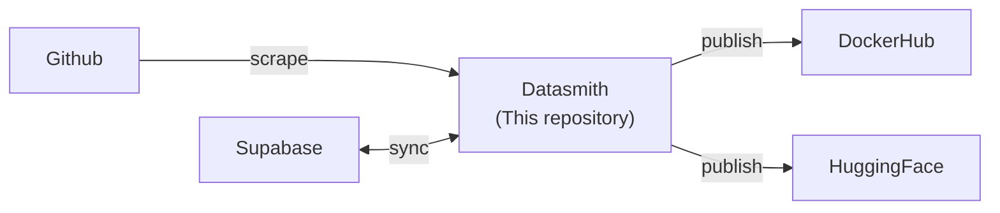

# FormulaCode - DataSmith

[](https://github.com/formula-code/datasmith/actions/workflows/main.yml?query=branch%3Amain)
[](https://img.shields.io/github/license/formula-code/datasmith)

## Abstract

Datasmith is a package for automatically building and maintaining FormulaCode tasks. The package is engineered to support any repository-level, verification-by-execution based coding benchmark that heavily uses Docker and GitHub.

FormulaCode is a benchmark of 67+ repositories with 964+ performance-improving commits, designed to evaluate LLMs' ability to optimize real-world codebases. It scores optimizers relative to the human-authored speedup using ASV (Airspeed Velocity) benchmarks — providing a dense performance signal instead of binary pass/fail.

## High level overview


```mermaid
graph LR
    A --->|scrape| B
    A2 <-->|sync| B
    B -->|publish| C
    B -->|publish| D

    A[Github]
    A2[Supabase]
    B["`Datasmith
    (This repository)`"]
    C[DockerHub]
    D[HuggingFace]
```

## Use cases

`datasmith` helps you manage your github-centric benchmark. Each benchmark contains a task which revolves around a GitHub Issue (or Pull request; which is just an issue with extra details). We include some helpful properties to start off:

```python
from datasmith.github import PR, GitHubClient
from datasmith.utils import TokenPool

# Every task starts with a PR.
pr = PR(repository="astropy/astropy", issue_number=16222)

# PRs are frozen Pydantic v2 models — immutable after creation.
pr.merge_commit_sha   # the merge commit sha
pr.base_sha           # base branch commit
pr.cache_key          # "astropy/astropy:16222" — used for Supabase caching
```

You can fetch live data from GitHub using the async client:
```python
pool = TokenPool()   # reads GH_TOKENS env var, rotates tokens on rate-limit
gh = GitHubClient(pool)

# Fetch a PR from the GitHub API.
pr = await gh.get_pr("pandas-dev", "pandas", 16222)

# Fetch the diff as a string.
diff = await gh.get_diff("pandas-dev", "pandas", 16222)

# Fetch the timeline of events.
events = await gh.get_timeline("pandas-dev", "pandas", 16222)
```

Want to make a problem statement? A pull request can be rendered into one:
```python
from datasmith.github import render_problem_statement, scrape_links

# Render a problem statement from the PR and its linked issues.
statement = render_problem_statement(pr, anonymize=True)

# Don't want to expose the users? anonymize=True maps @alice -> @user_1, strips emails.

# You can also scrape for linked issues via BFS.
issues = await scrape_links(pr, gh.get_issue, depth=2, only_issues=True, limit=6)

# Then pass them into the renderer for richer context.
statement = render_problem_statement(pr, issues=issues, repo_description="pandas is a data analysis library")
```


Don't like the current set of operations? Define your own!

```python
# You can register custom hooks for dataset-specific operations.
from datasmith.github import HookRegistry

from dspy import ChainOfThought
summarizer = ChainOfThought("document -> summary")

def summarize(pr):
    doc = render_problem_statement(pr, anonymize=True)
    return summarizer(doc).summary

HookRegistry.register("summarize", summarize)   # auto-wrapped with @supabase_cached

# Now use it:
pr = PR(repository="astropy/astropy", issue_number=16222)
HookRegistry.call("summarize", pr)   # first call: hits LLM
HookRegistry.call("summarize", pr)   # second call: reads from Supabase cache. No cost!
```

Almost all our supported operations can be run asynchronously. Here's how to run some FormulaCode-specific operations at scale:
```python
from datasmith.runners import ClassifyPRsRunner
from datasmith.agents import PerfClassifier, ClassifyJudge

runner = ClassifyPRsRunner(PerfClassifier(), ClassifyJudge(), n_concurrent=64)
await runner.run(pr_items)
# Progress tracked in Supabase runner_progress table.
# Per-item failures logged in runner_failures — the runner never aborts.
```

By default, each operation is cached in Supabase so you don't keep hitting expensive hooks.

A pull request is useless if you cannot build a reproducible environment for it. Datasmith supports building docker images for any pull request using a three-tier hierarchy:

```python
from datasmith.docker import ImageManager, MultiObjVerifier, SmokeVerifier, ProfileVerifier

mgr = ImageManager()
mgr.build_base_image("./context")                                # formulacode/base:latest
mgr.build_repo_image("pandas-dev", "pandas", "./context")        # formulacode/pandas-dev-pandas:latest
mgr.build_pr_image("pandas-dev", "pandas", 16222, "./context")    # formulacode/pandas-dev-pandas:16222

# Verify an image with a chain of verifiers — short-circuits on first failure.
verifier = MultiObjVerifier(verifiers=[
    SmokeVerifier("pandas"),      # can we import the package?
    ProfileVerifier(timeout=300), # can we discover and run ASV benchmarks?
])
result = verifier.verify("formulacode/pandas-dev-pandas:16222")
# result.ok, result.rc, result.stdout, result.stderr, result.duration_s
```

One of the main features of `datasmith` is the ability to automatically synthesize docker containers for a pull request. The synthesizer is a state machine:

```python
from datasmith.agents import Synthesizer

synth = Synthesizer(max_attempts=3, models=["o4-mini", "claude-sonnet-4-20250514"])
ctx = synth.run("pandas-dev", "pandas", 16222, pr_context="...", verifier=verifier)
# Checking cache for astropy/astropy:16222...                    [MISS]
# Found 4 similar scripts from astropy/astropy
# Attempt 1/4 with similar script...                              [FAIL]
# Attempt 2/4 with similar script...                              [FAIL]
# Attempt 3/4 with similar script...                              [FAIL]
# Attempt 4/4 with similar script...                              [FAIL]
# Generating with Codex (model=o4-mini)...                        [FAIL]
# Generating with Codex (model=claude-sonnet-4-20250514)...                  [PASS]
# [DONE] Build script synthesized for astropy/astropy#16222
```

If ALL attempts fail, `synthesize` logs every attempt (stderr, stdout, model, script used) to Supabase's `build_attempts` table and returns `None`. Failed PRs can be retried later — the logged attempts provide context for debugging or a future synthesis run.

This can be run asynchronously as well for multiple tasks (WARNING: Might be expensive!):
```python
from datasmith.runners import SynthesizeImagesRunner

runner = SynthesizeImagesRunner(synth, verifier, n_concurrent=8)
await runner.run(pr_items)
# Returns None entries for PRs where synthesis failed.
```

How do we make a dataset out of this? Query Supabase directly and publish:
```python
from datasmith.utils.db import get_client
from datasmith.publish import records_from_supabase, HuggingFacePublisher

# Query all verified, unpublished perf PRs from the last month.
records = records_from_supabase(start_date="2026-02-01", end_date="2026-03-01")

# Or query Supabase directly for more control.
sb = get_client()
rows = sb.table("pull_requests") \
    .select("*") \
    .eq("is_performance_commit", True) \
    .not_.is_("container_name", "null") \
    .execute()

# Publish to HuggingFace as a versioned Parquet dataset.
hf = HuggingFacePublisher()
hf.publish(records, version="formulacode@2026-03")
```

We define tasks using `terminal-bench`'s formulacode adapter for evaluation:
```python
from terminal_bench.adapters.formulacode import FormulaCodeAdapter
from terminal_bench.harness.harness import Harness

adapter = FormulaCodeAdapter(task_dir="fctasks/", force=True)
adapter.generate_task(pr.to_record())

run = Harness(
    output_path="fcevals/",
    dataset_path="dataset_path",
    task_ids=[pr.to_record().task_id],
    agent_configs=[
        {"agent_name": "nop", "model_name": "nop"},
        {"agent_name": "oracle", "model_name": "oracle"},
    ],
)

print(run.results[0].is_resolved)  # Did the oracle get a speedup > 1.00 over baseline?
```


## Architecture

Datasmith contains seven high-level modules. FormulaCode-specific logic lives directly in the appropriate `ds.*` module (no separate examples folder) since FormulaCode is the primary consumer.

* `ds.utils`: Shared utilities.
	* `ds.utils.db`: Supabase client initialization, common query helpers, and the `@supabase_cached` decorator. Cache keys are deterministic (SHA-256 of canonical JSON).
	* `ds.utils.tokens`: GitHub token pool with round-robin selection per request. Blocks on rate limits using GitHub's `X-RateLimit-Reset` header. Thread-safe via `threading.Lock`.
	* `ds.utils.core`: `Settings` (pydantic-settings from `tokens.env`), structured logging via `get_logger()`, `@with_backoff` retry decorator.
* `ds.github`: Pydantic v2 models for GitHub issues and PRs. All expensive methods use the `@supabase_cached` decorator (from `ds.utils.db`). GitHub API access via `httpx` + `ds.utils.tokens`.
	* `ds.github.models`: Frozen `Issue`, `PR` (extends Issue), `FormulaCodeRecord`, `IssueExpanded`, `PRFileChange`, `PRChangeSummary`.
	* `ds.github.client`: Async `GitHubClient` wrapping `httpx.AsyncClient` with `TokenPool`. Methods: `get_pr()`, `get_issue()`, `get_timeline()`, `get_diff()`, `get_files()`, `graphql()`. Handles 429/403 with automatic token rotation.
	* `ds.github.hooks`: `HookRegistry` — class-level registry for custom hooks. `register()` auto-wraps with `@supabase_cached`.
	* `ds.github.links`: `extract_references()` parses `#N`, `owner/repo#N`, and full GitHub URLs. `scrape_links()` does BFS traversal with depth, limit, and `only_issues` controls.
	* `ds.github.render`: Jinja2-based `render_problem_statement()` with `Anonymizer` (`@username` -> `@user_N`, email stripping).
* `ds.docker`: Dependencies for constructing and maintaining docker tasks.
	* `ds.docker.images`: `ImageManager` wrapping `python-on-whales` (not `docker-py`) — subprocess-based, thread-safe by design, scales to 40-50+ concurrent threads without connection pool issues. Three-tier hierarchy: base -> repo -> PR.
	* `ds.docker.context`: `DockerContext` Pydantic model holding Dockerfile + shell scripts. `to_tar_bytes()` produces reproducible tarballs (zero mtimes, deterministic order). `from_directory()` loads from a task directory.
	* `ds.docker.verifiers`: Abstract `Verifier` base class. Concrete: `SmokeVerifier` (`import {package}`), `ProfileVerifier` (runs `profile.sh`, timeout exit code 124 treated as success), `PytestVerifier` (runs `run_tests.sh`), `MultiObjVerifier` (chains verifiers, short-circuits on failure).
	* `ds.docker.publish`: `DockerHubPublisher` with lazy login, `@with_backoff` retry, version tagging (`@YYYY-MM`), remote tag listing, and delta publish.
* `ds.agents`: Agents for dynamic filtering and automatic build script generation. Simple agents use `dspy`; complex agents use an installed agent (like `codex`).
	* `ds.agents.extractors`: `ProblemExtractor` — DSPy module that extracts structured `ProblemExtraction` (initial_observations, triage_attempts, solution_overview, solution_observations) from PR text.
	* `ds.agents.classifiers`: `PerfClassifier` — binary YES/NO on whether a PR is performance-improving. `ClassifyJudge` — classifies by `OptimizationType` (14 categories with descriptions) + difficulty (easy/medium/hard) + confidence. Patch truncation via tiktoken.
	* `ds.agents.codex`: `codex_exec()` wraps `codex exec --full-auto --json -m {model}` via subprocess. Parses JSON stream for output and files_changed. Handles timeout, missing CLI, and errors.
	* `ds.agents.synthesizer`: State machine: `CHECK_CACHE` -> `FIND_SIMILAR` -> `TRY_SIMILAR` -> `LLM_GENERATE` -> `FAIL`. All attempts logged to `build_attempts` table.
* `ds.runners`: Scalable async runners that store inputs/outputs in Supabase. Each runner takes `n_concurrent` and manages its own progress tracking.
	* `ds.runners.base`: `BaseRunner` ABC — `asyncio.Semaphore` for concurrency, upserts to `runner_progress` every 10 items or 30s, per-item failures to `runner_failures`. Single item errors never abort the runner.
	* `ds.runners.scrape_repos`: Finds compliant GitHub repositories using the REST API. Skips existing repos.
	* `ds.runners.scrape_commits`: For a given repository, scrapes merged PRs and stores metadata in `pull_requests`.
	* `ds.runners.synthesize_images`: Runs `ds.agents.synthesizer` for each PR. Docker operations via `asyncio.to_thread()`.
	* `ds.runners.classify_prs`: Runs `PerfClassifier` + `ClassifyJudge` across PRs concurrently. Updates `pull_requests` table in-place.
* `ds.publish`: Publishes verified tasks to DockerHub and HuggingFace.
	* `ds.publish.records`: `records_to_parquet()` / `records_from_parquet()` via pyarrow. `records_from_supabase()` queries unpublished perf PRs.
	* `ds.publish.huggingface`: `HuggingFacePublisher` — reads token from file path, uploads Parquet via `huggingface_hub`, generates dataset cards. Append-only: never overwrites prior versions.
	* `ds.publish.pipeline`: `publish_pipeline()` orchestrates: query DB -> push DockerHub -> upload HuggingFace -> mark `published_at`.
	* Dataset versioning follows `@YYYY-MM` (e.g. `formulacode@2026-03`). The dataset is updated monthly.
* `ds.update`: Pipeline orchestrator. Updates datasmith to find compliant tasks within a given date range.
	1. `ds.runners.scrape_repos`
	2. `ds.runners.scrape_commits`
	3. `ds.runners.classify_prs`
	4. `ds.runners.synthesize_images`
	5. `ds.publish`

	Supports `--resume` (skip completed stages), `--stage N` (run only one stage), and `--dry-run`.

### FormulaCodeRecord

The bridge between datasmith's PR model and `terminal-bench`'s evaluation harness:

```python
class FormulaCodeRecord(BaseModel):
    owner: str
    repo: str
    issue_number: int
    task_id: str          # "{owner}__{repo}-{issue_number}"
    gt_hash: str          # pr.merge_commit_sha
    base_commit: str      # pr.base_sha
    date: datetime | None # pr.merged_at
    instructions: str     # rendered problem statement (from ds.github.render)
    classification: str   # from ds.agents.classifiers (14 categories)
    difficulty: str       # easy / medium / hard
    container_name: str   # Docker container reference
    patch: str            # ground truth diff
    image_name: str       # full Docker image reference
```

`PR.to_record()` constructs this from the PR model. Returns `None` if the merge commit SHA is missing.


### Database schema

Six tables in Supabase (Postgres), defined in `supabase/migrations/00001_initial_schema.sql`:

| Table | Primary key | Purpose |
|-------|-------------|---------|
| `repositories` | `(owner, repo)` | Scraped GitHub repos (language, stars, topics, description) |
| `pull_requests` | `(owner, repo, issue_number)` | PR metadata, classification, rendered problems, publish status |
| `hook_cache` | `(entity_key, hook_name, args_hash)` | Deterministic cache for `@supabase_cached` |
| `build_attempts` | `id` (serial) | Every Docker build attempt (model, script, ok, stderr/stdout tails) |
| `runner_progress` | `runner_id` | Per-runner progress (total, completed, failed) |
| `runner_failures` | `id` (serial) | Per-item failure details (error message, traceback) |


## Installation

Install [uv](https://astral.sh/uv/) and [Node.js](https://nodejs.org/) (for Supabase CLI), then set up the development environment:

```bash
# Install uv
$ curl -LsSf https://astral.sh/uv/install.sh | sh
# Install npm (for Supabase CLI)
$ curl -o- https://raw.githubusercontent.com/nvm-sh/nvm/v0.39.7/install.sh | bash
$ nvm install --lts
$ nvm use --lts
# Install dev environment and pre-commit hooks
$ make install
```

Create a `tokens.env` file in the repo root:
```bash
# Supabase (required)
SUPABASE_URL=http://127.0.0.1:54321
SUPABASE_KEY=your-service-role-key

# GitHub (required — comma-separated for multiple tokens)
GH_TOKENS=github_pat_xxx,github_pat_yyy

# LLM backends (for classification and synthesis)
DSPY_MODEL=openai/meta-llama/Llama-3.3-70B-Instruct
DSPY_API_BASE=http://localhost:30000/v1
DSPY_API_KEY=local
DSPY_MAX_TOKENS=16000

# DockerHub (for publishing)
DOCKERHUB_USERNAME=formulacode
DOCKERHUB_PASSWORD=dckr_pat_xxxxx

# HuggingFace (for dataset publishing)
HF_TOKEN_PATH=/path/to/huggingface/token
```

Start local Supabase and apply the schema:
```bash
$ npx supabase start
$ npx supabase db push
```


## Verification

We have a simple test to ensure that all the variables we need are properly defined:
```bash
$ python -m datasmith.preflight
DataSmith Preflight Check
========================================

== Environment ==
  [OK] SUPABASE_URL — http://127.0.0.1:54...
  [OK] SUPABASE_KEY — ***
  [OK] GH_TOKENS — 3 token(s)
  [OK] HF_TOKEN — /path/to/huggingface/token

== Supabase ==
  [OK] Connection

== Docker ==
  [OK] Docker daemon

== GitHub ==
  [OK] API access — remaining=4998

========================================
All checks passed!
```

After that works, run the tests locally. Each new functionality MUST have a test:
```bash
$ make check    # ruff lint + mypy type check
$ make test     # pytest — 224 tests
```


## Updating FormulaCode

The monthly update is a single command:
```bash
$ ds-update --start-date 2026-02-01 --end-date 2026-03-01
```

This runs five stages in order: scrape repos, scrape commits, classify PRs, synthesize Docker images, and publish to DockerHub + HuggingFace. Options:

```bash
$ ds-update --start-date 2026-02-01 --end-date 2026-03-01 --resume    # skip completed stages
$ ds-update --start-date 2026-02-01 --end-date 2026-03-01 --stage 3   # run only classification
$ ds-update --start-date 2026-02-01 --end-date 2026-03-01 --dry-run   # log without executing
```


## Dataset verification

Each task lives in `dataset/formulacode_verified/<owner_repo>/<sha>/` with a multi-stage Dockerfile and shell build scripts. The verification loop:

```bash
$ python dataset/verify.py --task dataset/formulacode_verified/<owner_repo>/<sha>
# Check failure.json for errors -> edit docker_build_pkg.sh / docker_build_run.sh -> rerun
# Done when verification_success.json appears
```

Only modify `docker_build_pkg.sh` and `docker_build_run.sh` during verification fixes.


## Migration from SQLite

For existing installations using the old SQLite + pickle backend:
```bash
$ python scripts/migrate_sqlite_to_supabase.py --pipeline-db pipeflush.db --cache-db cache.db
# Use --dry-run to preview row counts before migrating.
```


## License

This project is licensed under the MIT License. See the [LICENSE](LICENSE) file for details.
