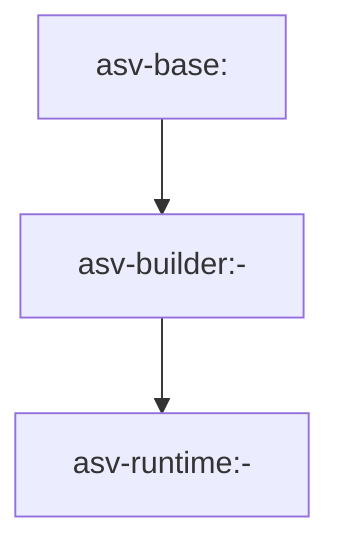

# Variant 2: Split Dockerfiles + Buildx Bake

## Intent
Move from one large Dockerfile to layered images with clear ownership:

- `base` image: slow-changing toolchain
- `builder` image: repo checkout + environment construction
- `runtime` image: benchmark execution only

Coordinate builds using `docker buildx bake`.

## Proposed Repository Shape

```text
docs/
  MULTI_STAGE_DOCKER_2.md
src/datasmith/docker/
  bake.hcl
  dockerfiles/
    base.Dockerfile
    builder.Dockerfile
    runtime.Dockerfile
  scripts/
    build_base.sh
    build_builder.sh
    build_runtime.sh
  context.py
```

## Stage and Image Topology



## Build Workflow

1. Nightly/weekly pipeline refreshes `asv-base`.
2. Commit-triggered pipeline builds `asv-builder` from pinned base digest.
3. Final runtime image copies only required runtime artifacts.
4. `buildx bake` pushes/pulls remote cache to speed repeated commit builds.

## Why This Variant

- Better cache hit rates for large dependencies (micromamba, compilers, toolchains).
- Cleaner ownership by concern: platform, build logic, runtime behavior.
- Strong fit for CI pipelines that publish reusable intermediate images.

## Trade-offs

- Higher operational complexity (registry retention, digest pinning, bake config).
- More moving parts than a single Dockerfile.
- Requires stricter versioning discipline for cross-image compatibility.
