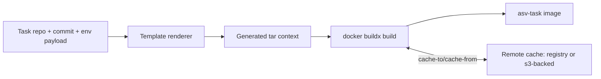

# Variant 3: Generated Per-Task Dockerfile + Shared Base Cache

## Intent
Keep a stable, reusable base image but generate task-specific Docker build contexts at runtime from `DockerContext` metadata.

This leans into DataSmith's per-commit benchmark model where each task may need custom environment logic.

## Proposed Repository Shape

```text
docs/
  MULTI_STAGE_DOCKER_3.md
src/datasmith/docker/
  Dockerfile.template
  stage_snippets/
    base.snippet
    env.snippet
    pkg.snippet
    run.snippet
  context.py
  build_context.py
  s3_cache_manager.py
```

## Runtime Architecture



## Build Workflow

1. Read task metadata (`repo`, `sha`, `ENV_PAYLOAD`, benchmark subset).
2. Render Dockerfile from template + stage snippets.
3. Package deterministic tar context (already supported by `DockerContext`).
4. Build with `buildx` and remote cache import/export.
5. Emit image plus structured build metadata for reproducibility.

## Why This Variant

- Most flexible for repo-specific or commit-specific build quirks.
- Preserves cache efficiency while allowing dynamic stage logic.
- Strong fit for batch execution where build inputs are generated programmatically.

## Trade-offs

- Harder to debug than static Dockerfiles unless rendered Dockerfiles are persisted.
- Requires strict template/version management to stay reproducible.
- Additional testing needed around renderer output and cache key stability.
