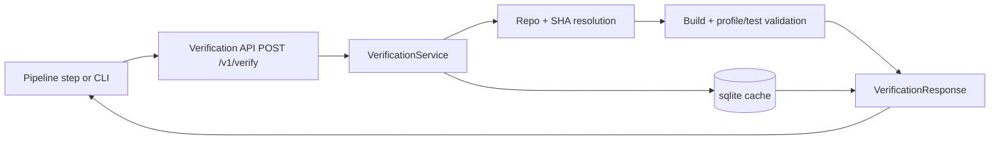

# Variant 1: Synchronous Verification API

## Intent
Introduce a small HTTP microservice that verifies a single `(repo, sha)` pair synchronously and returns the result in one request.

This is the least disruptive change because it reuses existing build and validation logic from `datasmith/docker/validation.py` and existing repo/commit utilities.

## Proposed Repository Shape

```text
docs/
  VERIFICATION_MICROSERVICE_1.md
src/datasmith/verification/
  api.py
  service.py
  models.py
  adapters/
    git_adapter.py
    docker_adapter.py
scratch/scripts/
  verify_repo_sha.py
```

## Request Topology



## Verification Flow

1. Caller sends `repo`, `sha`, and optional execution hints (`python_version`, benchmark subset).
2. Service resolves metadata and validates the commit exists.
3. Service runs build + profile/test checks.
4. Service returns pass/fail plus normalized logs and metadata.
5. Result is cached by `(repo, sha, config_hash)` for quick retries.

## Why This Variant

- Fastest path to production with minimal migration risk.
- Easy integration from existing scripts (`synthesize_contexts.py`, publish flows).
- Clear request/response semantics for manual and automated callers.

## Trade-offs

- Request latency can be high for long builds.
- API replicas are constrained by local Docker capacity.
- Harder to provide robust retry semantics for interrupted requests.
