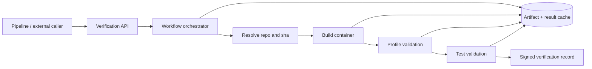

# Variant 3: Workflow-Orchestrated Verification Platform

## Intent
Model repo/sha verification as a resumable workflow with explicit stages (`resolve -> build -> profile -> tests -> attest`) and persistent state.

This variant is optimized for reproducibility, auditability, and large-scale reprocessing.

## Proposed Repository Shape

```text
docs/
  VERIFICATION_MICROSERVICE_3.md
src/datasmith/verification/
  api/
    app.py
    submit.py
  workflow/
    orchestrator.py
    stages.py
    retries.py
  cache/
    keying.py
    artifacts.py
  attest/
    schema.py
    signer.py
  models.py
scratch/scripts/
  replay_verification_workflow.py
```

## Workflow Topology



## Verification Flow

1. Submit `(repo, sha, policy_version)` and receive `verification_id`.
2. Orchestrator checks cache and either short-circuits or schedules stage execution.
3. Each stage persists inputs/outputs and emits structured events.
4. Final output includes stage-level evidence and a signed verification record.
5. Failed workflows can resume from the last durable checkpoint.

## Why This Variant

- Strongest reliability and replayability for critical verification data.
- Natural place for policy versioning and audit trails.
- Minimizes wasted work through stage-level caching.

## Trade-offs

- Highest implementation and ops complexity.
- Requires workflow runtime choices and stricter schema governance.
- Slower initial development compared with synchronous or queued designs.
