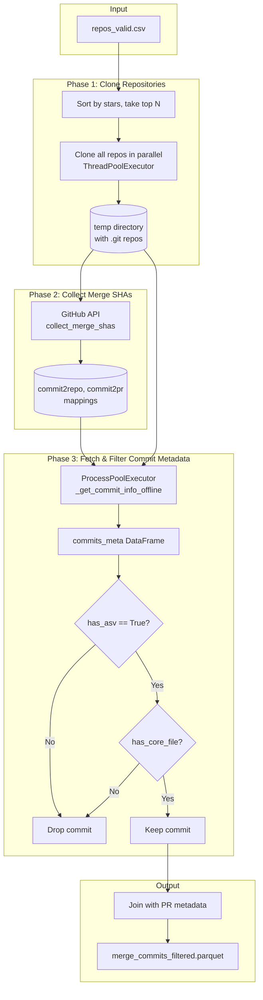

# Design: Docker

| Author(s) | Created | Status | Last Updated |
|-----------|---------|--------|--------------|
| Atharva Sehgal | 2026-02-01 | Draft | 2026-02-01 |

---

## Context and Scope


FormulaCode is distributed as a set of docker images. After a particular repository and commit has been identified as a candidate for benchmarking, the process from building a docker image for that commit is non-trivial and is outlined in the following documents.

---

# Design: Building FormulaCode Images (syn)

## Goals and Non-Goals

### Goals

1. **Collect merge SHAs** — Extract all merged pull requests from each repository within a configurable date range
2. **Filter to core changes** — Exclude commits that only modify docs, tests, benchmarks, or configuration
3. **Verify ASV presence** — Ensure each commit exists in a codebase with ASV benchmarks configured
4. **Enrich with PR metadata** — Attach pull request information to enable downstream analysis
5. **Support incremental updates** — Allow running on a date range to update the dataset monthly

### Non-Goals

- **Performance classification** — Determining if a commit is performance-related happens in `collect_perf_commits.py`
- **Docker image building** — Handled by `synthesize_contexts.py` and `build_and_publish_to_*.py`
- **Benchmark execution** — This script focuses on discovery, not evaluation
- **Fork detection** — Repository filtering happens upstream in repo scraping

---

## Design Overview

The script follows a three-phase architecture: **Clone → Collect → Filter → Export**.



---

## Detailed Design

### 1. Input Processing

The script accepts:

| Argument | Type | Description |
|----------|------|-------------|
| `--filtered-benchmarks-pth` | Path | CSV with `repo_name`, `stars` columns |
| `--output-pth` | Path | Output Parquet file |
| `--max-repos` | int | Limit to top N repos by stars (default: 150) |
| `--since` / `--until` | ISO date | Date range for PR filtering |

The repository list is sorted by stars descending, then truncated. This prioritization ensures we focus on high-impact, well-maintained projects.

### 2. Repository Cloning

```python
with tempfile.TemporaryDirectory(prefix="gh-repos-") as td:
    with ThreadPoolExecutor(max_workers=args.threads) as tp:
        futures = {tp.submit(clone_repo, td, repo_name): repo_name for repo_name in all_repo_names}
```

**Trade-off**: We clone full repositories rather than shallow clones.

- *Advantage*: Full history enables `git format-patch` and accurate `has_asv` detection
- *Cost*: ~2-5 minutes per repository; mitigated by parallel cloning
- *Alternative considered*: GitHub API for file trees — rejected because format-patch requires local repo

### 3. Merge SHA Collection

For each repository, we call `collect_merge_shas()` which performs a paginated GitHub API lookup.

The `collect_merge_shas` function in [`datasmith/execution/collect_commits.py`](../../src/datasmith/execution/collect_commits.py):

- Queries `/repos/{repo}/pulls?state=closed` sorted by creation date
- Filters PRs with non-null `merge_commit_sha` and `merged_at`
- Applies date range filtering with **early termination** — stops paginating when PRs are older than `since`
- Limits to default branch PRs to reduce result set

**Output**: Dictionaries mapping commit SHA → PR metadata.

### 4. Commit Metadata Extraction

```python
with ProcessPoolExecutor(max_workers=args.procs) as pp:
    commit_info = list(pp.map(_commit_info_worker, commit_info_args))
```

The `_get_commit_info_offline` function extracts without hitting GitHub API:

| Field | Source | Purpose |
|-------|--------|---------|
| `sha` | `commit.hexsha` | Primary key |
| `date` | `committed_datetime` | Temporal filtering |
| `message` | `commit.message` | Context for LLM classification |
| `total_additions` | `stats.total` | Change volume metrics |
| `files_changed` | `stats.files` | Core file detection |
| `patch` | `git format-patch` | Full diff for classification |
| `has_asv` | `has_asv()` | ASV configuration check |

**Caching**: Results are cached via `@cache_completion` decorator to SQLite, enabling restarts without recomputation.

### 5. Filtering Logic

Two sequential filters reduce the commit set:

#### Filter 1: ASV Presence

```python
commits_meta = commits_meta[commits_meta["has_asv"]]
```

The `has_asv()` function traverses the commit tree looking for `asv.*.json` files. This ensures we only keep commits from benchmarked states.

#### Filter 2: Core File Changes

```python
commits_merged = commits_meta[commits_meta["files_changed"].apply(has_core_file)]
```

The `has_core_file()` function uses a negative pattern match:

```python
NON_CORE_PATTERNS = re.compile(r"""(
    (^|/)tests?(/|$)        |   # test directories
    (^|/)doc[s]?(/|$)       |   # documentation
    (^|/)benchmarks?(/|$)   |   # benchmark files
    (^|/)\.github(/|$)      |   # CI configuration
    \.rst$ | \.md$              # prose files
)""", re.VERBOSE)
```

A commit is kept if **any** changed file does **not** match these patterns.

### 6. Output Format

The final DataFrame is written as Parquet with these columns:

| Column | Type | Source |
|--------|------|--------|
| `sha` | string | Commit hash |
| `repo_name` | string | `owner/repo` format |
| `date`, `message` | string | Commit metadata |
| `patch` | string | Full git diff |
| `files_changed` | string | Newline-separated paths |
| `pr_*` | various | Expanded PR metadata fields |

---

## Data Flow

```
┌─────────────────────────────────────────────────────────────────────────────┐
│                                 Data Volume                                 │
├─────────────────┬───────────────────────────────────────────────────────────┤
│ Stage           │ Typical Order of Magnitude                               │
├─────────────────┼───────────────────────────────────────────────────────────┤
│ Input repos     │ ~150 repositories                                        │
│ Merged PRs      │ ~10,000+ PRs across all repos                            │
│ After ASV check │ ~5,000 commits (repos without ASV are common)            │
│ After core filt │ ~2,000-3,000 commits (many PRs are docs-only)            │
│ Output          │ Single Parquet file (~50-100 MB)                         │
└─────────────────┴───────────────────────────────────────────────────────────┘
```

---

## Alternatives Considered

### 1. GitHub GraphQL API vs REST API

**Considered**: GraphQL allows fetching PRs + commits + files in a single query.

**Rejected**: 
- GraphQL rate limits are more restrictive for unauthenticated/low-tier tokens
- Response parsing complexity higher for nested data
- Existing REST caching layer (`@cache_completion`) works well

### 2. Shallow Clones

**Considered**: `git clone --depth 1` would be faster.

**Rejected**:
- `git format-patch` requires full history for accurate diffs
- `has_asv()` needs to traverse the tree at the commit's point in time
- Fetch-on-demand is possible but adds complexity and network calls

### 3. In-Memory Processing vs Parquet

**Considered**: Keeping everything in memory for the full pipeline.

**Rejected**:
- Parquet enables pipeline checkpointing — can resume from any step
- Memory usage scales with commit count; Parquet enables out-of-core processing
- Downstream steps (`collect_perf_commits.py`) can filter columns efficiently

---

## Cross-Cutting Concerns

### Performance

| Component | Parallelism | Bottleneck |
|-----------|-------------|------------|
| Repository cloning | `ThreadPoolExecutor` (I/O bound) | Network bandwidth, ~16 threads optimal |
| Commit metadata | `ProcessPoolExecutor` (CPU bound) | Git operations, 8-32 processes optimal |
| GitHub API calls | Sequential with caching | Rate limits (5000/hour authenticated) |

Typical runtime for 150 repos: **15-30 minutes** depending on network and existing cache.

### Error Handling

- **Missing commits**: Fetches from remote if local lookup fails, then returns empty dict
- **API failures**: Logged and skipped; downstream steps handle missing data
- **Cache corruption**: `bypass_cache=True` option for forced refresh

### Observability

- Logging via `configure_logging()` with structured output
- Progress bars via `tqdm` for long-running loops
- Final log line reports row count written

---

## Dependencies

### Internal

| Module | Purpose |
|--------|---------|
| `datasmith.execution.collect_commits.collect_merge_shas` | GitHub PR enumeration |
| `datasmith.execution.utils._get_commit_info_offline` | Local git metadata extraction |
| `datasmith.execution.utils.clone_repo` | Repository cloning wrapper |
| `datasmith.execution.utils.has_core_file` | Non-documentation filter |
| `datasmith.core.git.repository.has_asv` | ASV configuration detection |

### External

| Package | Purpose |
|---------|---------|
| `GitPython` | Git repository operations |
| `pandas` | DataFrame manipulation |
| `tqdm` | Progress reporting |

---

## Future Considerations

1. **Incremental updates** — Currently re-processes all commits in date range; could diff against previous output
2. **Monorepo support** — Some large projects have ASV in subdirectories; `has_asv` may miss these
3. **Branch filtering** — Currently only examines default branch PRs; some performance work lands on release branches
