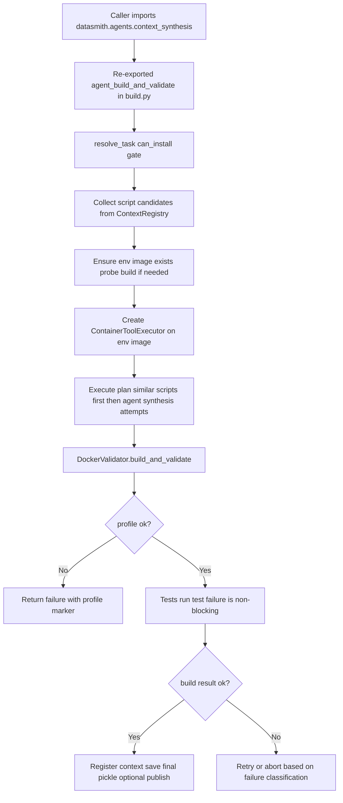

# Design: Context Synthesis (Current State)

| Author(s) | Created | Status | Last Updated |
|-----------|---------|--------|--------------|
| Codex | 2026-02-28 | Current | 2026-02-28 |

---

## Context and Scope

This document describes how "context synthesis" works **today** for:

- [`src/datasmith/agents/context_synthesis.py`](../../src/datasmith/agents/context_synthesis.py)

Important framing: this file is now a **compatibility shim**, not the implementation. It preserves old import paths while re-exporting the active implementation from:

- `src/datasmith/agents/build.py` (agent planning + iterative synthesis loop)
- `src/datasmith/docker/validation.py` (build/profile/tests validation contract)
- `src/datasmith/agents/tools/container.py` (container-backed tools used during synthesis)
- `src/datasmith/docker/cleanup.py` (run artifact cleanup helpers)

So the correct mental model is:

1. `context_synthesis.py` = stable public surface for legacy callers
2. `build.py` + collaborators = real synthesis behavior

---

## Public API Exposed by `context_synthesis.py`

`context_synthesis.py` re-exports:

- `AttemptRecord`
- `BuildScriptAgentStep`
- `BuildScriptProgram`
- `agent_build_and_validate`
- `build_once_with_context`
- `synthesize_script`
- `fast_cleanup_run_artifacts`
- `remove_containers_by_label`

There is no execution logic in this module beyond imports and `__all__`.

Design intent:

- Keep downstream code working without immediate refactors
- Allow internals to evolve in specialized modules

Trade-off:

- The module name suggests it contains synthesis logic, but now only forwards symbols

---

## High-Level Runtime Flow

When callers use `context_synthesis.agent_build_and_validate(...)`, they actually execute `datasmith.agents.build.agent_build_and_validate(...)`.

At runtime:

---

## Step-by-Step: What Happens in `agent_build_and_validate`

## 1) Task feasibility and short-circuit gates

The function first resolves task metadata (`resolve_task`) and exits early if `can_install` is false.

Then it handles operational flags:

- `ignore_exhausted` / `only_exhausted`: skip work based on existence of a terminal attempt pickle
- `only_final`: validate only against an existing final pickle (`final_check`)

These gates avoid paying full synthesis/build cost repeatedly.

## 2) Seed candidate scripts from historical contexts

The synthesis loop is not purely generative. It starts by retrieving:

- default env template: `context_registry.get_default(tag="env")[1].building_data`
- similar contexts: `context_registry.get_similar(task.with_tag("env"))`

Candidate scripts are the `building_data` values from similar contexts (bounded by `args.max_similar_candidates`). If none exist, it falls back to the default template.

This makes synthesis "retrieve-first, generate-second."

## 3) Ensure probe environment image exists

Before agent tool calls can work, an env image must exist. If missing:

- it builds one with `build_once_with_context(..., probe=True)`
- it uses the chosen probe context (most similar if available, else default)

`build_once_with_context` injects key Docker build args:

- `REPO_URL`
- `COMMIT_SHA`
- `ENV_PAYLOAD`
- `PY_VERSION`
- `BASE_IMAGE` (from `DATASMITH_BASE_IMAGE`, default `buildpack-deps:jammy`)
- optional `BENCHMARKS`

## 4) Create tool executor + validator

The function instantiates:

- `ContainerToolExecutor` bound to the env image
- `DockerValidator` with configured build/run/profile/test budgets

From here, each attempt either reuses a retrieved script or synthesizes a new one.

---

## Core Attempt Loop (`_execute_build_plan`)

Execution plan order is deterministic:

1. Similar-context script attempts
2. Agent-synthesized attempts (up to `max_attempts`)

Each iteration:

1. Choose script source
2. Build `DockerContext(building_data=script)`
3. Optionally persist attempt pickle (`attempt_idx >= 1`)
4. Run `validator.build_and_validate(...)`
5. If success: register/save/publish and return
6. If failure: decide retry vs abort

### How retry feedback is constructed

For agent attempts, retry context is derived from the previous `BuildResult`:

- `stderr_tail` and `stdout_tail` from prior attempt
- inferred failure location:
  - contains `[profile_ok=` -> `profiler`
  - contains `[tests_ok=` -> `pytest`
  - else `build`
- `failure_more` string:
  - `"{location} timeout"` if prior `rc == 124`
  - else `"{location} failed rc={rc}"`

This payload is fed into `synthesize_script(...)`.

### Retry abort condition

Iteration stops early if failure appears unrelated to script/verification:

- result is failure
- stderr exists
- stderr does **not** mention `docker_build_pkg.sh`
- failure stage is not `profile`/`tests`

Rationale: avoid wasting synthesis attempts on infrastructure/system failures.

---

## Agent Synthesis Internals (`BuildScriptProgram`)

`BuildScriptProgram` is a DSPy module wrapping a single predictive step schema (`BuildScriptAgentStep`) in a bounded loop.

### Inputs carried into each DSPy step

- repo identity and commit metadata
- latest stderr/stdout logs
- coarse failure descriptor (`failure_more`)
- previous build script
- `repo_facts_json`
- toolbelt description
- cumulative `messages_log` of prior tool actions/observations

### Action model

Per step, the model emits:

- `next_action`
- `action_input` (JSON-ish payload)
- optional `docker_build_script`

If `next_action` is `none` or `finish` and a script is present, synthesis ends.

Otherwise, action is dispatched through `tool_executor.choose_action(...)`, and the observation is appended to `messages_log` (truncated to 4000 chars per step).

`probe_repo` additionally refreshes `repo_facts_json` from the live container.

### Toolbelt available to the model

- `probe_repo`
- `list_tree`
- `read_file`
- `try_import`
- `exec_arbitrary`

These operate inside a persistent container started from the env image.

### Hard guards on generated script

Before returning, `BuildScriptProgram` enforces:

- required anchors present:
  - `/etc/profile.d/asv_utils.sh`
  - `/etc/profile.d/asv_build_vars.sh`
- disallowed fragments absent:
  - markdown code fences
  - IPython imports

Guard failure raises `RuntimeError`.

---

## Container Tooling Used During Synthesis

`ContainerToolExecutor` in `agents/tools/container.py` manages a long-lived `PersistentContainer`.

At startup it:

1. boots container from env image
2. discovers repo root heuristically (`git`, common paths, bounded `find`)
3. computes repository facts JSON

### Repository facts include

- `asv_conf`, `asv_dir`, `asv_json_candidates`
- `pyproject`, `setup_cfg`, `setup_py`
- requirements/environment files
- project name candidates (with hyphen/underscore alternates)
- python versions from ASV config
- `installed_packages` from `/etc/asv_env/installed_packages_*`

This facts payload is central to context synthesis quality and avoids blind package-guessing.

### Tool dispatch behavior

- Unknown action -> `[noop] ...`
- Tool parsing errors -> `[tool_error] ...`
- `exec_arbitrary` caps command length and output snippet size

---

## Validation Contract That Feeds Back Into Synthesis

`DockerValidator.build_and_validate(...)` performs:

1. Docker build (`build_once_fn`)
2. profile validation
3. test validation (only if profile passed)

### Important acceptance semantics

- Profile failure is blocking (`ok=False`, `failure_stage="profile"`)
- Test failure is **non-blocking** (logged, but final `ok=True` if profile passed)
- Timeout `rc=124` in profile/tests quick checks is treated as success

### Feedback markers inserted into logs

Validator appends structured markers in combined stderr:

- `[profile_ok=0|1]`
- `[tests_ok=0|1]` (when tests run)

The attempt loop reads these markers to decide failure location for next synthesis prompt.

---

## Artifacts and Persistence

On intermediate attempts:

- pickles are saved as `{owner}-{repo}-{sha}-attempt-{idx}.pkl` for `idx >= 1`

On success:

1. register context in `ContextRegistry` (under `task.with_tag("pkg")`)
2. optionally save registry file (`args.context_registry`)
3. optionally publish final image to Docker Hub
4. save final pickle `{owner}-{repo}-{sha}-final.pkl`

Result payload includes normalized attempt history (`attempt`, `ok`, `rc`, log tails, `building_data`).

---

## Failure Modes and Operational Behavior

## Notable robustness behaviors

- probe image creation is skipped if env image already exists
- image existence checks retry with exponential backoff
- cleanup in `finally`: tool executor shutdown + container/image/build-cache cleanup by run label

## Notable sharp edges

1. `synthesize_script` catches all exceptions and returns `""`, so upstream exception handling around synthesis is rarely triggered.
2. An empty synthesized script then fails at build time, which can obscure the original synthesis failure cause.
3. Because test failures are non-blocking, a "successful" build may still have broken tests.
4. `context_synthesis.py` naming can mislead readers into expecting implementation in that file.

---

## Summary of "How Context Synthesis Works Today"

Today, context synthesis is a **backward-compatible façade** (`context_synthesis.py`) over a retrieve-and-repair loop in `build.py`:

1. try context-registry script priors first
2. if needed, iteratively synthesize with DSPy using failure tails + repo introspection tools
3. validate build/profile/tests with markerized feedback
4. persist successful contexts for future retrieval

The net effect is a pragmatic hybrid: historical script reuse for speed and stability, plus bounded agent-driven synthesis when retrieval fails.
