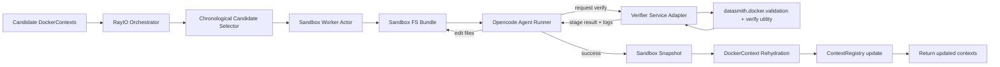

# Design: Synthesis Overhaul (Sandbox + Agent + Verifier + RayIO)

| Author(s) | Created | Status | Last Updated |
|-----------|---------|--------|--------------|
| Codex | 2026-02-28 | Proposal | 2026-03-01 |

---

## Context and Scope

`src/datasmith/agents/context_synthesis.py` is currently a compatibility shim that re-exports `agents/build.py` logic. The current loop works, but it tightly couples:

1. Script synthesis prompt logic
2. Docker build/validation execution
3. Retry orchestration
4. Persistence back into `ContextRegistry`

This document proposes a full overhaul with three explicit components:

1. Development Sandbox
2. Opencode Agent
3. Verification Utility/Microservice

And a fourth cross-cutting execution layer:

4. RayIO parallel orchestration (implemented with Ray Core tasks/actors)

---

## Goals

1. Fast iteration per candidate context via warm sandboxes and incremental edits.
2. High throughput over large candidate sets via horizontal Ray parallelism.
3. Modularity with strict interfaces between sandbox, agent, verifier, and orchestrator.
4. Deterministic artifacts so successful outputs are reproducible and auditable.
5. Easy migration from existing `dataset/verify.py` and `ContextRegistry`.
6. Preserve and strengthen chronological cache-first reuse of previously successful scripts.

## Non-Goals

1. Replacing Docker as the build and runtime substrate.
2. Rewriting `datasmith.docker.validation` internals immediately.
3. Solving global benchmark scheduling beyond synthesis/verification.

---

## Proposed Architecture



Key design rule: each component has a narrow contract and can be tested independently.

---

## Chronological Cache Integration (Cache-First Stage)

Current behavior already does this and must be retained: for a target `(owner, repo, sha)`, we first try scripts from other successful contexts in the same repo, ordered by commit-date proximity to the target commit.

In overhaul mode, this becomes an explicit pre-agent stage.

## Selection Rules

1. Candidate pool is restricted to same `owner/repo`.
2. Ordering is by `abs(target.commit_date - candidate.commit_date)` when available.
3. Only contexts with verifier-backed success provenance are eligible.
4. Cap to top `N` (`max_similar_candidates`).
5. Deduplicate by script/content hash so equivalent scripts are not retried.

If commit date is missing, fallback order is deterministic (`created_unix`, then SHA).

## Cache-First Execution

For each selected candidate, before any agent edit loop:

1. Materialize sandbox from target context.
2. Inject candidate `docker_build_pkg.sh` (or corresponding editable layer script).
3. Run verifier immediately.
4. If verifier succeeds, short-circuit and return updated context.
5. If verifier fails, record structured failure and continue to next candidate.

Only after all `N` candidates fail do we enter the opencode edit loop.

## Agent Warm Start from Cache Attempts

Agent attempt 1 starts from the best failed cached candidate (rank-1 failure by chronology), with:

1. Candidate script contents.
2. Failure stage (`build/profile/tests`) and condensed logs.
3. Attempt history from earlier cache-first verifier runs.

This keeps synthesis effort focused on delta-fixes instead of full-script regeneration.

## Parallel and Registry Safety

1. Workers read from an immutable registry snapshot for selection.
2. A single-writer registry actor commits successful outputs.
3. New successes become eligible candidates for subsequent batches.
4. Per-image and per-task locks prevent duplicate work under parallel execution.

## Provenance Fields to Persist

Persist these alongside successful contexts so chronological cache stays trustworthy:

1. `verified_ok: true`
2. `verified_at_unix`
3. `source_task_key`
4. `script_hash`
5. `verifier_digest` (policy/config hash)
6. `synthesis_mode` (e.g., `sandbox-opencode-v1`)

---

## Component 1: Development Sandbox

## Purpose

Provide a mutable filesystem workspace per `(owner, repo, sha)` containing:

- `Dockerfile`
- `entrypoint.sh`
- `docker_build_base.sh`
- `docker_build_env.sh`
- `docker_build_pkg.sh`
- `docker_build_run.sh`
- `docker_build_final.sh`
- `profile.sh`
- `run-tests.sh`
- `task.txt`
- `sandbox_manifest.json` (new)
- `attempts/` (new: logs, verifier results, diffs)

This mirrors dataset task directories (`dataset/formulacode_verified/{repo}/{sha}`) so tooling stays familiar.

## Sandbox Data Model

Introduce a versioned manifest:

```json
{
  "schema_version": 1,
  "task_key": "owner/repo/sha",
  "base_context_hash": "sha256:...",
  "files": {
    "docker_build_pkg.sh": "sha256:...",
    "run-tests.sh": "sha256:..."
  },
  "created_at": "2026-02-28T00:00:00Z"
}
```

Benefits:

1. Fast change detection (file hash diff).
2. Reproducibility checks before writing back to registry.
3. Easy cache keys for verifier and retry deduplication.

## Networking and Isolation

Sandbox container/network requirements:

1. Use a user-defined bridge network per sandbox batch (not default bridge).
2. Add host access using `--add-host host.docker.internal=host-gateway`.
3. Avoid host-network mode for default operation.

Rationale:

- User-defined bridges give better isolation and service scoping than default bridge.
- `host-gateway` allows controlled host reachability without full host namespace sharing.
- Host networking reduces network isolation and is only for explicit debug/perf cases.

Optional hardening:

1. Run Docker rootless on worker nodes when feasible.
2. Set explicit CPU/memory limits for sandbox and verifier containers.

---

## Component 2: Opencode Agent

## Runtime Configuration

Use:

- `scratch/configs/opencode_oss120b_config/opencode.json`

This should be injected as the opencode home/config for every agent session.

## Agent Contract

The agent receives:

1. Sandbox path
2. `task.txt` contents
3. Previous verifier result (stage + condensed logs)
4. Editable file allowlist (`docker_build_*.sh`, optionally `run-tests.sh`, `profile.sh`)
5. Exit conditions and budget

The agent can:

1. Edit allowed files
2. Run verifier command/API
3. Read resulting structured feedback

The agent cannot:

1. Mutate files outside sandbox
2. Bypass verifier as success criterion

## Prompting Strategy

Use the current DSPy loop as a template, but move to a file-edit objective prompt:

1. State target outcome: `build + profile + tests` all green.
2. Include last failing stage and likely root cause.
3. Include strict edit scope and idempotency constraints.
4. Require brief change rationale per attempt in `attempts/attempt_N.md`.

## Agent Loop (per context)

```text
for attempt in 1..max_attempts:
  run opencode with sandbox + prompt
  run verifier
  if verifier.ok:
    snapshot sandbox and stop
  else:
    feed structured verifier output back into next prompt
return failure if attempts exhausted
```

---

## Component 3: Verification Utility / Microservice

## Purpose

Verification is the source of truth for success. This should be exposed as:

1. Library call (in-process adapter) for low latency.
2. Optional HTTP microservice wrapper for remote workers.

The implementation should reuse existing `dataset/verify.py` and `datasmith.docker.validation` behavior.

## Contract

Input:

```json
{
  "sandbox_path": "/path/to/sandbox",
  "task_key": "owner/repo/sha",
  "verify_profile": true,
  "verify_tests": true
}
```

Output:

```json
{
  "ok": false,
  "stage": "tests",
  "rc": 1,
  "summary": "pytest collection error",
  "stdout_tail": "...",
  "stderr_tail": "...",
  "artifacts": {
    "failure_json": ".../failure.json",
    "logs_dir": ".../logs"
  }
}
```

## Verification Stages

1. Build image from sandbox files.
2. Run profile validation.
3. Run pytest validation.
4. Return structured result plus machine-readable stage markers.

Design choice: in overhaul mode, treat test failure as blocking by default (configurable), so agent actually repairs tests instead of passing on profile-only success.

---

## RayIO Execution Model

## Why RayIO

Ray Core fits this workflow because it supports:

1. Parallel tasks and stateful actors.
2. Fault-tolerant retries (`max_retries`, `retry_exceptions`).
3. Backpressure (`ray.wait`) to avoid unbounded pending queues.
4. Placement groups for co-locating related actor bundles.
5. Runtime environment isolation per job/actor.

## Actor and Task Topology

1. `SynthesisSupervisor` (driver or named actor)
2. `ContextWorker` actor per candidate context
3. Optional shared `VerifierActor` pool for warm verifier containers
4. Final aggregation task to write updated contexts

## Per-Context Worker Responsibilities

1. Materialize sandbox from `DockerContext`.
2. Run cache-first chronological candidate verifier attempts.
3. If needed, run iterative agent/verifier loop.
4. Emit attempt events.
5. Return updated snapshot or terminal failure.

## Scheduling and Resource Controls

Use Ray resources to prevent Docker overload:

1. `num_cpus` and optional custom `{"docker_slot": 1}` per verification-heavy actor.
2. `ray.wait` in supervisor to cap inflight contexts.
3. Avoid too fine-grained tasks; one context should be one coarse unit of work.

Placement strategy:

1. `PACK`/`STRICT_PACK` for co-locating sandbox+verifier when node-local cache reuse matters.
2. `SPREAD` for cluster-wide throughput when caches are less important.

## Fault Tolerance

1. Configure `max_retries` for transient infra failures.
2. Use `retry_exceptions` allowlist for known transient errors.
3. Persist attempt checkpoints after each verifier run.

## Runtime Environments

Use `runtime_env` to pin worker dependencies and working directory per job, so workers are reproducible and not coupled to global node state.

---

## ContextRegistry Integration

Current registry stores `Task -> DockerContext`. Overhaul adds a reversible bridge:

1. `docker_context_to_sandbox(context, task) -> SandboxBundle`
2. `sandbox_to_docker_context(bundle) -> DockerContext`

On success:

1. Read all sandbox files into a new `DockerContext`.
2. Register under `task.with_tag("pkg")`.
3. Save registry file atomically.

Chronological cache behavior in registry-backed lookup:

1. Keep `get_similar` semantics: same repo, nearest commit date first.
2. Filter to verifier-proven-success contexts only.
3. Return top `N` candidates for cache-first verifier attempts.
4. Include exact-match successful context first when available (fast no-edit path).

Store provenance metadata next to context:

1. synthesis mode = `sandbox-opencode-v1`
2. attempt count
3. final verifier digest
4. source context hash

---

## Performance Plan

1. Keep verifier containers warm per worker to avoid cold starts.
2. Rebuild only when editable files changed (hash gate).
3. Cache verifier results by `(context_hash, verify_policy_hash)`.
4. Limit log payload sizes and persist full logs to artifact paths.
5. Use batch submission + `ray.wait` backpressure instead of submitting all contexts at once.
6. Track chronological cache hit rate and short-circuit success rate as first-class metrics.

---

## Modularity and Maintainability Plan

Proposed module layout:

```text
src/datasmith/synthesis_overhaul/
  models.py
  sandbox.py
  opencode_agent.py
  verifier_client.py
  verifier_service.py
  rayio_orchestrator.py
  context_registry_adapter.py
  prompts.py
```

Design rules:

1. No cross-module file mutation outside typed interfaces.
2. All component boundaries use typed request/response models.
3. Every attempt writes structured JSON event logs.
4. Unit tests per component plus end-to-end sandbox loop tests.

---

## End-to-End Workflow (Target)

1. User submits large candidate `DockerContext` list.
2. RayIO supervisor starts bounded set of `ContextWorker` actors.
3. Each worker:
   1. Creates sandbox from candidate context.
   2. Runs cache-first chronological candidate verifier pass (top `N` similar successful contexts).
   3. If cache-first pass does not succeed, runs opencode edit + verifier loop until success/exhaustion.
   4. On success, rehydrates updated `DockerContext`.
4. Supervisor aggregates successful updates and returns them.
5. Registry update can be immediate or batched commit mode.

---

## Migration Plan

## Phase 1: Extract interfaces without behavior change

1. Add sandbox serialization helpers.
2. Wrap existing `dataset/verify.py` as library + CLI adapter.
3. Add a local single-context sandbox loop (no Ray).

## Phase 2: Replace DSPy loop with opencode loop

1. Keep old path behind feature flag.
2. Add structured attempt artifacts and prompts.

## Phase 3: Introduce RayIO orchestrator

1. Parallelize across contexts with bounded inflight.
2. Add resource policies and retry rules.
3. Validate scale behavior on synthetic batches.

## Phase 4: Deprecate old synthesis entrypoint

1. Keep `context_synthesis.py` re-export compatibility.
2. Route `agent_build_and_validate` to overhaul mode via flag/default switch.

---

## Risks and Mitigations

1. Docker saturation under high parallelism.
Mitigation: Ray resource quotas + `ray.wait` backpressure + per-node limits.

2. Non-deterministic agent edits.
Mitigation: strict file allowlist, attempt artifacts, verifier-gated success only.

3. Network/security drift in sandbox runtime.
Mitigation: user-defined bridge defaults, explicit host-gateway mapping, optional rootless mode.

4. Registry corruption on concurrent writes.
Mitigation: single-writer actor or atomic batched writes with lock and fsync.

---

## Acceptance Criteria

1. For a fixed candidate set, overhaul mode achieves higher success/hour than current synthesis.
2. Each completed context has reproducible sandbox artifacts and verifier traces.
3. N contexts can run concurrently with bounded memory and no unbounded pending queue growth.
4. Successful outputs are written back as valid `DockerContext` objects and pass existing verification.
5. Chronological cache-first stage resolves a measurable fraction of contexts without agent edits.

---

## External References

Ray documentation:

- https://docs.ray.io/en/latest/ray-core/tasks.html
- https://docs.ray.io/en/latest/ray-core/actors.html
- https://docs.ray.io/en/latest/ray-core/patterns/limit-pending-tasks.html
- https://docs.ray.io/en/latest/ray-core/patterns/limit-running-tasks.html
- https://docs.ray.io/en/latest/ray-core/patterns/too-fine-grained-tasks.html
- https://docs.ray.io/en/latest/ray-core/fault_tolerance/tasks.html
- https://docs.ray.io/en/latest/ray-core/actors/concurrency_group_api.html
- https://docs.ray.io/en/latest/ray-core/scheduling/placement-group.html
- https://docs.ray.io/en/latest/ray-core/handling-dependencies.html

Docker documentation:

- https://docs.docker.com/engine/network/drivers/bridge/
- https://docs.docker.com/reference/cli/docker/container/run/#add-host
- https://docs.docker.com/engine/network/drivers/host/
- https://docs.docker.com/engine/security/rootless/
