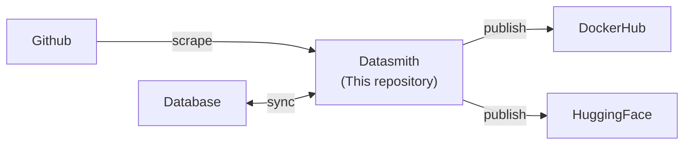

---
tags:
  - documentation
  - formulacode
  - datasmith
---
## Abstract

Datasmith is a package for automatically building and running FormulaCode tasks. The package is engineered to support any repository-level, verification-by-execution based coding task that heavily uses docker and github.

## High level overview



## Use cases

`datasmith` helps you manage your github-centric benchmark. Each benchmark contains a task which revolves around a GitHub Issue (or Pull request; which is just an issue with extra details). We include some helpful properties to start off:

```python
# Datasmith helps you manage your github-centric benchmark.
import datasmith as ds

# Construct a bare PR (fields empty — useful when you already have the data):
pr = ds.PR(repository="pandas-dev/pandas", issue_number=1234, title="Speed up groupby", ...)

# Or fetch a fully-hydrated PR (tries Supabase cache first, then GitHub API):
pr = await ds.PR.fetch("pandas-dev/pandas", 1234)
```

You can run basic operations to get relevant data:
```python
# You can get the merge commit sha of the pull request
pr.merge_commit

# This returns all the comments on the pull request.
pr.scrape_comments()

# Want to make a problem statement? A pull request can be rendered into a problem statement as well.
pr.render()

# Don't want to expose the users? We support anonymizing the data as well.
pr.render(anonymize=True)

# You can scrape for other linked issues.
issues = pr.scrape_links(depth=2, only_issues=True, limit=6)
```


Don't like the current set of operations? Define your own!

```python
# You can also define custom hooks for dataset-specific operations.
from dspy import ChainOfThought
summarizer = ChainOfThought("document -> summary")

def summarize(obj: pr.PR) -> str:
	doc = pr.render(anonymize=True)
	return summarizer(doc).summary

ds.PR.register_hook(summarize)
pr = ds.PR(repository="pandas-dev/pandas", issue_number=1234)
pr.summarize()
```

In fact, `render()` is just a pre-registered hook:
```python
# or use one of the pre-registered hooks:
pr.render() # Yep, the render is defined as a hook.
pr.attribute_compliance() # So is this attribute filter

```

Almost all our supported operations can be run asynchronously. Here's how to run some formulacode specific operations:
```python
# We only define the async runners for formulacode; but they might generalize to your task!
ds.runners.classify_prs(prs=[...], classifier=ds.agents.perf_classifier, n_concurrent=64)
```

By default, each operation is cached in Supabase so you don't keep hitting expensive hooks.
```python
ds.runners.classify_prs(prs=[...], classifier=ds.agents.perf_classifier, n_concurrent=64) # Reads from cache. No additional cost!
```

A pull request is useless if you cannot build a reproducible environment for it. Datasmith supports building docker images for any pull request. However, you must define a verifier to ensure the docker image builds properly
```python
ds.docker.build_image(pr, build_script={"default": ds.docker.DEFAULT_BUILD_SCRIPT}, verifier=ds.docker.PythonVerifier("""import pandas as pd; print(pd.zeros(10))""")
# Checking if base image exists...                                   [PASS]
# Checking if pandas-dev/pandas image exists...                      [PASS]
# Checking if pandas-dev/pandas/1234 containre script exists...      [FAIL]
# Attempt 1/1 with script default...                     [PASS]
# Returning docker build script...
```

There is already a pre-registered hook for loading a docker environment, though we don't really use it (or recommend using it — prefer `terminal-bench` for evaluation)....
```python
from python_on_whales import docker
container = pr.get_container()  # detached container via python-on-whales
container.execute(["ls"])
container.stop()
container.remove()
```

Instead, we define tasks using `terminal-bench`'s formulacode adapter:
```python
from terminal_bench.adapters.formulacode import FormulaCodeAdapter
from terminal_bench.agents.agent_name import AgentName
from terminal_bench.harness.harness import Harness

adpater = FormulaCodeAdapter(task_dir="fctasks/", force=True)
fceval.adapter.generate_task(pr.to_record())
run = Harness(
	output_path="fcevals/",
	dataset_path='dataset_path',
	task_ids=[pr.to_record().task_id]
	agent_configs=[
		 {"agent_name": AgentName.NOP, "model_name": "nop",},
		 {"agent_name": AgentName.ORACLE, "model_name": "oracle",},
])

print(run.results[0].is_resolved) # Did the oracle pass the test cases and get a speedup > 1.00 over the baseline?
pr.publish() # Puts the task on huggingface (and the local database)
```

One of the main features of `datasmith` is the ability to automatically synthesize docker containers for a pull request. Here is how it works...

```python
pr_buildscript = ds.agents.synthesize_image(pr, verifier=ds.docker.MultiObjVerifier)
# Checking if base image exists...                   [PASS]
# Checking if pandas-dev/pandas image exists...      [FAIL]
# Making pandas-dev/pandas container...
# [DONE] container available at formulacode/pandas-dev-pandas:latest
# Checking if pandas-dev/pandas/1234 container script exists... [FAIL]
# Found 4/10 similar scripts from pandas-dev/pandas
# Attempt 1/1 with script 1...                           [FAIL]
# Attempt 1/1 with script 2...                           [FAIL]
# Attempt 1/1 with script 3...                           [FAIL]
# Attempt 1/1 with script 4...                           [FAIL]
# Fail with existing scripts.
# Using Synthesizer: CodexInstalledAgent
# Attempt 1/3 with Model gpt-oss-120b...                 [FAIL]
# Attempt 2/3 with Model gpt-oss-120b...                 [FAIL]
# Attempt 3/3 with Model gpt-oss-120b...                 [FAIL]
# Attempt 1/3 with Model claude-sonnet-3.5               [PASS]
# Adding container script to database
# [DONE] container available at formulacode/pandas-dev-pandas-1234:latest
# Returning container build script...
```

If ALL attempts fail, `synthesize_image` logs every attempt (stderr, stdout, model, script used) to Supabase and returns `None`. Failed PRs can be retried later — the logged attempts provide context for debugging or a future synthesis run.

This can be run asynchronously as well for multiple tasks (WARNING: Might be expensive!)!
```python
pr_build_scripts = ds.runners.synthesize_images(prs=[...], verifier=ds.docker.MultiObjVerifier, n_concurrent=64)
# Returns list[str | None]. None entries are PRs where synthesis failed.
```

How do we make a dataset out of this? The easiest way to do this locally is to use Supabase queries on the database.
```python
from ds.utils.db import get_client
sb = get_client()
rows = sb.table("pull_requests") \
    .select("*") \
    .gte("pr_merged_at", "2021-01-01") \
    .lt("pr_merged_at", "2023-01-01") \
    .not_.is_("container_name", "null") \
    .execute()
records = [ds.PR.from_row(r).to_record() for r in rows.data]
```


## Architecture
Datasmith contains seven high-level modules. FormulaCode-specific logic lives directly in the appropriate `ds.*` module (no separate examples folder) since FormulaCode is the primary consumer.

* `ds.github`: Pydantic v2 models for GitHub issues and PRs. All expensive methods use the `@supabase_cached` decorator (from `ds.utils.db`). GitHub API access via `httpx` + `ds.utils.tokens`.
	* `ds.github.issue`: The `Issue` model. Core methods: `scrape_comments()`, `scrape_links()`.
	* `ds.github.pr`: The `PR` model (extends Issue). Properties: `merge_commit`, `patch`. Compliance methods below are regular `@supabase_cached` methods (not dynamically registered hooks).
	* `ds.github.hooks`: Implementation modules for PR compliance checks and rendering.
		* `ds.github.hooks.pr.render`: Constructs a problem statement from a pull request.
		* `ds.github.hooks.pr.exists`: Checks if a merge commit exists and if we can pull the diff patch. Rejects the PR otherwise.
		* `ds.github.hooks.pr.attribute_compliance`: Checks if the PR has all required attributes (e.g. merged, has patch, correct date range).
		* `ds.github.hooks.pr.llm_compliance`: Runs `ds.agents.perf_classifier` and rejects the PR if it's not performance-improving.
* `ds.docker`: Dependencies for constructing and maintaining docker tasks.
	* `ds.docker.build_image`: Builds a docker image for a PR. Uses `python-on-whales` (not `docker-py`) — it wraps the Docker CLI via subprocess, is thread-safe by design, and scales to 40-50+ concurrent threads without connection pool issues.
	* `ds.docker.verify`: Abstract verifier class that can be run inside a docker image to check correctness.
	* `ds.docker.python_verify`: A simple "python smoke test" verifier. Mostly for exposition.
	* `ds.docker.verify.smoke`: A simple smoke test for the build (`import {package_name}`).
	* `ds.docker.verify.profile`: Collects asv benchmarks and runs the asv profiler with `--quick`.
	* `ds.docker.verify.pytest`: Collects the pytest suite with `testrunner` without errors. Runs pytest with a 45-second timeout.
	* `ds.docker.verify.MultiObjVerifier`: Chains `smoke -> profile -> pytest` verifiers.
* `ds.agents`: Agents for dynamic filtering and automatic build script generation. Simple agents use `dspy`; complex agents use an installed agent (like `codex`). Each module should define its default prompt as a constant.
	* `ds.agents.dspy.classifier`: Abstract base class for DSPy classifiers.
	* `ds.agents.codex`: Wrapper for invoking codex in fully autonomous mode (`codex exec --full-auto "..."`). Manages the working directory, prompt construction, and output capture via `--json` streaming.
	* `ds.agents.synthesizer`: The reflexive agent that synthesizes docker build scripts. This is the most complex part of datasmith — see the component design doc for details.
	* `ds.agents.decompose_pr`: A DSPy module that extracts structured details from a PR's problem statement.
	* `ds.agents.perf_classifier`: A DSPy classifier that checks if a PR is performance-improving.
	* `ds.agents.optimization_classifier`: Classifies a PR by optimization category and estimated difficulty.
	* `ds.agents.cmd_classifier`: Classifies a bash command by category.
* `ds.runners`: Scalable async runners that store inputs/outputs in Supabase. Each runner takes `n_concurrent` and manages its own progress tracking.
	* `ds.runners.scrape_repos`: Finds compliant GitHub repositories using the search API. Takes attribute filters (minimum stars, search query) and adds results to the repository table.
	* `ds.runners.scrape_commits`: For a given repository, scrapes all commits and runs compliance checks (`.exists`, `.attribute_compliance`, `.llm_compliance`) on each PR.
	* `ds.runners.synthesize_images`: For a given set of PRs, runs `ds.agents.synthesizer` for each. Returns `list[str | None]`. This is expensive and must scale to ~20k PRs.
	* `ds.runners.classify_prs`: Runs a classifier agent across a set of PRs concurrently.
* `ds.utils`: Shared utilities.
	* `ds.utils.db`: Supabase client initialization, common query helpers, and the `@supabase_cached` decorator.
	* `ds.utils.tokens`: GitHub token pool with random selection per request. Blocks on rate limits using GitHub's `X-RateLimit-Reset` header with exponential backoff as a fallback.
	* `ds.utils.core`: Common utilities (logging, config, etc).
* `ds.publish`: Publishes verified tasks to DockerHub and HuggingFace.
	* Dataset versioning follows `@YYYY-MM` (e.g. `formulacode@2026-03`). The dataset is updated monthly.
	* Each publish run creates a new version tag on the HuggingFace dataset and pushes verified images to DockerHub.
* `ds.update`: Pipeline orchestrator. Updates datasmith to find compliant tasks within a given date range `YYYY-MM-DD`. This is an ordered run of:
	1. `ds.runners.scrape_commits`
	2. `ds.runners.synthesize_images`
	3. `ds.publish`

### FormulaCodeRecord

The bridge between datasmith's PR model and `terminal-bench`'s evaluation harness:

```python
@dataclass
class FormulaCodeRecord:
    container_name: str
    patch: str
    task_id: str
    gt_hash: str        # pr.merge_commit_sha
    base_commit: str    # pr.base_sha
    date: str           # pr.merged_at
    instructions: str   # rendered problem statement (from ds.github.hooks.pr.render)
    classification: str # from ds.agents.optimization_classifier
    difficulty: str     # normalized difficulty estimate
    image_name: str     # full Docker image reference
```

`PR.to_record()` constructs this from the PR's Supabase row. Returns `None` if any required field is missing or invalid.


## Verification

We have a simple test to ensure that all the variables we need are properly defined...
```bash
$ python preflight.py
# Reading variables from tokens.env...
# Connecting to Supabase...                                             [PASS]
# Checking Supabase tables: pull_requests, repositories, hook_cache...  [PASS]
# Found provider: localhost:11330
# Found provider: portkey
# Found dockerhub: formulacode
# Found Github Tokens: xxxx,yyyy,zzzz
# Checking if gpt-oss-120b is accessible through provider: localhost:11330...
# Checking if claude-sonnet-3.5 is accessible through provider portkey...
# Checking pull/push capabilities for formulacode...
# Checking read/write on Supabase (pull_requests)...                    [PASS]
# Checking validity of github token: xxxx
# Checking validity of github token: yyyy
# Checking validity of github token: zzzz
# Done! Now run pytest.
```

After that works, you can run the tests locally using `pytest`. Each new functionality MUST have a test. We aim to have 100% code coverage in this repository.
```python
$ pytest
# Can take a long time...
```

----
****
