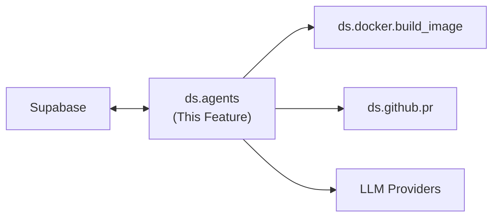

---
tags:
  - documentation
  - formulacode
  - datasmith
---

## Abstract

This document covers the `ds.agents` module — agents for dynamic filtering and automatic build script generation. Simple agents use `dspy`; complex agents use a coding agent (like `codex`) running in fully autonomous mode. Each module defines its default prompt as a constant.

## High level overview



## Modules

* `ds.agents.dspy.classifier`: Abstract base class for DSPy classifiers. Defines the interface for classification agents that take a PR and return a label.
* `ds.agents.codex`: Wrapper for invoking codex in fully autonomous mode (`codex exec --full-auto "..."`). Manages the working directory, prompt construction, and output capture via `--json` streaming.
* `ds.agents.synthesizer`: The reflexive agent that synthesizes docker build scripts. This is the most complex part of datasmith.
* `ds.agents.decompose_pr`: A DSPy module that extracts structured details from a PR's problem statement.
* `ds.agents.perf_classifier`: A DSPy classifier that checks if a PR is performance-improving.
* `ds.agents.optimization_classifier`: Classifies a PR by optimization category and estimated difficulty.
* `ds.agents.cmd_classifier`: Classifies a bash command by category.

## Synthesizer State Machine

The synthesizer follows a strict try-existing-first strategy:

```
1. Check Supabase for an existing build script for this PR → if found, return it
2. Query Supabase for similar scripts from the same repository
3. Try each similar script against the verifier
   → if any pass, store and return it
4. Fall back to LLM synthesis (codex in fully autonomous mode)
   → try up to N attempts with configurable model list
   → if any pass, store and return it
5. Log all failed attempts (stderr, stdout, model, script) to Supabase
6. Return None
```

All attempts are logged so failed PRs can be retried later with improved prompts or models.

## Key Design Questions

### Codex autonomous invocation
**Resolved.** The non-interactive subcommand is `codex exec` (not `codex run`). The `--full-auto` flag grants full autonomy (sets `--ask-for-approval on-request` + `--sandbox workspace-write`). Codex can edit files, run commands, observe failures, re-edit, and loop — up to 7 hours per invocation.

Typical invocation from the synthesizer:
```bash
codex exec --full-auto --json \
  -C /tmp/build-workspace-{pr_id} \
  --skip-git-repo-check \
  -m gpt-oss-120b \
  "Edit build_script.sh so that running python verify.py exits 0. ..."
```

Key details:
- **`--json`**: Emits JSON Lines to stdout (event types: `item.*` for file changes, command executions, etc.). We parse these to extract the final build script.
- **`--sandbox workspace-write`**: Already set by `--full-auto`. Codex can write within the working directory and `/tmp`.
- **`-C` (--cd)**: Sets the workspace root directly — no need to `cd` before invoking.
- **`--skip-git-repo-check`**: Our temp build workspace isn't necessarily a git repo.
- **`-m` (--model)**: Override the model per invocation — enables the multi-model fallback chain.
- **Session resumption**: `codex exec resume --last` can continue a previous session if we want multi-stage synthesis.

Remaining questions:
- **Timeout**: No `--timeout` flag exists for `codex exec`. We must enforce timeouts externally via subprocess timeout (e.g. Python's `subprocess.run(timeout=...)` or `asyncio.wait_for`). Recommend 10–15 min per attempt.
- **Model selection**: Confirmed — `--model` / `-m` flag overrides the configured model per invocation. This enables the multi-model fallback chain (try model A, then model B, etc.).
- Cost tracking: does the `--json` output include token usage for budget enforcement?

Other useful flags discovered:
- **`--cd` / `-C`**: Set the workspace root directly — no need to `cd` before invoking.
- **`--output-schema`**: Validate codex's final output against a JSON Schema. Could be useful to enforce structured build script output.
- **`--skip-git-repo-check`**: Allows running outside a git repo (useful if our temp build workspace isn't a git repo).

### DSPy classifier patterns
**Resolved.**
- **Signatures**: Each classifier defines its own `dspy.Signature` (they already inherit from it). The `ds.agents.dspy.classifier` base class provides common infrastructure (model config, caching integration) but not a shared signature — `perf_classifier` and `optimization_classifier` have fundamentally different output schemas.
- **Multi-label**: `optimization_classifier` returns both `category` and `difficulty` as separate output fields in its signature. This is standard DSPy — just a signature with multiple output fields.
- **No prompt versioning**: We assume the latest prompt is always the best. No `prompt_version` column, no tracking. **Cache invalidation note**: when a classifier prompt changes, old cached results are stale. Clear them manually: `DELETE FROM hook_cache WHERE hook_name = 'llm_compliance'` (or whichever classifier changed). This is a rare, manual step that fits the "latest is best" philosophy.

### Multi-model fallback chains
The synthesizer tries multiple models in sequence. Questions:
- How to configure the model priority list (config file vs. code constant)?
- Should we track per-model success rates in Supabase to dynamically reorder?
- Timeout and cost budget per synthesis attempt.

## Verification

* Unit tests for each classifier with known PR inputs and expected labels.
* Integration test for the synthesizer state machine: mock a PR with no existing script, verify it progresses through all stages.
* Test that failed synthesis logs are correctly written to Supabase.
* Test codex autonomous invocation with a simple build task (verify it edits the script, runs the verifier, and exits).

## Current implementation details

### Agent backend configuration

`src/datasmith/agents/config.py:configure_agent_backends()`:
- Checks env vars in order: `PORTKEY_API_KEY` → `ANTHROPIC_API_KEY` → `DSPY_API_KEY` → local fallback.
- Portkey: uses `portkey_ai` gateway with `PORTKEY_MODEL_NAME` (default: `@anthropic/claude-3-5-sonnet-latest`).
- Anthropic: uses `anthropic/claude-3-opus-20240229`.
- vLLM/local: uses `DSPY_MODEL_NAME` + `DSPY_URL` + `DSPY_API_KEY`.
- OpenAI reasoning models (gpt-5): special handling with `temperature=1.0, max_tokens=16000`.
- Default: `max_tokens=8000` (overridable via `DSPY_MAX_TOKENS`), `temperature=0.0` (via `DSPY_TEMPERATURE`).
- DSPy disk cache enabled at `~/.dspy_cache`, memory cache enabled.

### ds.agents.dspy.classifier

No abstract base class. Concrete implementations use DSPy signatures directly.

### ds.agents.codex

Not implemented. No codex wrapper exists. All synthesis uses DSPy with configurable LLM backends.

### ds.agents.synthesizer

Implemented in `src/datasmith/agents/build.py` as `BuildScriptProgram` (DSPy module).
COMMENTS: This did not work well at all at making scripts that worked for pytest. I'm hoping the codex agent is better than our spaghetti implementation.

**DSPy Signature (`BuildScriptAgentStep`):**
- Inputs: `owner_repo`, `sha`, `commit_date`, `stderr_logs`, `stdout_logs`, `failure_more`, `last_docker_build_script`, `repo_facts_json`, `toolbelt`, `messages_log`.
- Outputs: `thought`, `next_action` (one of: `probe_repo|list_tree|read_file|try_import|exec_arbitrary|none|finish`), `action_input`, `error_summary`, `resolution_steps`, `docker_build_script`.

**State machine (`agent_build_and_validate()` at line 733):**
1. Probe build — build environment image if not present.
2. Try similar contexts — attempt up to `max_similar_candidates` (default 5) existing scripts from same repo via `ContextRegistry`.
3. Agent synthesis loop — `BuildScriptProgram.forward()` runs up to `max_steps` (default 4) ReACT steps where the agent observes failures and edits the build script.

**Tool executor** (`src/datasmith/agents/tool_executor.py:ContainerToolExecutor`):
- Wraps a `PersistentContainer` (long-lived Docker container for repeated command execution).
- Available actions: `probe_repo` (repo facts), `list_tree` (directory tree), `read_file`, `try_import` (test Python imports), `exec_arbitrary` (shell commands).
- `PersistentContainer` in `src/datasmith/agents/tools/container.py` — `start()`, `exec(cmd, timeout_s=30)`, `find_repo_root()`, `infer_repo_facts()`.

### ds.agents.decompose_pr

Implemented as `ProblemExtractor` in `src/datasmith/agents/problem_extractor.py`.
COMMENTS: We can use the same prompt for this signature. it was pretty decent performance-wise.
**DSPy Signature (`ProblemExtractorSignature`):**
- Inputs: `pr_title`, `pr_body`, `pr_comments`.
- Outputs: `initial_observations` (symptoms only), `triage_attempts` (investigative steps), `solution_overview` (changes made), `solution_observations` (post-change measurements).

**Output:** `ProblemExtraction` dataclass with methods `to_problem_markdown()` (problem only) and `to_problem_with_solution_markdown()` (all 4 sections).

Validation: each field must be 20+ characters with at least one letter; short fields rejected.

### ds.agents.perf_classifier

Implemented as `PerfClassifier` in `src/datasmith/agents/summ_judge.py`.
COMMENTS: This has served us well as well. Feel free to use the same prompt.
**DSPy Signature (`JudgeSignature`):**
- Inputs: `problem_description`, `github_patch`, `file_change_summary`.
- Outputs: `reasoning` (str), `label` ("YES"/"NO").

`get_response()` returns `(is_performance: bool, json_str)`.

Decision logic rejects: tests/ASV/harness-only changes, CI/workflows/build/packaging, pre-commit/format/lints, docs, version bumps, renames, pure refactors without performance claims.

### ds.agents.optimization_classifier

Implemented as `ClassifyJudge` in `src/datasmith/agents/summ_judge.py`.
COMMENTS: This has served us well as well. I would have liked it better if we DESCRIBE what each category actually means in the prompt; but it serves us well as-is.
**DSPy Signature (`ClassifySignature`):**
- Inputs: `problem_description`, `github_patch`.
- Outputs: `category` (`OptimizationType` enum — 14 values), `difficulty` (`DifficultyLevel` enum — easy/medium/hard), `reasoning`.

**OptimizationType values:** `use_better_algorithm`, `use_better_data_structure_and_layout`, `use_lower_level_system`, `accept_less_precise_solution`, `use_parallelization`, `remove_or_reduce_work`, `cache_and_reuse`, `do_it_earlier_batch_throttle`, `scale_platform`, `database_and_storage_tuning`, `micro_optimizations`, `io_and_latency_hiding`, `use_higher_level_system`, `uncategorized`.

**DifficultyLevel values:** `easy` (localized change <50 lines), `medium` (module-level refactor), `hard` (algorithm rewrite or architectural change).

Truncates patch to `DSPY_MAX_TOKENS` (default 16000) via tiktoken before classification.

Returns `ClassificationDecision` dataclass with `reason`, `category`, `difficulty`, `confidence` (0-100).

### ds.agents.cmd_classifier

Not implemented. The tool dispatch in `ContainerToolExecutor.choose_action()` handles action routing but does not classify bash commands.
COMMENTS: The implementation is here `/mnt/sdd1/atharvas/formulacode/eval_frameworks/terminal-bench/analysis/tag_analyzer/cmd_classifier.py`
Read that file and add comments.
