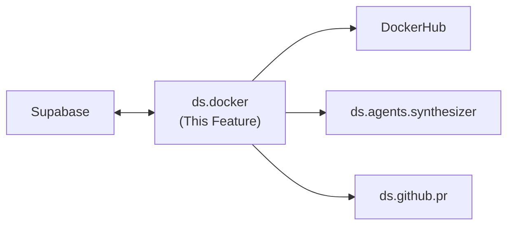

---
tags:
  - documentation
  - formulacode
  - datasmith
---

## Abstract

This document covers the `ds.docker` module — building, verifying, and managing Docker images for datasmith tasks. The module implements a 3-tier image hierarchy and must scale across 40-50 concurrent threads.

## High level overview



## Modules

* `ds.docker.build_image`: Builds a Docker image for a PR. Accepts a `build_script` dict and a `verifier`. Returns the image name on success, `None` on failure.
* `ds.docker.verify`: Abstract verifier base class. Each verifier takes a container reference and returns pass/fail with logs.
	* `ds.docker.verify.smoke`: Runs `import {package_name}` inside the container.
	* `ds.docker.verify.profile`: Collects asv benchmarks and runs `asv --quick`.
	* `ds.docker.verify.pytest`: Collects the pytest suite via `testrunner`, runs with a 45-second timeout.
	* `ds.docker.verify.MultiObjVerifier`: Chains `smoke -> profile -> pytest`.
* `ds.docker.python_verify`: Simple "python smoke test" verifier (mostly for exposition).

## 3-Tier Image Hierarchy

1. **Base image** (`formulacode/base:latest`): Common dependencies shared across all repositories.
2. **Repository image** (`formulacode/{owner}-{repo}:latest`): Repository-level dependencies (e.g. `formulacode/pandas-dev-pandas:latest`).
3. **PR image** (`formulacode/{owner}-{repo}-{issue_number}:latest`): PR-specific build script applied on top of the repository image.

`build_image` checks each tier top-down — if the base and repo images exist, it only builds the PR layer.

## Key Design Questions

### Docker client thread-safety
**Resolved: Use `python-on-whales` instead of `docker-py`.**

`docker-py`'s `APIClient` is not thread-safe (confirmed in [docker-py #3229](https://github.com/docker/docker-py/issues/3229)). Its urllib3 connection pool defaults to 10 connections and corrupts under concurrent load. Even with one client per thread, users report persistent reliability issues at scale.

[`python-on-whales`](https://github.com/gabrieldemarmiesse/python-on-whales) is a Docker CLI wrapper that is thread-safe and process-safe by design — it stores no intermediate state and each operation is a subprocess call to the Docker CLI. The maintainer explicitly confirms concurrent usage is supported ([python-on-whales #43](https://github.com/gabrieldemarmiesse/python-on-whales/issues/43)).

Why this is the right choice:
- **Thread-safe by construction**: No shared connection pool, no shared state. Each `docker.build()` call spawns its own subprocess.
- **Scales to 40-50+ threads trivially**: No connection pool cap, no per-thread client bookkeeping.
- **Buildx by default**: `docker.build()` wraps `docker buildx`, which supports parallel builds natively. Also supports `docker.buildx.bake()` for building multiple images in parallel.
- **Clean failure modes**: Subprocess errors surface as exceptions with full stderr. No silent corruption.
- **Tradeoff is negligible**: Requires Docker CLI installed (always true in our environment). Per-call subprocess overhead is irrelevant for builds that take minutes.

Usage:
```python
from python_on_whales import docker

# Thread-safe — call from any thread without coordination
image = docker.build(
    context_path=".",
    tags=["formulacode/pandas-dev-pandas-1234:latest"],
    file="Dockerfile",
)
```

### Cleanup of broken builds
When a build fails partway through, dangling images and containers may be left behind. Strategy needed for:
- Tagging in-progress builds so they can be identified and cleaned up.
- A periodic cleanup job or post-failure hook that removes dangling artifacts.
- Handling the case where the process crashes mid-build (no cleanup hook fires).

### Disk space management
At ~20k PRs across many repositories, disk usage from Docker images will be significant. Considerations:
- LRU eviction of PR-tier images (base and repo images are kept).
- Pushing verified images to DockerHub and removing local copies.
- Monitoring disk usage and alerting before builds fail due to `ENOSPC`.

## Verification

* Unit tests for each verifier with mock containers.
* Integration test: build a known-good PR image (e.g. `pandas-dev/pandas#1234`) and run `MultiObjVerifier`.
* Thread-safety stress test: run 10+ concurrent `build_image` calls and verify no race conditions.
* Cleanup test: simulate a failed build and verify dangling artifacts are removed.

## Current implementation details

### Docker client library
COMMENTS: This was super buggy for us. I'm happy if we get rid of this implementation.
Uses **`docker-py`** (Python Docker SDK), not python-on-whales.
- `docker.from_env(timeout=1800, max_pool_size=max_concurrency)` in `src/datasmith/docker/orchestrator.py`.
- To mitigate thread-safety issues, each build creates a **fresh low-level `docker.APIClient`** via `_new_api_client()` in `src/datasmith/docker/context.py:31-58`.

### Image hierarchy

5 tiers (not 3), defined by the `tag` field on `Task` (`src/datasmith/core/models/task.py`):
COMMENTS: So, I already have 1400+ images on docker for this and I was hoping, even if we abandon this version, if its possible to make a `migrate to new hierarchy` script. Also, a Multi-stage dockerfile here was not a great idea because each image gets too big.

| Tier | Tag | Purpose |
|------|-----|---------|
| 1 | `base` | System environment: Rust, cmake, micromamba, Python, UV |
| 2 | `env` | Repository clone + Python environments with pinned dependencies |
| 3 | `pkg` | Package installed in editable mode (`pip install -e .`) |
| 4 | `run` | Prepared for benchmarking/testing (repo locked, ASV configured) |
| 5 | `final` | Production image with benchmark list and runtime deps |

Multi-stage Dockerfile in `src/datasmith/docker/Dockerfile` implements all 6 stages (base, repo, env, pkg, run, final). Each stage runs a corresponding `docker_build_*.sh` script.

### Image naming

`Task.get_image_name()` → `{owner}-{repo}-{sha}:{tag}` (e.g., `pandas-dev-pandas-0021d2:pkg`). Components sanitized to `[a-z0-9._-]`.
COMMENTS: This was a slightly more efficient design overall because mulitple PRs can often have the same base commit sha. Might be better to have a separate container for each issue though tbh.
### Build pipeline

`DockerContext.build_container_streaming()` in `src/datasmith/docker/context.py:528-800`:
- Creates reproducible tar context via `_get_context_bytes()`.
- Uses low-level `api.build(fileobj=..., decode=True)` with streaming output and `deque` tail buffers (2000 chunks max).
- Build args: `REPO_URL`, `COMMIT_SHA`, `ENV_PAYLOAD`, `PY_VERSION`, `BUILDKIT_INLINE_CACHE`.
- On broken-cache errors, retries with `nocache=True`.
- Optional BuildKit support via `_build_with_buildx()` and S3 cache integration.
- Labels: `datasmith.run`, `datasmith.task`, `datasmith.sha` for cleanup tracking.
- Returns `BuildResult` dataclass: `ok`, `image_name`, `image_id`, `rc`, `duration_s`, `stderr_tail`, `stdout_tail`, `failure_stage`, `benchmarks`.

COMMENTS: The build pipeline was slow, clunky and buggy. It blocked a lot of times and I had to restart it a lot because it would deadlock.
### Verification (verifiers)
COMMENTS: These served us fine but I'd prefer if we just wait out the --quick and the asv and pytest collection because a lot of containers got marked as false positives because the pytest collection would take 2-3 minutes (and error out at minute 2) but get marked as success because it ran for 45 seconds. 

`DockerValidator` in `src/datasmith/docker/validation.py:159-566`. Two verifiers chained via `validate_acceptance()`:

1. **Profile verifier** (`validate_profile()`) — runs `/profile.sh` inside container with configurable timeout (default 30s). Extracts ASV benchmark list from tarballs. Timeout (rc=124) treated as success. Returns `ProfileValidationResult`.

2. **Tests verifier** (`validate_tests()`) — runs `/run_tests.sh` with configurable timeout (default 30s). Parses structured JSON results from `/logs/test_results.json` if available. Summarizes pytest output (first errors + last 40 lines). Timeout (rc=124) treated as success. Returns `TestValidationResult`.

3. **Combined acceptance** (`validate_acceptance()`) — runs profile first; if it passes, runs tests. Returns `AcceptanceResult`.

No separate "smoke" verifier (import check). The `try_import` tool exists in the agent toolbox (`src/datasmith/agents/tools/container.py`) but is not a standalone verifier stage.

### Dataset verification pipeline

`dataset/verify.py` runs 4 stages in sequence:
1. **Build** — Docker build (timeout: 3600s)
2. **Profile** — run `profile.sh` (timeout: 3600s)
3. **Tests** — run `run_tests.sh` (timeout: 3600s)
4. **DockerHub push** — build final image and push

Writes `verification_success.json` or `failure.json` to `dataset/formulacode_verified/{owner}_{repo}/{sha}/`.

### DockerHub publishing
COMMENTS: WE SHOULD NOT USE SINGLE REPO MODE. It works file but my god it looks bad.
`publish_images_to_dockerhub()` in `src/datasmith/docker/dockerhub.py`:
- **Single mode** (default): all images tagged as `{namespace}/{single_repo}:{encoded_tag}` where tag encodes `/` → `__`, `:` → `--`. Tags over 128 chars are truncated with SHA256 suffix.
- **Mirror mode**: each repo gets its own DockerHub repository.
- Checks existing tags via Docker Registry HTTP API v2 before pushing (delta publishing).
- Rate limiting with exponential backoff (3 retries, configurable wait via `DOCKERHUB_RATE_LIMIT_WAIT`).
- Parallel push with configurable workers (default: 4).
- Credentials from: function params → env vars (`DOCKERHUB_USERNAME`, `DOCKERHUB_TOKEN`) → `~/.docker/config.json`.

### Cleanup
COMMENTS: WE SHOULD NOT USE THIS. THIS NEVER WORKED AND IT ACTUALLY DELETED SOME IMPORTANT FILES ONCE. PURGE IT.
`src/datasmith/docker/cleanup.py`:
- `remove_containers_by_label(run_id)` — prunes containers with `datasmith.run={run_id}`.
- `soft_prune()` — prunes stopped containers (>1h), dangling images, BuildKit cache.
- `fast_cleanup_run_artifacts()` — resolves image refs to IDs, removes by ID, prunes networks/volumes/build cache.

### Disk space management
COMMENTS: WE SHOULD NOT USE THIS. THIS NEVER WORKED AND IT ACTUALLY DELETED SOME IMPORTANT FILES ONCE. PURGE IT.
`src/datasmith/docker/disk_management.py`:
- `free_gb()` — returns free disk space via `shutil.disk_usage()`.
- `guard_and_prune(min_free_gb)` — checks free space, runs `soft_prune()` if low, `SystemExit` if still insufficient and `hard_fail=True`.
- `guard_loop()` — background async task, checks every `interval_s` (default 120s).
- Defaults: `guard_min_free_gb=1200`, `guard_hard_fail=False`.

### Configuration

| Env var | Default | Purpose |
|---------|---------|---------|
| `DOCKER_USE_BUILDX` | `False` | Use docker buildx |
| `DOCKER_NETWORK_MODE` | None | Build network mode |
| `DOCKER_DATA_ROOT` | `/var/lib/docker` | Docker data dir for disk checks |
| `DATASMITH_MIN_FREE_GB` | 1200 | Min free disk (GB) |
| `DATASMITH_GUARD_INTERVAL_S` | 120 | Disk check interval (s) |
| `DATASMITH_RUN_ID` | Generated hash | Run label for cleanup |
| `AWS_S3_CACHE_BUCKET` | None | S3 bucket for BuildKit cache |
