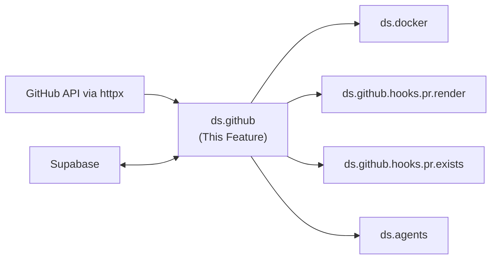

---
tags:
  - documentation
  - formulacode
  - datasmith
---

## Abstract

This document covers the `ds.github` module — the `Issue` and `PR` models, their core methods (`scrape_comments`, `scrape_links`), and the pre-registered hooks (`render`, `exists`, `attribute_compliance`, `llm_compliance`). The `ds.github.hooks.pr.render` hook is covered in a separate design doc due to its complexity.

## High level overview



## Design Decisions

### Why not the `Entity` base class?

An earlier draft introduced an abstract `Entity` class with `register_hook`/`unregister_hook` and a `SOME_SUPABASE_COMPATIBLE_KEY` abstract method. This is **dropped** because:

1. **It conflates method dispatch with caching.** Whether a method is callable and whether its result is cached are orthogonal concerns. A caching decorator solves one; normal Python class design solves the other.
2. **The "hook" concept adds indirection without value for built-in methods.** `render()`, `exists()`, `scrape_comments()` are stable, well-defined operations — they should be regular methods, not dynamically registered plugins.
3. **Python already has this.** For custom user-defined extensions, a class-level registry dict + `__getattr__` on `Issue`/`PR` directly is simpler and more Pythonic than an abstract base class.

### Pydantic v2 for models

`Issue` and `PR` use Pydantic `BaseModel` (v2):
- **Validation**: Repository format (`owner/repo`), issue number > 0, etc.
- **Serialization**: `.model_dump()` produces a dict ready for Supabase upsert.
- **Type safety**: All fields are typed; IDE autocompletion works.
- **Immutability**: `model_config = ConfigDict(frozen=True)` — once constructed, an Issue/PR is a value object. This is important for cache key stability.

### GitHub API access via `httpx`

We use `httpx.AsyncClient` directly rather than a GitHub library (`PyGithub`, `githubkit`):
- `ds.utils.tokens` already manages token rotation and rate limiting.
- We only need a handful of endpoints (issues, comments, timeline, pulls, diff).
- Async-native — works directly with the asyncio runners.
- No dependency on a third-party GitHub wrapper's auth or caching layer (which would conflict with ours).

### Caching via `@supabase_cached` decorator

All expensive methods are wrapped with `@supabase_cached`, a project-wide decorator (defined in `ds.utils.db`, used everywhere). The decorator:

```python
from ds.utils.db import supabase_cached

@supabase_cached
def scrape_comments(self, before: datetime | None = None) -> list[str]:
    ...  # Only runs if not in cache
```

How it works:
1. **Cache key**: `f"{self.cache_key}:{func.__name__}:{stable_hash(args, kwargs)}"` where `self.cache_key` is `"{owner}/{repo}#{issue_number}"`.
2. **Lookup**: Query the `hook_cache` table (`entity_key`, `hook_name`, `args_hash`). If found, deserialize and return.
3. **Miss**: Call the wrapped function, serialize the result, upsert into `hook_cache`.
4. **Cache bust**: Pass `force=True` to skip the lookup and overwrite. This is handled by the decorator (popped from kwargs before forwarding), not leaked into method signatures.
5. **Serialization**: Results are JSON-serialized. For complex types, the decorator uses Pydantic's `.model_dump_json()` / `.model_validate_json()` round-trip.

This replaces the `__overwrite=True` magic kwarg from the earlier design. The `force` parameter is intercepted by the decorator and never reaches the wrapped function.

## Class Definitions

```python
from pydantic import BaseModel, ConfigDict, field_validator
from datetime import datetime

class Issue(BaseModel):
    model_config = ConfigDict(frozen=True)

    repository: str         # "owner/repo" format
    issue_number: int
    _meta: dict | None = None  # Raw GitHub API response, lazily loaded

    @field_validator("repository")
    @classmethod
    def validate_repo_format(cls, v: str) -> str:
        assert v.count("/") == 1, f"Expected 'owner/repo', got '{v}'"
        return v

    @property
    def owner(self) -> str:
        return self.repository.split("/")[0]

    @property
    def repo(self) -> str:
        return self.repository.split("/")[1]

    @property
    def cache_key(self) -> str:
        return f"{self.repository}#{self.issue_number}"

    @supabase_cached
    def scrape_comments(self, before: datetime | None = None) -> list[str]:
        """Fetch all comments. Filters by last_modified < before."""
        ...

    @supabase_cached
    def scrape_links(
        self,
        depth: int = 1,
        only_issues: bool = False,
        before: datetime | None = None,
        limit: int = 6,
    ) -> list[str]:
        """BFS traversal of linked issues/PRs. See implementation details below."""
        ...

    # --- Custom hook support ---
    _hooks: ClassVar[dict[str, Callable]] = {}

    @classmethod
    def register_hook(cls, func: Callable) -> None:
        """Register a user-defined hook. Automatically cached."""
        cls._hooks[func.__name__] = supabase_cached(func)

    def __getattr__(self, name: str):
        if name in self._hooks:
            return lambda **kw: self._hooks[name](self, **kw)
        raise AttributeError(f"'{type(self).__name__}' has no attribute '{name}'")


class PR(Issue):
    @property
    def merge_commit(self) -> str:
        """SHA of the merge commit."""
        ...

    @property
    def patch(self) -> str:
        """Diff from patch-diff.githubusercontent.com (not GitHub's .patch)."""
        ...

    # Pre-registered hooks (defined in ds.github.hooks.pr.*)
    # These are regular methods, NOT dynamic hooks — they're stable and well-defined.
    @supabase_cached
    def render(self, anonymize: bool = False) -> str:
        """Construct a problem statement. See datasmith.github.render.md."""
        from ds.github.hooks.pr.render import render_pr
        return render_pr(self, anonymize=anonymize)

    @supabase_cached
    def exists(self) -> bool:
        """Check merge commit exists and diff patch is retrievable."""
        from ds.github.hooks.pr.exists import check_exists
        return check_exists(self)

    @supabase_cached
    def attribute_compliance(self) -> bool:
        """Check required attributes (merged, has patch, date range)."""
        from ds.github.hooks.pr.attribute_compliance import check_compliance
        return check_compliance(self)

    @supabase_cached
    def llm_compliance(self) -> bool:
        """Run ds.agents.perf_classifier. Reject if not performance-improving."""
        from ds.agents import perf_classifier
        return perf_classifier.classify(self)

    def to_record(self) -> "FormulaCodeRecord | None":
        """Convert to a FormulaCodeRecord for terminal-bench. None if incomplete."""
        ...
```

### Why pre-registered hooks are regular methods

The Overview.md says `render()` is "just a pre-registered hook." Conceptually that's true — it's a pluggable operation. But in practice, `render`, `exists`, `attribute_compliance`, and `llm_compliance` are **never swapped out at runtime**. Making them regular `@supabase_cached` methods:
- Gives IDE autocompletion and type checking.
- Makes the code navigable (ctrl+click works).
- Removes one layer of indirection.

User-defined hooks (like the `summarize` example in the Overview) still use `register_hook` + `__getattr__`, which is the right pattern for truly dynamic extensions.

## Implementation Details

### `scrape_links` — BFS with cycle detection
Scrapes the timeline, body, and comments for linked issues/PRs. Uses **BFS traversal**:
1. Start from the current issue/PR.
2. Discover linked issues from the body, comments, and timeline events.
3. Add unseen links to the BFS queue; recurse up to `depth` levels.
4. A `visited: set[str]` prevents cycles (an issue linking back to the original PR won't be scraped twice).
5. `limit` caps total returned results (default 6). BFS ordering means closer links are preferred.

Parameters:
* `before : datetime | None` — Filters by `last_modified` date. Excludes any comments or linked issues whose last modification timestamp is after the cutoff. This prevents information leakage when constructing problem statements.
* `limit : int = 6` — Maximum number of linked entities to return across all depth levels.
* `only_issues : bool = False` — If True, excludes PRs from results (useful for finding the "problem" without the "solution").

### `scrape_comments` — Filtered comment list
Returns all comments on the issue/PR. The `before` parameter filters on `last_modified` (not `created_at`), so edited comments whose latest revision postdates the cutoff are excluded.

### `exists` — Merge commit + diff patch check
Checks if `merge_commit_sha` resolves to a valid commit and if the patch diff endpoint returns a non-empty response. Rejects the PR otherwise. All GitHub API calls go through `ds.utils.tokens` for rate limit handling.

## Verification

### Unit tests
* `Issue` and `PR` construction with valid/invalid inputs (Pydantic validation).
* `@supabase_cached` decorator: verify cache hit, cache miss, `force=True` bust.
* `register_hook`: verify custom hooks are callable and cached.
* `scrape_links` BFS: mock GitHub API, verify traversal order, cycle detection, and `limit` cap.

### Integration tests
* From astropy, find PR https://github.com/astropy/astropy/pull/16222:
	* Verify the PR exists and passes the `exists` hook.
	* Scrape it and verify we get comments.
	* Verify `scrape_links` includes at least the parent issue (https://github.com/astropy/astropy/issues/13479).
	* Verify `scrape_links(only_issues=True)` excludes other PRs.
	* Call each method twice — second call must hit cache (verify via Supabase query count or mock).

## Current implementation details

### Data models

There are no Pydantic v2 `Issue` / `PR` models. Data is represented as:

- **`IssueExpanded`** — frozen dataclass in `src/datasmith/scrape/models.py` with fields: `number`, `title`, `url`, `description`, `comments: tuple[str, ...]`, `cross_references: tuple[str, ...]`, `created_at`, `closed_at`. Custom `__eq__`/`__hash__` by URL.
- **`ReportResult`** — dataclass in `src/datasmith/scrape/models.py` with `final_md`, `final_md_no_hints`, `problem_statement`, `classification`, `difficulty`, `is_performance_commit`, `all_data: dict[str, Any]`.
- **`Task`** — frozen dataclass in `src/datasmith/core/models/task.py` with `owner`, `repo`, `sha`, `commit_date`, `env_payload`, `python_version`, `tag`, `benchmarks`. Used for Docker builds, not PR modeling.
- PR data throughout the pipeline is passed as **pandas DataFrame rows** or **plain dicts** (`pr_dict`), not as structured model instances.

### Comment scraping
**Assessment: Rewrite.** The comment scraping code is fragile — single-page timeline fetches miss paginated results, the comment deduplication via `dict.fromkeys` is a hack, and the bot filtering hardcodes ~40 usernames instead of using a proper heuristic (e.g., `[bot]` suffix, app installations). The time-filtering logic works conceptually but the implementation mixes concerns (fetching, filtering, formatting) in ways that make bugs hard to isolate. Rebuild with cleaner separation: fetch raw timeline (with pagination), filter, then transform.

- `src/datasmith/scrape/report_utils.py:issue_timeline()` — calls `GET /repos/{owner}/{repo}/issues/{num}/timeline` via `get_github_metadata()`. Single-page fetch (no pagination).
- `src/datasmith/scrape/issue_extractor.py:_build_issue_payload()` — filters timeline events where `event == "commented"` and `created_at < pr_created_at`. Deduplicates with `list(dict.fromkeys(comments))`.
- `src/datasmith/scrape/report_builder.py:_collect_pr_discussions()` — collects PR timeline events, filters `created_at < pr_merged_at`, converts to `HintComment` objects.
- Bot usernames are filtered via a `BOT_USERNAMES` set (~40 known bots) in `report_utils.py`.

### Linked issue extraction
**Assessment: Rewrite.** The linked issue extraction is one-level deep only (no BFS, no cycle detection, no `depth`/`limit` parameters) — significantly less capable than the design spec. The regex extraction itself works for common patterns but misses edge cases. The design doc's BFS traversal with `visited` set and configurable depth is the right approach. Rebuild from scratch following the design spec.

- `src/datasmith/scrape/issue_extractor.py:_extract_issue_refs()` — regex extraction of issue references from text:
  - Full URLs: `https://github.com/owner/repo/issues|pull/123`
  - Cross-repo: `owner/repo#123`
  - Same-repo: `#123`
  - Keyword-aware: prioritizes refs after `close|closes|fix|fixes|resolve|resolves`
- Extraction is **one level deep** only (from PR body and comments, not recursive). No BFS, no `depth`/`limit`/`only_issues` parameters, no cycle detection.
- Merged PRs among linked issues are skipped; unmerged PRs are kept.
- Cross-reference bodies extracted from timeline `cross-referenced` events.

### Existence checks

No unified `exists()` method. Scattered checks include:
- `scratch/scripts/collect_commits.py` — validates `merge_commit_sha` via `GET /repos/{repo}/commits/{sha}`, falls back to `search_for_merge_commit()`.
- `scratch/scripts/collect_and_filter_commits.py` — filters `commits_meta[commits_meta["has_asv"]]` and `commits_meta["files_changed"].apply(has_core_file)`.

### Attribute compliance (filtering)

No `attribute_compliance()` class method. Filtering is done via pandas DataFrame masks in `src/datasmith/execution/filter_commits.py`:

**`crude_perf_filter(df, filter_repos=False)`** applies these conditions:
- `basic_message_filter(message)` — regex match: positive patterns (perf, optimize, speed, cache, parallel, benchmark, etc.) AND negative pattern rejection (docs, CI, packaging, versioning, formatting, type annotations).
- `total_additions + total_deletions < 40000`
- `n_files_changed < 500`
- `n_patch_tokens >= 5`
- `n_patch_tokens < DSPY_MAX_TOKENS` (default 16000)

Additional filtering in `collect_and_filter_commits.py`:
- `has_asv` — repository has ASV benchmark config.
- `has_core_file(files_changed)` — commit touches at least one core (non-benchmark) file.

### LLM compliance (performance classification)

- **`PerfClassifier`** — DSPy module in `src/datasmith/agents/summ_judge.py`. Signature `JudgeSignature` takes `problem_description`, `github_patch`, `file_change_summary` → outputs `reasoning` (str), `label` (YES/NO). `get_response()` returns `(is_performance: bool, json_str)`.
- **`ClassifyJudge`** — DSPy module in the same file. Signature `ClassifySignature` outputs `category` (14 `OptimizationType` enum values), `difficulty` (easy/medium/hard), `reasoning`. Truncates patch to `DSPY_MAX_TOKENS` via tiktoken.
- Used inside `ReportBuilder.build()`: `_evaluate_performance_detection()` → `PerfClassifier`, then `_classify_performance()` → `ClassifyJudge`.

### Caching

- **SQLite-backed `@cache_completion(db_loc, table_name)`** decorator in `src/datasmith/core/cache/decorators.py`. No Supabase.
- Cache key: `pickle.dumps((function_name, args, kwargs))` stored as blob.
- Cross-process locking via `.lock` file (`fcntl.flock`). Thread-safe via `threading.Lock`.
- `bypass_cache=True` parameter forces refresh.
- GitHub API calls cached in SQLite table `github_metadata` via `CACHE_LOCATION` env var (default: `cache.db`).

### GitHub API access

- Uses **`requests`** library (not httpx), synchronous.
- `src/datasmith/core/api/github_client.py:get_github_metadata()` — REST endpoint via `request_with_backoff()`.
- `get_github_metadata_graphql()` — GraphQL via `_post_with_backoff()`.
- `src/datasmith/core/api/http_utils.py` — session with `HTTPAdapter(pool_connections=64, pool_maxsize=64)`.
- Rate limiting: detects 403/429, waits until `X-RateLimit-Reset` or defaults to 30min. Rate-limit waits do not consume retries. `_sleep_with_pings()` logs every 5min during long waits.
- Per-site RPS throttling: `github: 2 req/s`, `codecov: 20 req/s`.

### Token management

- `GH_TOKENS` env var (comma-separated). `parse_gh_tokens()` returns list.
- **Random selection** per request via `random.choice()`. No per-token rate-limit state tracking, no round-robin.
- Random `User-Agent` rotation via `simple_useragent` library.

### Custom hook support

Not implemented. No `register_hook()`, no `__getattr__`, no dynamic dispatch.
