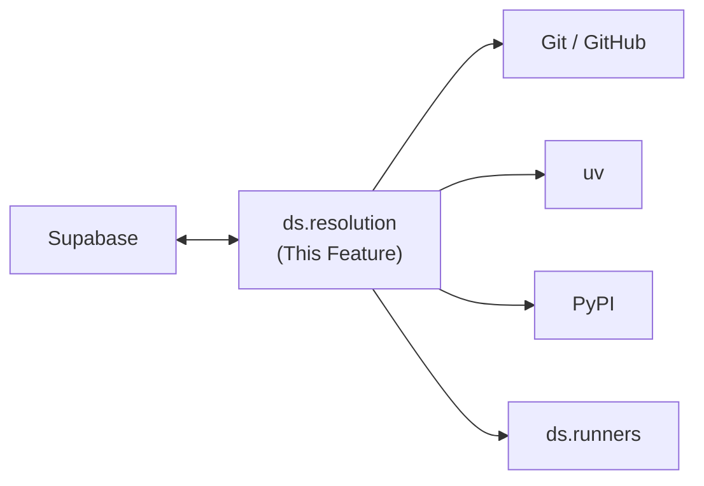
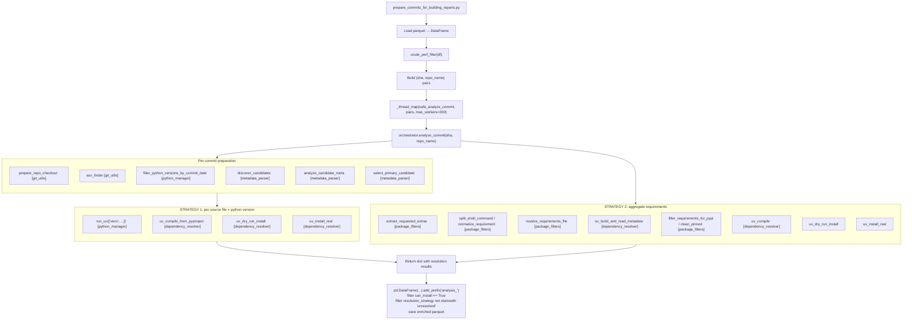
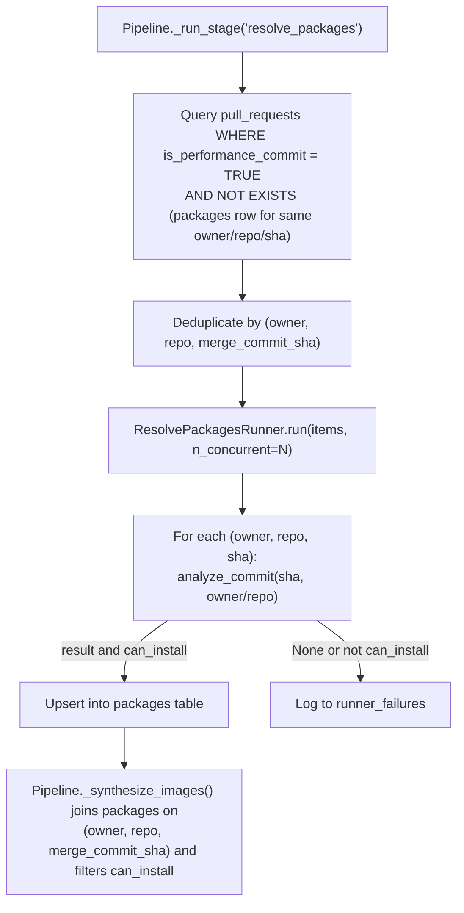

---
tags:
  - documentation
  - formulacode
  - datasmith
---

## Abstract

This document covers the `ds.resolution` module — dependency resolution for Python repositories. Given a commit SHA and repository name, this module discovers packaging metadata, resolves pinned dependencies via `uv`, validates installability, and persists results to a `packages` Supabase table. It runs as pipeline stage 3.5 — after `classify_prs` and before `synthesize_images` — providing the `env_payload` and `python_version` that the synthesizer requires to produce correct Docker build contexts.

!!! warning "Redesigned — read the guide first"

    Stage 4 was rewritten against
    `docs/superpowers/specs/2026-08-23-stage4-resolution-redesign-design.md`, which
    is the authority on intent. The module tables and the `packages` schema below
    are current. **The prose, the flow diagrams and the code snippets below are
    not**: they describe the two-strategy orchestrator this redesign replaced, and
    they are kept as the record of how the stage was first designed. For what the
    stage does now — the six units, the seed contract, and why `can_install` no
    longer gates — see [the pipeline guide](../../guide/pipeline.md#stage-4-resolve-packages).

## High level overview



## Motivation

The synthesizer (`ds.agents.synthesizer`) expects `env_payload` (a JSON string of pinned dependencies) and `python_version` to generate Docker build contexts. Without these, the `docker_build_env.sh` script has no idea what packages to install, making synthesis unreliable. Currently nothing populates these fields — `pipeline.py:_synthesize_images()` reads `env_payload` and `python_version` from the `pull_requests` table but they default to empty strings.

The old pipeline handled this in `prepare_commits_for_building_reports.py` (stage 3), which called `analyze_commit()` from the `execution.resolution` module. This module must be ported into the new architecture as a standalone pipeline stage with its own Supabase table.

## Pipeline position

```
Stage 1: scrape_repos
Stage 2: scrape_commits
Stage 3: classify_prs
Stage 4: resolve_packages    ← NEW
Stage 5: synthesize_images   (now receives env_payload + python_version)
Stage 6: publish
```

The `resolve_packages` stage runs after classification because only performance-classified PRs need resolution (expensive operation — clones repos, creates venvs, runs `uv pip compile`). Running it on all PRs would waste resources.

## Supabase schema

### New table: `packages`

```sql
CREATE TABLE IF NOT EXISTS packages (
    owner TEXT NOT NULL,
    repo TEXT NOT NULL,
    sha TEXT NOT NULL,

    -- Resolution outputs
    package_name TEXT,              -- PyPI name (e.g., "pandas")
    package_version TEXT,           -- Version from metadata
    python_version TEXT NOT NULL,   -- Selected Python version (e.g., "3.10")
    env_payload TEXT NOT NULL,      -- JSON array of pinned requirement strings
    primary_root TEXT,              -- Relative path to primary package root; the image's BUILD_ROOT
    requires_python TEXT,           -- Requires-Python constraint from metadata

    -- Advisory probe (migration 00028). Orders the stage 5 queue; excludes nobody.
    probe_status TEXT,              -- installable | unresolved | failed | empty
    probe_log TEXT,                 -- dry-run output

    -- Provenance (migration 00028)
    interpreter_source TEXT,        -- which ladder rung chose python_version
    dropped_requirements TEXT NOT NULL DEFAULT '[]',  -- JSON-encoded [{req, reason}]
    cutoff_used TIMESTAMPTZ,        -- the commit-date cutoff applied; null when relaxed
    resolver_version TEXT,          -- 'legacy' marks a row the predecessor wrote
    uv_version TEXT,
    resolved_at TIMESTAMPTZ,

    -- Deprecated. Nullable since migration 00028; neither read nor written.
    can_install BOOLEAN,

    created_at TIMESTAMPTZ DEFAULT NOW(),
    updated_at TIMESTAMPTZ DEFAULT NOW(),
    PRIMARY KEY (owner, repo, sha)
);
```

`build_commands`, `install_commands` and `resolution_strategy` were dropped: a
reader audit found no consumer for any of the three outside the runner that wrote
them, and the explicit provenance columns say what `resolution_strategy` was
trying to.

**Key design decisions:**

- **Keyed by `(owner, repo, sha)`** — not by `issue_number`. Multiple PRs can share the same base SHA within a repo; resolution results are identical for the same commit, so we deduplicate at the SHA level.
- **`env_payload`** is a JSON array of pinned requirement strings (e.g., `["numpy==1.24.3", "scipy==1.11.0"]`). This is passed directly to `docker_build_env.sh` via Docker build args.
- **`can_install`** was meant to filter out commits where dependency resolution failed. It did — 3,245 rows of 13,016, and 3,217 performance PRs that no stage ever attempted. It is now deprecated; **`probe_status`** replaces it as an *ordering* key, never a filter, and stage 6 is the sole arbiter of buildability.
- **`dropped_requirements`** records every requirement that was refused and why, so a thin seed is diagnosable without a re-run. It is JSON-encoded text, exactly like `env_payload`, so query it with a cast: `dropped_requirements::jsonb`. It supersedes the `dry_run_log` and `excluded_*` dicts this design originally omitted.

### Impact on `pull_requests` table

The `env_payload` and `python_version` columns on `pull_requests` (referenced by `pipeline.py:_synthesize_images()`) are **removed as sources of truth**. Instead, the synthesize stage joins `pull_requests` with `packages` on `(owner, repo, merge_commit_sha = sha)` to get resolution data. This avoids duplicating resolution results across PRs that share a base commit.

### Impact on `candidate_containers` table

The `candidate_containers` table already has `python_version` and `env_payload` columns. These continue to store the values used for the specific synthesis attempt (which may differ from the resolution output if overridden). The `packages` table is the source of truth for resolution; `candidate_containers` records what was actually used.

## Module structure

```
src/datasmith/resolution/
    __init__.py              # Public API: analyze_commit()
    orchestrator.py          # Main analyze_commit() function
    metadata_parser.py       # Parse pyproject.toml, setup.cfg, setup.py
    dependency_resolver.py   # uv pip compile, dry-run
    python_manager.py        # Python version selection, temporal filtering, uv wrapper
    declare.py               # Collect declared runtime/build/extra requirements
    interpreter.py           # The declared ladder that chooses the Python
    pin.py                   # One uv pip compile, cutoff first
    probe.py                 # The advisory dry-run; it never gates
    cache.py                 # @cache_completion, the SQLite memo
    requirements.py          # PEP 508 parsing; a bad string is dropped, never rewritten
    constants.py             # Paths, cache locations, the two regexes still read
    models.py                # Candidate, CandidateMeta, ASVCfgAggregate
    git_utils.py             # Repo checkout, ASV config finder
```

This is a direct port from `archive/execution/resolution/` into the new package namespace. The module is self-contained — it depends only on `git`, `uv`, and the local filesystem, not on any other `ds.*` modules (except `ds.core.cache` for the `@cache_completion` decorator and `ds.utils` for logging).

## Core API

### `analyze_commit(sha, repo_name) → dict | None`

The single public entry point. Orchestrates the full resolution pipeline:

```python
from datasmith.resolution import analyze_commit

result = analyze_commit("abc123", "pandas-dev/pandas")
# Returns:
# {
#     "sha": "abc123",
#     "repo_name": "pandas-dev/pandas",
#     "package_name": "pandas",
#     "package_version": "2.1.0",
#     "python_version": "3.10",
#     "build_command": ["python setup.py build_ext --inplace"],
#     "install_command": ["pip install -e ."],
#     "final_dependencies": ["numpy==1.24.3", "scipy==1.11.0", ...],
#     "can_install": True,
#     "primary_root": ".",
#     "resolution_strategy": "cutoff=strict, extras=on, python=3.10, source=pyproject.toml",
# }
```

Returns `None` if:
- No ASV config found in the commit
- No Python >= 3.8 available
- No packaging files found (no pyproject.toml, setup.py, etc.)
- All resolution strategies exhausted without success

Results are cached via `@cache_completion` in the local SQLite cache (keyed by `(sha, repo_name)`), so repeated calls for the same commit are free.

## Resolution strategies

The orchestrator tries two strategies in order, each with self-healing retry logic:

### Strategy 1: Direct `uv pip compile` from pyproject.toml (preferred)

For each packaging source file (pyproject.toml, setup.cfg, setup.py) in the primary candidate:
1. Create a `uv` venv for each of the top 3 candidate Python versions
2. Run `uv pip compile --all-extras` with an optional RFC3339 temporal cutoff (`UV_EXCLUDE_NEWER`) set to the commit's authored date
3. Validate with `uv pip install --dry-run`
4. Confirm with a real `uv pip install` preflight
5. Return on first success

Tries strict cutoff first, then relaxed (no cutoff) if strict fails.

### Strategy 2: Aggregate base requirements → `uv pip compile` (fallback)

When Strategy 1 fails (e.g., the pyproject.toml uses dynamic dependencies, has build-time code generation, etc.):
1. Collect base requirements from: packaging metadata (`core_deps`), ASV install commands, ASV matrix values, and optionally `uv build` wheel metadata
2. Filter through `filter_requirements_for_pypi()` to remove stdlib, local modules, conda packages, etc.
3. Run `uv pip compile`
4. Dry-run validate, then real install validate
5. On ABI errors, fall back to older Python versions

## Data flow trace

### How `prepare_commits_for_building_reports.py` called the resolution module (archive)



### How the new pipeline will call resolution



## Key data models (from archive, ported as-is)

### `Candidate`

```python
@dataclass
class Candidate:
    root_relpath: str                        # e.g., "." or "subpackage/"
    pyproject_path: Path | None = None
    setup_cfg_path: Path | None = None
    setup_py_path: Path | None = None
    req_files: list[Path] = field(default_factory=list)
    env_yamls: list[Path] = field(default_factory=list)
```

### `CandidateMeta`

```python
@dataclass
class CandidateMeta:
    name: str | None = None                  # PyPI name
    version: str | None = None
    import_name: str | None = None
    requires_python: str | None = None
    core_deps: set[str] = field(default_factory=set)
    extras: dict[str, set[str]] = field(default_factory=dict)
    build_requires: set[str] = field(default_factory=set)
```

### `ASVCfgAggregate`

```python
@dataclass
class ASVCfgAggregate:
    pythons: set[tuple[int, ...]] = field(default_factory=set)
    build_commands: set[str] = field(default_factory=set)
    install_commands: set[str] = field(default_factory=set)
    matrix: dict[str, set[str]] = field(default_factory=dict)
```

## Functions and classes used per module

### `orchestrator.py`

| Function | Purpose |
|----------|---------|
| `analyze_commit(sha, repo_name)` | Main entry point — two-strategy resolution with caching |

### `metadata_parser.py`

| Function | Purpose |
|----------|---------|
| `parse_pyproject(path)` | Extract name, deps, extras from pyproject.toml (TOML) |
| `parse_setup_cfg(path)` | Extract from setup.cfg (ConfigParser) |
| `parse_setup_py(path)` | Heuristic AST-based extraction from setup.py (no code execution) |
| `discover_candidates(commit)` | Scan commit tree for packaging files, return `dict[str, Candidate]`. A directory holding only a `requirements.txt` or an `environment.yml` is not a packaging root |
| `analyze_candidate_meta(candidate)` | Merge metadata from all sources into `CandidateMeta` |
| `select_primary_candidate(repo_name, candidates, install_cmds, analyzed)` | Heuristic selection of the primary package |

### `dependency_resolver.py`

| Function | Signature | Purpose |
|----------|-----------|---------|
| `uv_compile` | `(requirements, python_version, cutoff_rfc3339) → list[str]` | `uv pip compile` from stdin requirements |
| `uv_dry_run_install` | `(pinned, python_version, venv_path) → (bool, str)` | Validate wheels downloadable |
| `uv_build_and_read_metadata` | `(project_dir) → (name, version, requires_dist, requires_python)` | Build wheel and read METADATA |
| `rfc3339` | `(datetime) → str` | Convert to RFC3339 timestamp |

`uv_compile_from_pyproject` was the entry to the pyproject fast path and
`uv_install_real` the host-side install. Both are deleted, along with
`package_filters.py` — the module that filtered names against hand-maintained
sets and rewrote the requirements it kept. `declare.py` and `requirements.py`
replace it: what a project declares is read, parsed, and never rewritten.

### `python_manager.py`

| Function | Purpose |
|----------|---------|
| `ensure_python_version_available(version)` | Install Python via `uv python install` if needed |
| `filter_python_versions_by_commit_date(versions, commit_date)` | Temporal filtering with 90-day grace |
| `run_uv(args, input_text, cwd, extra_env)` | Subprocess wrapper for all `uv` commands |

### `declare.py`

| Function | Purpose |
|----------|---------|
| `declare(meta, asv_matrix)` | Collect the runtime, build and extra requirements a project **declares**, plus the ones dropped and why. Reads no `requirements*.txt`, no `environment.yml` and no import statements |

### `requirements.py`

| Function | Purpose |
|----------|---------|
| `parse_many(raws)` | Parse with `packaging.requirements.Requirement`, isolating failures |
| `to_requirement_lines(raws)` | The exact lines to hand to uv, keeping a bare archive URL |
| `strip_inline_comment(text)` | Read a requirements-file line the way the file format defines it |

### `constants.py`

| Constant | Purpose |
|----------|---------|
| `ASV_REGEX` | Matches an `asv.conf.json` / `.asv.conf.jsonc` path in a commit tree |
| `ANSI_RE` | Strips colour escapes from uv's console output |
| `PYPROJECT` / `SETUP_CFG` / `SETUP_PY` | The three packaging file names discovery looks for |
| `CACHE_LOCATION` | SQLite memo for `@cache_completion` |
| `GIT_CACHE_DIR` | Mirrors and base clones |

The hand-maintained name sets — `NOT_REQUIREMENTS`, `ALLOWLIST_COMMON_PYPI`,
`GENERIC_LOCAL_NAMES`, `CONDA_SYSTEM_PACKAGES`, `SPECIAL_IMPORT_TO_PYPI` — are
deleted with `package_filters.py` and `import_analyzer.py`, the only readers they
had. Guessing which declared names are real is no longer something the stage
does: it reads declarations and drops what does not parse.

## Runner

### `ResolvePackagesRunner`

```python
class ResolvePackagesRunner:
    """Resolve dependencies for classified PRs and persist to packages table."""

    def __init__(self, n_concurrent: int = 16):
        ...

    async def run(self, items: list[dict]) -> None:
        """Process items concurrently via asyncio.to_thread (analyze_commit is blocking)."""
        ...
```

Each item is `{"owner": str, "repo": str, "sha": str}`. The runner:
1. Deduplicates by `(owner, repo, sha)` — multiple PRs may reference the same commit
2. Skips items already in the `packages` table (resumption)
3. Runs `analyze_commit(sha, f"{owner}/{repo}")` via `asyncio.to_thread`
4. Upserts results into `packages` table
5. Logs failures to `runner_failures`

Default concurrency is 16 (each analysis clones a repo and runs `uv` — higher concurrency may exhaust disk I/O or rate-limit GitHub).

## Integration with synthesizer

After resolution, the synthesize stage becomes:

```python
async def _synthesize_images(self) -> None:
    client = get_client()
    resp = (
        client.table("pull_requests")
        .select(
            "owner, repo, issue_number, merge_commit_sha, title, body, "
            "created_at, rendered_problem"
        )
        .eq("is_performance_commit", True)
        .is_("container_name", "null")
        .execute()
    )
    rows = resp.data

    # Join with packages for env_payload and python_version
    shas = {(r["owner"], r["repo"], r["merge_commit_sha"]) for r in rows}
    pkg_resp = (
        client.table("packages")
        .select("owner, repo, sha, env_payload, python_version")
        .eq("can_install", True)
        .execute()
    )
    pkg_lookup = {
        (p["owner"], p["repo"], p["sha"]): p
        for p in pkg_resp.data
    }

    items = []
    for r in rows:
        key = (r["owner"], r["repo"], r.get("merge_commit_sha", ""))
        pkg = pkg_lookup.get(key, {})
        items.append({
            ...
            "env_payload": pkg.get("env_payload", ""),
            "python_version": pkg.get("python_version", ""),
        })
```

The `env_payload` is a JSON array of pinned requirements. The `docker_build_env.sh` template receives it as a Docker build arg and installs the packages:

```bash
# docker_build_env.sh
ENV_PAYLOAD='${ENV_PAYLOAD}'
if [ -n "$ENV_PAYLOAD" ]; then
    echo "$ENV_PAYLOAD" | python -c "import sys,json; [print(p) for p in json.load(sys.stdin)]" > /tmp/requirements.txt
    uv pip install -r /tmp/requirements.txt
fi
```

## Verification

- **Unit tests**: Mock `run_uv` and test each strategy path (direct compile success, fallback to aggregate).
- **Integration test**: Run `analyze_commit` on a known commit (e.g., a pandas PR) and verify `can_install=True` with correct `python_version`.
- **Resumption test**: Run the runner, kill mid-execution, restart — verify it skips already-resolved packages.
- **Declaration test**: a `requirements.txt` and an `environment.yml` in the tree change neither the packaging root nor the declared requirements.

## Migration path

1. Create `supabase/migrations/00005_packages.sql` with the table definition above.
2. Port `archive/execution/resolution/` → `src/datasmith/resolution/`, updating imports from `datasmith.execution.resolution` to `datasmith.resolution`.
3. Add `ResolvePackagesRunner` to `src/datasmith/runners/resolve_packages.py`.
4. Add `"resolve_packages"` to `STAGES` in `pipeline.py` between `"classify_prs"` and `"synthesize_images"`.
5. Update `_synthesize_images()` to join with `packages` table.
6. Remove `env_payload` and `python_version` columns from `pull_requests` (migration 00006).
