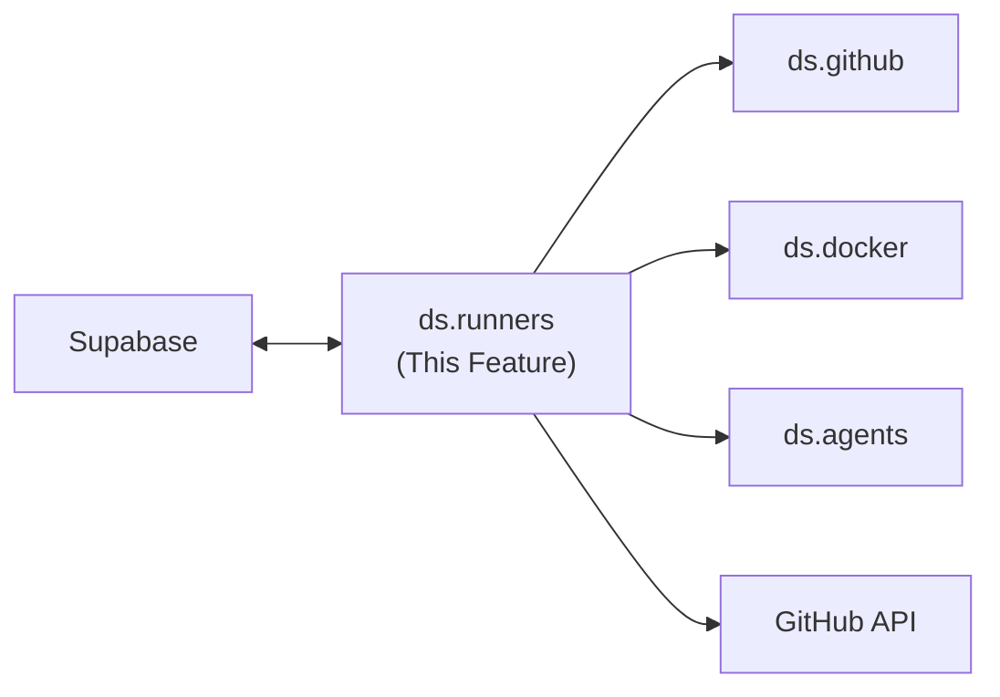

---
tags:
  - documentation
  - formulacode
  - datasmith
---

## Abstract

This document covers the `ds.runners` module — scalable async runners that orchestrate scraping, synthesis, and classification at scale. Each runner stores inputs/outputs in Supabase and takes `n_concurrent` to control parallelism.

## High level overview

## Modules

* `ds.runners.scrape_repos`: Finds compliant GitHub repositories using the search API. Takes attribute filters (minimum stars, search query) and adds results to the `repositories` table.
* `ds.runners.scrape_commits`: For a given repository, scrapes all commits and runs compliance checks (`.exists`, `.attribute_compliance`, `.llm_compliance`) on each PR.
* `ds.runners.classify_prs`: Runs a classifier agent across a set of PRs concurrently.
* `ds.runners.resolve_packages`: For each classified PR, runs `ds.resolution.analyze_commit()` to resolve Python dependencies via `uv`, then persists results (pinned deps, Python version) to the `packages` table. Deduplicates by `(owner, repo, sha)`. See `datasmith.resolution.md`.
* `ds.runners.synthesize_images`: For a given set of PRs, runs `ds.agents.synthesizer` for each. Reads `env_payload` and `python_version` from the `packages` table (populated by `resolve_packages`). Returns `list[str | None]`. This is expensive and must scale to ~20k PRs.

## Async Concurrency Model

Each runner accepts `n_concurrent` and manages its own task pool. Key design decision:

### asyncio vs threading
**Resolved: Hybrid — asyncio primary, thread pool for Docker.**

- `supabase-py` v2.2.0+ has native async support (`acreate_client` → `AsyncClient`). All table operations (`select`, `insert`, `upsert`) work with `await`.
- GitHub API calls via `httpx.AsyncClient` are natively async.
- Docker operations via `python-on-whales` are subprocess-based (synchronous). Offload to a thread pool via `asyncio.to_thread`.

This means runners use `asyncio.Semaphore(n_concurrent)` for concurrency control, with the main event loop handling GitHub + Supabase I/O directly and Docker builds dispatched to threads.

## Progress Tracking

Runners process thousands of items. Progress tracking requirements:
- Log progress to Supabase (e.g. `runner_progress` table with runner_id, total, completed, failed, timestamp).
- Support resumption — if a runner crashes, it should pick up where it left off by querying which items are already processed.
- Emit periodic progress updates (every N items or every M seconds) for monitoring.

## Supabase Read/Write Patterns at Scale

### Batch operations
- Runners should batch inserts/updates (e.g. 100 rows per request) rather than one-at-a-time.
- Use upsert semantics to handle retries without duplicates.

### Rate limiting
- Supabase has request rate limits. Runners should respect these with backoff.
- GitHub API rate limits are handled by `ds.utils.tokens` (token rotation + `X-RateLimit-Reset`).

### Failure handling
- Individual item failures should not abort the entire runner.
- Failed items are logged to a `runner_failures` table with error details for later retry.

## Verification

* Unit tests with mocked GitHub API and Supabase responses.
* Integration test: `scrape_commits` on a small known repository, verify all PRs are scraped and compliance-checked.
* Stress test: `classify_prs` with `n_concurrent=64` on 1000 PRs, verify no race conditions or dropped results.
* Resumption test: kill a runner mid-execution, restart it, verify it resumes from the correct point.

## Current implementation details

There are no `ds.runners.*` module abstractions. Each pipeline stage is a standalone script in `scratch/scripts/` using ad-hoc concurrency.
**Assessment: Replace all scripts.** The 6 standalone scripts in `scratch/scripts/` each reinvent concurrency (mixed ThreadPool/ProcessPool patterns, ad-hoc semaphores, inconsistent worker defaults from 1 to 84), error handling, and progress tracking. None share a common runner abstraction. The design doc's `ds.runners.*` module pattern with `asyncio.Semaphore(n_concurrent)` and structured progress tracking is the right approach — a single concurrency model instead of six different ones.

### Pipeline orchestrator
**Assessment: Keep concept, rewrite implementation.** A monthly `update_formulacode.py` script runnable as a cron job is the right UX — one command to refresh the dataset. The current implementation chains 6 scripts via `subprocess.run()` with no error recovery, no partial resumption across stages, and no shared state. Rebuild as a proper orchestrator that tracks stage completion, supports resume-from-failure, and shares a single DB connection and concurrency config.
`scratch/scripts/update_formulacode.py` — runs 6 stages sequentially via `subprocess.run()`:
1. `collect_commits.py` → find perf commits via GitHub API
2. `collect_and_filter_commits.py` → clone repos, filter irrelevant commits
3. `prepare_commits_for_building_reports.py` → tokenize patches, crude perf filter, **dependency resolution via `analyze_commit()`**
4. `collect_perf_commits.py` → LLM-based performance classification
5. `synthesize_contexts.py` → agent-based Docker build context synthesis
6. `build_and_publish_to_dockerhub.py` → build and push final images

In the new pipeline, the dependency resolution step (previously embedded in stage 3) is extracted into its own stage (`resolve_packages`) that runs after classification and before synthesis. See `datasmith.resolution.md`.

Per-run table naming with date suffix: `merge_commits_filtered_{start}_to_{end}`, `perfonly_commits_{start}_to_{end}`.

### scrape_repos equivalent

`scratch/scripts/collect_commits.py` — loads pre-filtered `repos_valid.csv` with GitHub URLs. Calls `find_perf_commits()` and `find_tagged_releases()` from `src/datasmith/execution/collect_commits_offline.py`. Filters for ASV config presence via `find_file_in_tree(repo_name, "asv.conf.json")`.

### scrape_commits equivalent

`scratch/scripts/collect_and_filter_commits.py`:
- **ThreadPoolExecutor** for repo cloning: `max_workers=args.threads` (default 16), `as_completed()` pattern.
- **ProcessPoolExecutor** for commit metadata: `max_workers=args.procs` (default 1). Maps `_commit_info_worker()` over SHA tuples.
- `collect_merge_shas(repo_name, since, until)` — fetches merged PRs from GitHub API with date filtering.
- Filters: `has_asv` (ASV config present), `has_core_file(files_changed)` (touches non-benchmark files).
- Output: SQLite table with filtered merge commits.
- Progress: `tqdm` bars.

### synthesize_images equivalent

Split across two stages:

**Stage A** — `scratch/scripts/prepare_commits_for_building_reports.py`:
- **ThreadPoolExecutor** for patch fetching and dependency resolution: `max_workers=args.max_workers` (default 84).
- Tokenizes patches via `tiktoken.encode_batch(num_threads=max_workers)`.
- Applies `crude_perf_filter(df)`.
- **Runs `analyze_commit(sha, repo_name)` from `datasmith.execution.resolution`** for each filtered commit. This is the dependency resolution step that produces `analysis_python_version`, `analysis_final_dependencies`, `analysis_can_install`, and `analysis_resolution_strategy` columns. Only commits with `analysis_can_install=True` and non-"unresolved" strategy proceed to synthesis. **This step is extracted into a dedicated `resolve_packages` pipeline stage in the new architecture.**
- Creates container names via `make_task(row, tag=args.container_tag)`.

**Stage B** — `scratch/scripts/synthesize_contexts.py`:
- **ThreadPoolExecutor**: `max_workers=args.max_workers` (default 8).
- Calls `agent_build_and_validate()` per task from `src/datasmith/agents/build.py`.
- Tracks via `ContextRegistry` JSON file.

### classify_prs equivalent

`scratch/scripts/collect_perf_commits.py`:
- **ThreadPoolExecutor**: `max_workers=args.max_workers` (default -1 = sequential).
- Wraps `ReportBuilder.build(pr_dict)` per row.
- **SQLite-backed cache** via `@cache_completion(_CACHE_DB, "perf_classification")` — cache key: `sha256(f"{sha}:{repo_name}:{patch}")`.
- Per-row exception handling: returns `{"is_performance_commit": False, ...}` on error.
- Progress: `tqdm` with performance commit count in postfix.

### Concurrency model

No asyncio. All stages use **synchronous threading**:

| Stage | Executor | Default workers | Control |
|-------|----------|----------------|---------|
| Collect commits | ThreadPool + ProcessPool | 16 threads, 1 process | `--threads`, `--procs` |
| Prepare commits | ThreadPool | 84 | `--max-workers` |
| Classify PRs | ThreadPool | -1 (sequential) | `--max-workers` |
| Synthesize images | ThreadPool | 8 | `--max-workers` |
| Build & publish | ThreadPool + Semaphores | 24 build, 8 push | `BUILD_CONCURRENCY`, `PUSH_CONCURRENCY` |

The Docker orchestrator (`src/datasmith/docker/orchestrator.py:orchestrate()`) uses **asyncio.Queue** as a resource pool and `asyncio.create_task()` for concurrent workers with `asyncio.gather()`, but this is only used for direct Docker orchestration (not the main pipeline scripts).

Build-and-publish uses **`threading.Semaphore`** to limit concurrent builds (24) and pushes (8), plus a **`threading.Lock`** (`_cr_lock`) to protect `ContextRegistry` mutations.

### Progress tracking

- **tqdm** progress bars in all stages.
- **Per-stage SQLite tables** with date suffixes for resumption (e.g., `merge_commits_filtered_20250101_to_20250201`).
- **ContextRegistry** JSON file tracks which contexts have been built/validated.
- **JSONL files** with per-task results appended incrementally.
- **`--skip-existing`** flag in publish stage skips already-pushed images.
- **`--ignore-exhausted`** flag in synthesis stage skips previously failed tasks.

No Supabase tables (`runner_progress`, `runner_failures`). No structured resumption protocol. Resumption is implicit via cached results and existing tables.

### Failure handling

- Per-item exceptions caught and logged; do not abort the runner.
- Classification failures return defensive defaults (`is_performance_commit: False`).
- Build failures detected by `failure_stage` in `BuildResult`; pkg-stage failures trigger `ContextRegistry.pop()` for retry.
- Docker client closed in `finally` block to prevent leaks.
- Disk space monitoring via `guard_loop()` in orchestrator (background asyncio task, checks every 120s).
