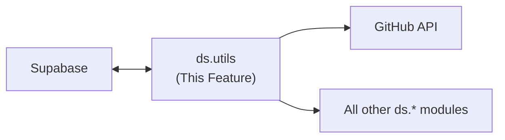

---
tags:
  - documentation
  - formulacode
  - datasmith
---

## Abstract

This document covers the `ds.utils` module — shared utilities for database access (Supabase), GitHub token rotation, and core helpers.

## High level overview



## Modules

* `ds.utils.db`: Supabase client initialization, common query helpers, and the `@supabase_cached` decorator used across all `ds.*` modules.
* `ds.utils.tokens`: GitHub token pool with random selection per request. Blocks on rate limits using GitHub's `X-RateLimit-Reset` header with exponential backoff as a fallback.
* `ds.utils.core`: Common utilities (logging, config, etc).

## Supabase Schema Design

### Core tables

| Table | Primary key | Purpose |
|-------|-------------|---------|
| `repositories` | `(owner, repo)` | Tracked repositories with metadata (stars, language, last_scraped) |
| `pull_requests` | `(owner, repo, issue_number)` | All scraped PRs with compliance status, classification, container_name |
| `packages` | `(owner, repo, sha)` | Resolved Python dependencies per commit. Populated by `resolve_packages` stage via `ds.resolution.analyze_commit()`. Stores `env_payload` (JSON array of pinned requirements), `python_version`, `can_install`, `resolution_strategy`, etc. Joined with `pull_requests` on `merge_commit_sha = sha` by the synthesize stage. See `datasmith.resolution.md`. |
| `candidate_containers` | `(owner, repo, sha)` | Synthesized Docker build contexts with one column per shell script. Also stores `python_version` and `env_payload` as used during synthesis (may differ from `packages` if overridden). |
| `hook_cache` | `(entity_key, hook_name, args_hash)` | Cached hook results keyed by entity + hook + serialized arguments |
| `build_attempts` | `(owner, repo, issue_number, attempt_id)` | Logged synthesis attempts (script, model, stderr, stdout, success) |
| `runner_progress` | `(runner_id)` | Runner state for resumption (total, completed, failed, last_updated) |
| `runner_failures` | `(runner_id, item_id)` | Per-item failure logs for retry |

### `@supabase_cached` decorator
Defined in `ds.utils.db`, this is the project-wide caching decorator. Any method on an object with a `.cache_key` property can be decorated:

```python
@supabase_cached
def scrape_comments(self, before: datetime | None = None) -> list[str]:
    ...  # Only called on cache miss
```

Behavior:
1. **Key construction**: `f"{self.cache_key}:{func.__name__}:{stable_hash(args, kwargs)}"` where `stable_hash` uses sorted keys + canonical JSON serialization for deterministic hashing.
2. **Lookup**: Query `hook_cache` table by `(entity_key, hook_name, args_hash)`. Return deserialized result on hit.
3. **Miss**: Call the wrapped function, JSON-serialize the result (Pydantic models use `.model_dump_json()`), upsert into `hook_cache`.
4. **Cache bust**: Caller passes `force=True` — the decorator intercepts this kwarg (never forwarded to the wrapped function) and skips lookup.
5. **Serialization**: Results must be JSON-serializable. For Pydantic models, uses `.model_dump_json()` / `.model_validate_json()` round-trip.

### Row-Level Security (RLS)
**Not needed.** Datasmith is a single-team tool, not multi-tenant. RLS would add complexity without benefit. All tables use the service role key with RLS disabled.

## Token Rotation

```python
class TokenPool:
    tokens: list[str]           # From tokens.env
    rate_limits: dict[str, RateLimit]  # Per-token rate limit state

    def get_token(self) -> str:
        # Random selection from non-rate-limited tokens.
        # If all tokens are rate-limited, block until the earliest
        # X-RateLimit-Reset timestamp expires (with exponential backoff fallback).

    def report_rate_limit(self, token: str, reset_at: datetime) -> None:
        # Called by GitHub API wrappers when a 429 is received.
```

### Rate limit handling
- Primary: Parse `X-RateLimit-Reset` header from GitHub 429 responses, sleep until that timestamp.
- Fallback: If header is missing, use exponential backoff (1s, 2s, 4s, ... capped at 60s).
- Token rotation: When a token is rate-limited, immediately rotate to the next available token before blocking.

## Key Design Questions

### Supabase Python SDK capabilities
**Resolved.**
- **Async support**: Native since `supabase-py` v2.2.0. Use `acreate_client(url, key)` to get an `AsyncClient`. All table operations (`select`, `insert`, `upsert`, `delete`) work with `await`. This means our asyncio runners can talk to Supabase directly without `asyncio.to_thread`.
- **Batch upsert**: Supported — pass a list of dicts to `.upsert([...])`. No documented batch size limit, but Supabase's PostgREST layer has a default request body limit (typically 1MB). Batch in chunks of ~100-200 rows to stay safe.
- **Connection pooling**: `supabase-py` uses `httpx` under the hood, which manages its own connection pool. No additional pooling configuration needed.
- **Transient failures**: Not handled automatically. Wrap Supabase calls in a retry decorator (e.g. `tenacity` with exponential backoff on 5xx / connection errors).

## Verification

* Unit tests for `TokenPool` with simulated rate limit scenarios.
* Unit tests for cache key serialization (verify deterministic hashing).
* Integration test: connect to Supabase, CRUD on each table, verify schema.
* Test token rotation under concurrent access (multiple threads calling `get_token`).

## Current implementation details

### Database layer

**Supabase** for all persistent storage. See `src/datasmith/utils/db.py` for the client and query helpers.

**Cache DB** (`CACHE_LOCATION` env var, default: `cache.db`):
   - Local SQLite cache for GitHub API responses.
   - Used by `@cache_completion` decorator.

### Caching decorator

`@cache_completion(db_loc, table_name)` in `src/datasmith/core/cache/decorators.py`:
- Cache key: `pickle.dumps((function_name, args, kwargs))` stored as blob.
- Result: pickle-serialized blob (not JSON).
- UPSERT with conflict handling on `(name, argument_blob)`.
- Cross-process locking via `.lock` sidecar file (`fcntl.flock` on POSIX).
- Thread-safe via `threading.Lock`.
- `bypass_cache=True` parameter forces refresh.
- Tracks `created_at`, `updated_at` timestamps.
- Backwards-compatible table migrations (adds columns if missing).

Usage:
```python
@cache_completion(CACHE_LOCATION, "github_metadata")
def get_github_metadata(endpoint, params=None): ...

@cache_completion(CACHE_LOCATION, "github_metadata_graphql")
def get_github_metadata_graphql(query, variables=None): ...

@cache_completion(_CACHE_DB, "perf_classification")
def _cached_classify(sha, repo_name, patch): ...
```

### GitHub API client

`src/datasmith/core/api/github_client.py`:
- **REST**: `get_github_metadata(endpoint, params)` → `request_with_backoff()` to `https://api.github.com/{endpoint}`. Handles 404/451/410 as `None`.
- **GraphQL**: `get_github_metadata_graphql(query, variables)` → `_post_with_backoff()` to `https://api.github.com/graphql`.
- All responses cached in SQLite via `@cache_completion`.

### HTTP client

`src/datasmith/core/api/http_utils.py`:
- Uses **`requests`** library (not httpx). Synchronous, not async.
- `get_session()` → `requests.Session` with `HTTPAdapter(pool_connections=64, pool_maxsize=64, max_retries=0)` mounted on `https://` and `http://`.
- Per-site RPS throttling: `{"github": 2, "codecov": 20}` via `_last_call` timing dict.
- Random `User-Agent` rotation via `simple_useragent` library.

### Rate limiting

`request_with_backoff(url, site_name, session, base_delay, max_retries, max_backoff)`:
- Detects 403/429 responses.
- Checks `X-RateLimit-Remaining == "0"`.
- Wait time from: `Retry-After` header → `X-RateLimit-Reset` (unix timestamp) → conservative 30-minute default.
- Rate-limit waits do NOT consume retry attempts.
- `_sleep_with_pings()` — logs every 5 minutes during long waits for observability.
- Non-rate-limit errors: exponential backoff (`base_delay * 2^attempt`, capped at `max_backoff`).

### Token management

`parse_gh_tokens()` in `http_utils.py`:
- Parses `GH_TOKENS` env var (comma-separated list).
- **Random selection** per request: `random.choice(all_gh_tokens)`.
- No per-token rate-limit state, no round-robin, no `TokenPool` class.
- Warning logged if no tokens found.

Codecov: single `CODECOV_TOKEN` env var, no rotation.

LLM tokens: `PORTKEY_API_KEY`, `ANTHROPIC_API_KEY`, `DSPY_API_KEY` in `src/datasmith/agents/config.py`.

### Logging and config

`src/datasmith/logging_config.py`:
- `configure_logging(level, format_string, date_format, stream)` — configures root + `"datasmith"` loggers. Default format: `"%(asctime)s %(levelname)-8s %(name)s: %(message)s"`.
- `get_logger(name)` → `logging.getLogger(f"datasmith.{name}")`.
- `ProgressLogger` — utility class with `progress()`, `update_progress()` (ANSI line replace), `finish_progress()`.

`src/datasmith/__init__.py:setup_environment()`:
- Loads `tokens.env` via `python-dotenv.load_dotenv()`.
- Called at module import.

### Legacy compatibility

`src/datasmith/utils.py` — forwards imports from `datasmith.core.*` modules for backwards compatibility (e.g., `from datasmith.utils import get_github_metadata`).
