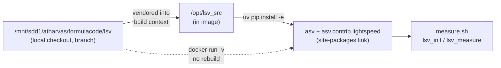

# Developing LSV alongside fc-data

LSV (`asv.contrib.lightspeed`) is what turns "this container builds" into
"this container can measure a speedup". It selects the benchmarks a patch
impacts, times them before and after, and hands the numbers to
`measure.sh` → `emit_measure.py` → the build manifest.

It lives in a **separate repository** — a fork of asv itself — so a change to
how FormulaCode measures is a two-repo change. This page describes the local
editable setup that makes that tractable.

## Why editable

`docker_build_final.sh` used to install LSV straight from GitHub:

```bash
micromamba run -n "$ENV_NAME" uv pip install --no-cache git+https://github.com/formula-code/lsv.git || true
```

Three problems with that for development:

1. **No way to test a change without pushing it.** The only input is a public
   git ref, so every experiment needs a commit on a public branch.
2. **The image cannot say which LSV it has.** The URL pins nothing; two images
   built a day apart can carry different measurement code with no record of it.
3. **Iteration costs a full image rebuild.** Task images are 8–30 GB.

The editable setup replaces the URL with a local checkout.



## Setup

```bash
git clone https://github.com/formula-code/lsv.git /mnt/sdd1/atharvas/formulacode/lsv
cd /mnt/sdd1/atharvas/formulacode/lsv
git checkout -b <your-branch>
```

Point the build at it with `DATASMITH_LSV_SOURCE` (defaults to the path above):

```bash
DATASMITH_LSV_SOURCE=/mnt/sdd1/atharvas/formulacode/lsv
```

## Three things that will bite you

### The distribution is named `lsv`, the import package is `asv`

`pyproject.toml` declares `name = "lsv"` while shipping the `asv/` package.
Two consequences:

- `SETUPTOOLS_SCM_PRETEND_VERSION_FOR_**LSV**` is the env var that sets the
  version, not `..._FOR_ASV`. Without it, an install from a tree with no
  `.git` fails outright — setuptools_scm has nothing to read.
- The fork asks `importlib_metadata` for its own version. Upstream asked for
  `"asv"`, which only resolves when the unrelated PyPI `asv` distribution
  happens to be installed alongside. `asv/_dist_version.py` now tries `lsv`
  first and falls back to `asv`.

### The PyPI `asv` wheel must be uninstalled first

Two copies of the `asv` package on `sys.path` break plugin discovery:
`pkgutil.iter_modules` walks one copy while the `Command` base class comes
from the other, so the command registry ends up empty and the CLI dies with
`KeyError: 'Quickstart'`. Uninstall the wheel before installing the fork.

Because the fork then owns the CLI, `pyproject.toml` provides an `asv`
console script alongside `lsv` — `docker_build_final.sh` runs
`asv run --bench just-discover` for benchmark discovery and would otherwise
lose its entrypoint.

### The `.git` directory is excluded from the build context

Vendoring `.git` would make the context non-deterministic and add ~5 MB per
build. It is stripped, and the version is supplied via the pretend-version
variable instead. The **commit sha is recorded separately** as a manifest
breadcrumb so an image can still say which LSV it carries.

## Iterating without rebuilding an image

Editable installs make the source directory live, so a bind-mount over
`/opt/lsv_src` picks up host edits with no reinstall and no rebuild:

```bash
docker run --rm \
  -v /mnt/sdd1/atharvas/formulacode/lsv:/opt/lsv_src:ro \
  <task-image> /measure.sh /tmp/solution.patch
```

The same trick works for the CLI wrappers, which are datasmith templates
rather than LSV code:

```bash
D=src/datasmith/harbor_adapter/template
docker run --rm \
  -v $D/lsv_init.py:/opt/lsv/lsv_init.py:ro \
  -v $D/lsv_measure.py:/opt/lsv/lsv_measure.py:ro \
  <task-image> /measure.sh /tmp/solution.patch
```

> **Check the version you are overriding.** The template in the working tree
> is not always the one baked into an image — images built by another working
> tree can carry a *newer* copy, and bind-mounting an older one over it
> silently reintroduces fixed bugs. Diff before you mount:
> `docker cp $(docker create ):/opt/lsv/lsv_init.py - | tar -xO`.

## Timing hyperparameters

`rounds` maps to asv's `processes`; `repeat` is samples per round. asv's
auto-repeat picks 1–10 and **halves it when `rounds > 1`**, so raising
`rounds` alone does not monotonically buy accuracy.

`asv._stats.is_different` runs a Mann-Whitney U test at `p_threshold=0.002`
when raw samples are present, and falls back to a pessimistic 99% CI-overlap
check when they are not. Its own guard,
`p_min = 1/binom(n_a + n_b, min(n_a, n_b))`, means the Mann-Whitney branch
**cannot fire below 6 samples per leg**:

| samples per leg | `binom` | `p_min` | branch taken |
|---|---|---|---|
| 5 + 5 | 252 | 0.00397 | CI-overlap (weak) |
| 6 + 6 | 924 | 0.00108 | Mann-Whitney U |

Both are settable end to end:

| variable | consumed by | default |
|---|---|---|
| `DATASMITH_VERIFY_MEASURE_ROUNDS` | `measure.sh` → `--rounds` | 2 |
| `DATASMITH_VERIFY_MEASURE_REPEAT` | `measure.sh` → `--repeat` | asv auto |
| `DATASMITH_VERIFY_MEASURE_WARMUP_S` | `measure.sh` → `--warmup-time` | asv auto |

`asv.contrib.lightspeed` passes all three through `_timing_params`; before
this change only `--rounds` reached the call site.

## Do not push without asking

The checkout is a working fork. Changes to it alter how every task image
measures, so they land deliberately, not as a side effect of an experiment.
