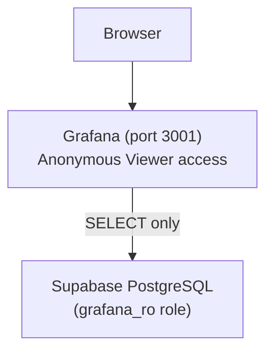

# Monitoring with Grafana

fc-data includes a pre-configured Grafana dashboard for monitoring the pipeline, browsing data, and tracking dataset growth.

The live dashboard is available at **<https://data.formulacode.org/>**.

## Prerequisites

- Local Supabase instance running (`make supabase-up`)
- Docker available on the host

## Quick Start

```bash
# Apply the read-only database role (first time only)
make grafana-migrate

# Start Grafana
make grafana-up
```

Grafana is now available at **<http://localhost:3001>** with no login required (anonymous read-only access).

## Public Exposure

The live dashboard is exposed via [Cloudflare Tunnel](https://developers.cloudflare.com/cloudflare-one/connections/connect-networks/) — free, persistent, and uses your own domain. Setup:

```bash
# Install cloudflared, then:
cloudflared tunnel login
cloudflared tunnel create datasmith-grafana
cloudflared tunnel route dns datasmith-grafana grafana.yourdomain.com

# Create ~/.cloudflared/config.yml with protocol: http2 (avoids QUIC/UDP firewall issues)
cloudflared tunnel run datasmith-grafana
```

## Architecture

Grafana runs as a Docker container that joins the existing Supabase Docker network. It connects to Postgres via a **read-only** `grafana_ro` database role that can only `SELECT` — no writes are possible, even from the Explore SQL editor.



## Dashboard Panels

The provisioned dashboard ("DataSmith Pipeline Overview") includes:

| Section | Panels |
|---------|--------|
| **Dataset Growth** | Containers built by month, stat counts (PRs, containers, packages, repos), PR-to-container rate |
| **Repository Overview** | All repos by stars, containers-by-repo treemap |
| **Pull Request Insights** | Performance commit ratio, dataset time span, difficulty distribution, PR volume over time, optimization type distribution |
| **Package Resolution** | Python version distribution, installability by repo, resolution strategy breakdown |
| **Pipeline Status** | Active runners table, completion gauge, recent failures |
| **Synthesis** | Success rate over time, failure stage distribution, top error messages |
| **Synthesis Deeper Analysis** | First-attempt vs retry success, hardest repos, agent head-to-head |
| **Attempt Details** | Attempts per repo, duration by agent, duration over time |
| **Resource Metrics** | Build metrics table, image size vs build time, avg resources over time |
| **Pipeline Funnel** | End-to-end conversion: Repos → PRs → Perf PRs → Resolved → Built → Published |
| **Data Explorer** | Filtered table of performance PRs with referenced issues |

## Ad-hoc SQL Queries

Use Grafana's **Explore** mode (compass icon in the sidebar) to run arbitrary read-only SQL against the database. The `grafana_ro` role has `SELECT` access to all tables.

## Admin Access

To edit dashboards in the Grafana UI, log in with:

- **Username:** `admin`
- **Password:** value of `GRAFANA_ADMIN_PASSWORD` in `tokens.env` (defaults to `admin`)

## Configuration Files

| File | Purpose |
|------|---------|
| `grafana/docker-compose.yml` | Grafana service definition |
| `grafana/provisioning/datasources/supabase-postgres.yml` | PostgreSQL datasource (read-only) |
| `grafana/provisioning/dashboards/dashboard-provider.yml` | Dashboard file provider config |
| `grafana/provisioning/dashboards-json/datasmith-overview.json` | Dashboard panels and queries |
| `supabase/migrations/00009_grafana_readonly.sql` | Read-only Postgres role |

## Makefile Targets

```bash
make grafana-up       # Start Grafana
make grafana-down     # Stop Grafana
make grafana-logs     # Tail container logs
make grafana-migrate  # Apply the grafana_ro database role
make grafana-tunnel   # Expose Grafana publicly via Cloudflare Tunnel
```
