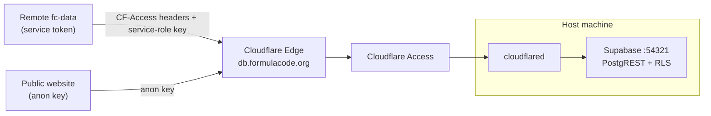

# Remote Access

The fc-data Supabase instance is not exposed on the public internet. Two paths
reach it from outside the host:

1. **Full read/write access** over a Cloudflare Tunnel, gated by Cloudflare
   Access service tokens. Intended for pipeline operators running `fc-data`
   against the shared database.
2. **Public read-only access** via the Supabase anon key. Intended for
   client-side websites that display dataset statistics.

## Architecture



Cloudflare Access blocks every request at the edge unless it carries a valid
service token. The anon-key path works because the RLS policies in
`supabase/migrations/00012_public_read_rls.sql` allow `SELECT` for the `anon`
role on four tables; writes and all other tables are rejected by RLS.

---

## For users

### Full read/write access

You need two things in `tokens.env`:

```bash
SUPABASE_URL=https://db.formulacode.org
SUPABASE_KEY=<service-role key>

DATASMITH_CF_ACCESS_CLIENT_ID=<client id>
DATASMITH_CF_ACCESS_CLIENT_SECRET=<client secret>
```

Both the service-role key and the Cloudflare Access credentials are issued by
a maintainer. To request them, [open an issue][issues] asking for remote
access; include the machine or project you need the credentials for.

Verify the connection:

```bash
fc-data --preflight
```

### Public read-only access

Use the Supabase anon key (shown as the "Publishable" key in
`supabase status`). No tunnel credentials are required; the host is the same.

| Table | Exposed |
|-------|---------|
| `repositories` | Repository metadata |
| `pull_requests` | PR metadata, classification, patches |
| `candidate_containers` | Successful build scripts per SHA |
| `harbor_runs` | Benchmark speedup results |

Example:

```js
const SUPABASE_URL = "https://db.formulacode.org";
const ANON_KEY = "sb_publishable_...";

const res = await fetch(
  `${SUPABASE_URL}/rest/v1/repositories?select=owner,repo,stars&order=stars.desc&limit=20`,
  {
    headers: {
      "apikey": ANON_KEY,
      "Authorization": `Bearer ${ANON_KEY}`,
    },
  },
);
```

Writes return `HTTP 403: new row violates row-level security policy`.

---

## For developers (host machine setup)

This section covers standing up the tunnel and Access policy. Day-to-day
operation is in the [Makefile targets](#makefile-targets) at the bottom.

### 1. Install cloudflared

```bash
curl -L https://github.com/cloudflare/cloudflared/releases/latest/download/cloudflared-linux-amd64.deb \
  -o cloudflared.deb
sudo dpkg -i cloudflared.deb
cloudflared --version
```

### 2. Authenticate and create the tunnel

```bash
cloudflared login
cloudflared tunnel create datasmith-db
```

Note the printed Tunnel ID. Credentials are saved to
`~/.cloudflared/<TUNNEL_ID>.json`.

### 3. Configure the tunnel

`~/.cloudflared/config.yml`:

```yaml
tunnel: <TUNNEL_ID>
credentials-file: /home/<user>/.cloudflared/<TUNNEL_ID>.json

ingress:
  - hostname: db.formulacode.org
    service: http://localhost:54321
  - service: http_status:404
```

### 4. DNS record

```bash
cloudflared tunnel route dns datasmith-db db.formulacode.org
```

### 5. Run the tunnel

```bash
make db-tunnel                        # foreground
sudo cloudflared service install      # or as a systemd service
sudo systemctl enable --now cloudflared
```

At this point `https://db.formulacode.org` proxies to local Supabase but
Cloudflare Access blocks everything until the policy is in place.

### 6. Cloudflare Access policy

In [Cloudflare Zero Trust](https://one.dash.cloudflare.com/) → Access →
Applications, add a self-hosted app:

- Application name: `datasmith-db`
- Application domain: `db.formulacode.org`
- Session duration: 24 hours
- Policy: action `Service Auth`, include the service token below.

Then under Access → Service Auth → Service Tokens, create a token (e.g.
`datasmith-remote`) and copy both the Client ID and Client Secret. The secret
is only shown once. Hand these to the requesting user along with the
service-role key.

### 7. Apply the RLS migration

The anon-key path requires `supabase/migrations/00012_public_read_rls.sql` to
be applied:

```bash
docker exec supabase_db_<project> psql -U postgres -d postgres \
  -c "$(cat supabase/migrations/00012_public_read_rls.sql)"
```

### How the client picks up the headers

When both `DATASMITH_CF_ACCESS_CLIENT_ID` and
`DATASMITH_CF_ACCESS_CLIENT_SECRET` are set, `datasmith.utils.db` injects the
`CF-Access-Client-Id` and `CF-Access-Client-Secret` headers into every
Supabase client request via `ClientOptions`. When unset, no extra headers are
added and behavior is identical to local development.

### Troubleshooting

| Symptom | Likely cause |
|---------|-------------|
| `403 Forbidden` | Missing or invalid CF Access headers |
| `502 Bad Gateway` | `cloudflared` not running, or Supabase is down |
| `Connection refused` | DNS not resolving; check the CNAME was created |

## Makefile targets

```bash
make db-tunnel        # Expose Supabase PostgREST via Cloudflare Tunnel
```

[issues]: https://github.com/formula-code/datasmith/issues/new
