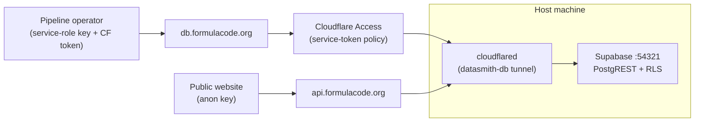

# Remote Access

The fc-data Supabase instance is not exposed on the public internet. Two
hostnames front the same tunnel:

| Hostname | CF Access gate | Credential | Scope |
|---|---|---|---|
| `db.formulacode.org` | yes, service-token policy | service-role key | full read/write |
| `api.formulacode.org` | no | anon (publishable) key | `SELECT` on four tables |

Pipeline operators use `db.*`; public websites use `api.*`. Two independent
credentials (service token + service-role key) must both leak before full
write access is at risk.

## Architecture



On `db.*`, Cloudflare Access rejects any request without a valid service
token before it reaches Supabase. On `api.*`, there is no Access application;
Supabase's `anon` role has `SELECT` grants on four tables only (see
`supabase/migrations/00012_public_read_rls.sql` and
`supabase/migrations/00015_revoke_anon_select.sql`), so anything else returns
`permission denied`.

---

## For users

### Full read/write access

You need two things in `tokens.env`:

```bash
SUPABASE_URL=https://db.formulacode.org
SUPABASE_KEY=<service-role key>

DATASMITH_CF_ACCESS_CLIENT_ID=<client id>
DATASMITH_CF_ACCESS_CLIENT_SECRET=<client secret>
```

Both the service-role key and the Cloudflare Access credentials are issued by
a maintainer. To request them, [open an issue][issues] asking for remote
access; include the machine or project you need the credentials for.

Verify the connection:

```bash
fc-data --preflight
```

### Public read-only access

Use the Supabase anon key (shown as the "Publishable" key in
`supabase status`) against `https://api.formulacode.org`. No Cloudflare
Access credentials are required for this hostname; the anon key is the only
auth layer.

| Table | Exposed |
|-------|---------|
| `repositories` | Repository metadata |
| `pull_requests` | PR metadata, classification, patches |
| `candidate_containers` | Successful build scripts per SHA |
| `harbor_runs` | Benchmark speedup results |

Example:

```js
const SUPABASE_URL = "https://api.formulacode.org";
const ANON_KEY = "sb_publishable_...";

const res = await fetch(
  `${SUPABASE_URL}/rest/v1/repositories?select=owner,repo,stars&order=stars.desc&limit=20`,
  {
    headers: {
      "apikey": ANON_KEY,
      "Authorization": `Bearer ${ANON_KEY}`,
    },
  },
);
```

Writes are rejected by RLS (`HTTP 401`, `new row violates row-level security
policy`). Reads of any table outside the four listed above return
`permission denied for table <name>`.

---

## For developers (host machine setup)

This section covers standing up the tunnel and Access policy. Day-to-day
operation is in the [Makefile targets](#makefile-targets) at the bottom.

### 1. Install cloudflared

```bash
curl -L https://github.com/cloudflare/cloudflared/releases/latest/download/cloudflared-linux-amd64.deb \
  -o cloudflared.deb
sudo dpkg -i cloudflared.deb
cloudflared --version
```

### 2. Authenticate and create the tunnel

```bash
cloudflared login
cloudflared tunnel create datasmith-db
```

Note the printed Tunnel ID. Credentials are saved to
`~/.cloudflared/<TUNNEL_ID>.json`.

### 3. Configure the tunnel

`~/.cloudflared/config.yml`:

```yaml
tunnel: <TUNNEL_ID>
credentials-file: /home/<user>/.cloudflared/<TUNNEL_ID>.json

ingress:
  - hostname: db.formulacode.org
    service: http://localhost:54321
  - hostname: api.formulacode.org
    service: http://localhost:54321
  - service: http_status:404
```

Both hostnames proxy to the same Supabase port. `db.*` is the gated
read/write path; `api.*` is the ungated public-read path. The distinction
lives in Cloudflare Access (step 6), not in the tunnel config.

### 4. DNS records

```bash
cloudflared tunnel route dns datasmith-db db.formulacode.org
cloudflared --config ~/.cloudflared/config-db.yml tunnel route dns \
  --overwrite-dns datasmith-db api.formulacode.org
```

The `--config` + `--overwrite-dns` flags on the second command are necessary
because `cloudflared` resolves the tunnel name against the default config;
without them it will route the CNAME to the wrong tunnel.

### 5. Run the tunnel

```bash
make db-tunnel                        # foreground
sudo cloudflared service install      # or as a systemd service
sudo systemctl enable --now cloudflared
```

At this point `https://db.formulacode.org` proxies to local Supabase but
Cloudflare Access blocks everything until the policy is in place.

### 6. Cloudflare Access policy — for `db.*` only

In [Cloudflare Zero Trust](https://one.dash.cloudflare.com/) → Access →
Applications, add a self-hosted app:

- Application name: `datasmith-db`
- Application domain: `db.formulacode.org`
- Session duration: 24 hours
- Policy: action `Service Auth`, include the service token below.

Then under Access → Service Auth → Service Tokens, create a token (e.g.
`datasmith-remote`) and copy both the Client ID and Client Secret. The secret
is only shown once. Hand these to the requesting user along with the
service-role key.

**Do not create an Access application for `api.formulacode.org`.** That
hostname must remain ungated so anon-key clients can reach PostgREST. The
anon key plus RLS grants are the only auth layer there.

### 7. Apply the Supabase migrations

The anon-key path depends on two migrations being applied against the host
Supabase instance:

```bash
docker exec -i supabase_db_<project> psql -U postgres -d postgres \
  < supabase/migrations/00012_public_read_rls.sql
docker exec -i supabase_db_<project> psql -U postgres -d postgres \
  < supabase/migrations/00015_revoke_anon_select.sql
```

`00012` enables RLS and adds the `public_read` SELECT policy on the four
exposed tables. `00015` revokes the default `anon` `SELECT ON ALL TABLES`
grant that Supabase ships with, then re-grants it only on those four tables
and sets the default for future tables to anon-invisible. Without `00015`,
anon can read every table because Supabase's default grants override the
absence of RLS.

### How the client picks up the headers

When both `DATASMITH_CF_ACCESS_CLIENT_ID` and
`DATASMITH_CF_ACCESS_CLIENT_SECRET` are set, `datasmith.utils.db` injects the
`CF-Access-Client-Id` and `CF-Access-Client-Secret` headers into every
Supabase client request via `ClientOptions`. When unset, no extra headers are
added and behavior is identical to local development.

### Troubleshooting

| Symptom | Likely cause |
|---------|-------------|
| `403 Forbidden` | Missing or invalid CF Access headers |
| `502 Bad Gateway` | `cloudflared` not running, or Supabase is down |
| `Connection refused` | DNS not resolving; check the CNAME was created |

## Makefile targets

```bash
make db-tunnel        # Expose Supabase PostgREST via Cloudflare Tunnel
```

[issues]: https://github.com/formula-code/datasmith/issues/new
