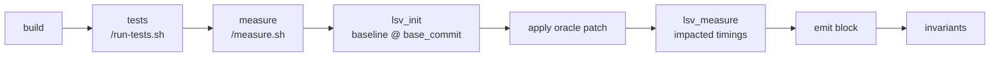

# Verification

Dataset verification ensures that each task's Docker image builds correctly and passes all validation checks.

## Task structure

Each task lives in `dataset/formulacode_verified/<owner_repo>/<sha>/` with:

- A multi-stage **Dockerfile**
- Shell build scripts (`docker_build_pkg.sh`, `docker_build_run.sh`)
- Validation scripts

## Verification loop

The iterative debugging workflow:

```bash
# Run verification for a specific task
python dataset/verify.py --task dataset/formulacode_verified/<owner_repo>/<sha>

# Check failure.json for errors
# Edit docker_build_pkg.sh and/or docker_build_run.sh
# Rerun until verification_success.json appears
```

!!! important
    Only modify `docker_build_pkg.sh` and `docker_build_run.sh` during verification fixes. Do not edit the Dockerfile or other scripts.

## Measurability

Stage-6 verification proves more than "the image builds". After the test stage
passes, `local_ci.py` runs the image a second time against `/measure.sh`, which
proves the container can **measure a speedup** — the measurement this dataset
exists to collect.



The oracle patch is bind-mounted read-only from `task/solution.patch` and is
never baked into the image — a published task image carrying the solution would
be readable by the agent under evaluation. Benchmark-directory and `asv.*.json`
sections are filtered out of the patch before it is applied, mirroring what
`run-tests.sh` resets at trial time, so the measured benchmarks are the ones
that exist at *both* commits.

Three fatal invariants gate the step:

| Invariant | Fires when |
|-----------|-----------|
| `measure_timed_out` | measurement exceeded its limit — a timeout is a **failure**, never a pass |
| `asv_exec_failed` | no benchmark produced a finite, non-zero timing at both commits |
| `oracle_patch_failed` | the stored patch exists but did not apply |

Three more are recorded as warnings rather than blocking: `speedup_direction`
(geomean below 1.0), `oracle_patch_touches_benchmarks` (the PR modified its own
benchmarks, so the measured set is narrower than the patch), and
`measure_partial` (LSV reported an error but still produced usable timings).

A failure here writes `failure.json` with `"stage": "measure"`.

**Cost.** The measure step adds roughly 14 minutes to a task at the median
(~26 minutes at p90), measured across 83 real oracle trials. It runs only after
the build *and* test stages have both passed, so a doomed attempt never pays it.

### Knobs

| Variable | Default | Effect |
|----------|---------|--------|
| `DATASMITH_VERIFY_MEASURE_TIMEOUT_S` | `3600` | Wall-clock limit for the measure step |
| `DATASMITH_VERIFY_MEASURE_ROUNDS` | `2` | LSV timing rounds; matches stage 7 |
| `DATASMITH_VERIFY_MEASURE_GEOMEAN_MIN` | `1.0` | Threshold for the `speedup_direction` warning |

## Preflight check

Before running verification, confirm your environment is properly configured:

```bash
python -m datasmith.preflight
```

This checks:

| Check | What it validates |
|-------|-------------------|
| Environment | `SUPABASE_URL`, `SUPABASE_KEY`, `GH_TOKENS`, `HF_TOKEN` |
| Supabase | Database connection |
| Docker | Docker daemon is running |
| GitHub | API access and remaining rate limit |

## Programmatic verification

Use verifiers directly in Python:

```python
from datasmith.docker import MultiObjVerifier, SmokeVerifier, ProfileVerifier

verifier = MultiObjVerifier(verifiers=[
    SmokeVerifier("pandas"),
    ProfileVerifier(timeout=300),
])

result = verifier.verify("formulacode/pandas-dev-pandas:16222")
print(result.ok)        # True/False
print(result.stderr)    # Error output if failed
print(result.duration_s)  # Time taken
```
