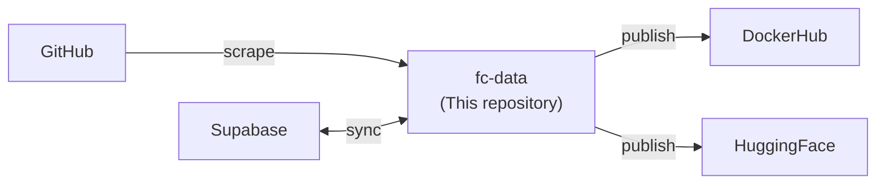

# 🔧 fc-data

**Python toolchain for building the [FormulaCode](https://github.com/formula-code) benchmark.**

[](https://github.com/formula-code/datasmith/actions/workflows/main.yml?query=branch%3Amain)
[](https://img.shields.io/github/license/formula-code/datasmith)

fc-data is a package for automatically building and maintaining FormulaCode tasks. It is engineered to support any repository-level, verification-by-execution based coding benchmark that heavily uses Docker and GitHub.

FormulaCode is a benchmark of **67+ repositories** with **964+ performance-improving commits**, designed to evaluate LLMs' ability to optimize real-world codebases. It scores optimizers relative to the human-authored speedup using ASV (Airspeed Velocity) benchmarks — providing a dense performance signal instead of binary pass/fail.

## How it works



## Get started

Most interaction with fc-data is through a single command:

```bash
fc-data --start-date 2026-03-01 --end-date 2026-04-01
```

This runs all 7 pipeline stages: repo discovery, PR scraping, LLM classification, dependency resolution, problem rendering, Docker synthesis, and publishing. See the **[Pipeline guide](guide/pipeline.md)** for the full CLI reference.

## Key features

- **Single-command pipeline** — `fc-data` runs all stages with `--resume`, `--stage`, and `--dry-run` support
- **GitHub scraping** — Async `httpx` client with automatic token rotation across multiple `GH_TOKENS`
- **LLM classification** — DSPy-based agents classify PRs by performance category and difficulty
- **Docker synthesis** — Automatically generate Docker build contexts using coding agents (Claude, Codex, Gemini)
- **Scalable runners** — Async runners with concurrency control, Supabase progress tracking, and per-item error isolation
- **Dataset publishing** — Versioned Parquet datasets on HuggingFace, Docker images on DockerHub

## Quick links

- [Installation](getting-started/installation.md) — Set up your development environment
- [Pipeline guide (`fc-data`)](guide/pipeline.md) — **The primary entrypoint** — full CLI reference and stage descriptions
- [Quickstart](getting-started/quickstart.md) — Python API examples
- [Configuration](guide/configuration.md) — `tokens.env` and environment variables
