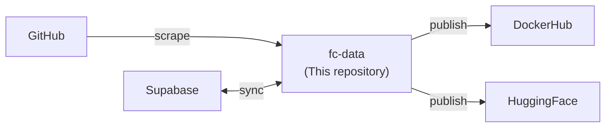

<p align="center">
  <a href="https://formula-code.github.io/">
    
  </a>
  <a href="https://huggingface.co/papers/2603.16011">
    
  </a>
  <a href="https://formula-code.github.io/leaderboard/">
    
  </a>
  <a href="https://formula-code.github.io/datasmith/">
    
  </a>
  <a href="https://data.formulacode.org/">
    
  </a>
</p>

`fc-data` is a python package for automatically curating and managing [FormulaCode](https://formula-code.github.io/) tasks. After installation, fc-data is designed to run as a monthly CRON job that updates the FormulaCode dataset with new commits and repositories.

[FormulaCode](https://formula-code.github.io/) is a *continually updating*  benchmark for evaluating  the holistic ability of LLM agents to optimize codebases. FormulaCode consists of two parts: a [pipeline](https://github.com/formula-code/datasmith) to construct performance optimization tasks, and an [execution harness](https://github.com/formula-code/terminal-bench) that connects a language model to our terminal sandbox.


## How it works



## Get started

Most interaction with fc-data is through a single command:

```bash
fc-data --start-date 2026-03-01 --end-date 2026-04-01
```

This runs all 7 pipeline stages: repo discovery, PR scraping, LLM classification, dependency resolution, problem rendering, Docker synthesis, and publishing. See the **[Pipeline guide](guide/pipeline.md)** for the full CLI reference.

## Key features

- **Single-command pipeline** — `fc-data` runs all stages with `--resume`, `--stage`, and `--dry-run` support
- **GitHub scraping** — Async `httpx` client with automatic token rotation across multiple `GH_TOKENS`
- **LLM classification** — DSPy-based agents classify PRs by performance category and difficulty
- **Docker synthesis** — Automatically generate Docker build contexts using coding agents (Claude, Codex, Gemini)
- **Scalable runners** — Async runners with concurrency control, Supabase progress tracking, and per-item error isolation
- **Dataset publishing** — Versioned Parquet datasets on HuggingFace, Docker images on DockerHub

## Quick links

- [Installation](getting-started/installation.md) — Set up your development environment
- [Pipeline guide (`fc-data`)](guide/pipeline.md) — **The primary entrypoint** — full CLI reference and stage descriptions
- [Quickstart](getting-started/quickstart.md) — Python API examples
- [Configuration](guide/configuration.md) — `tokens.env` and environment variables
