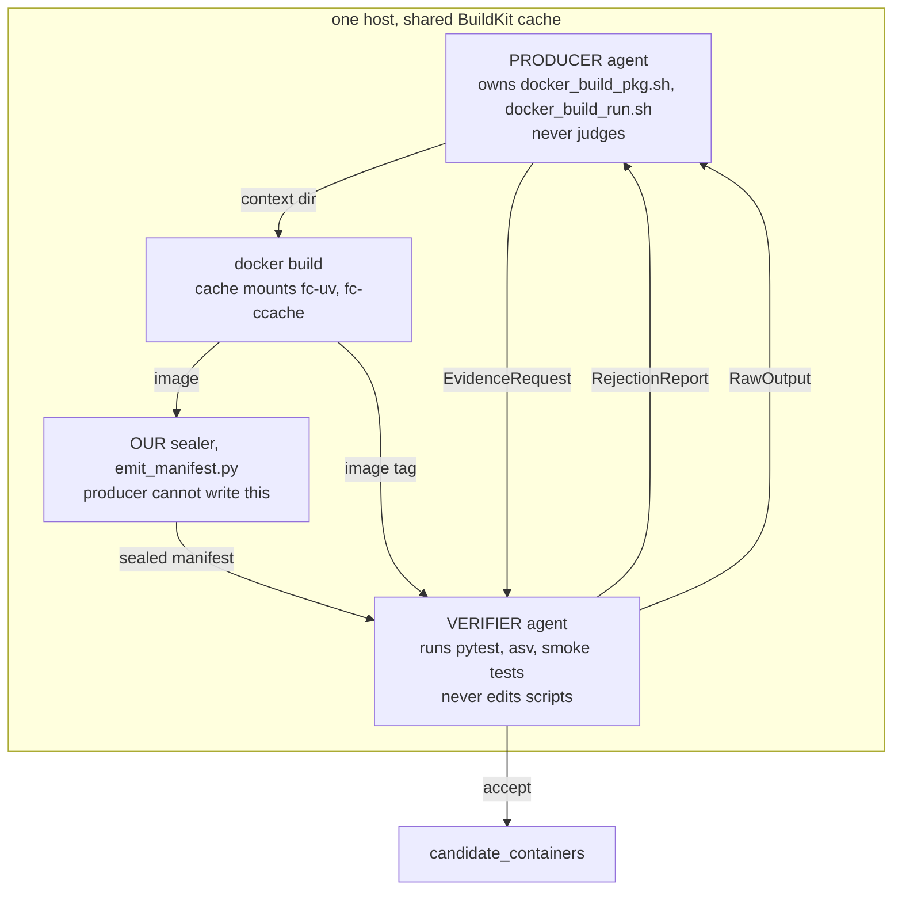
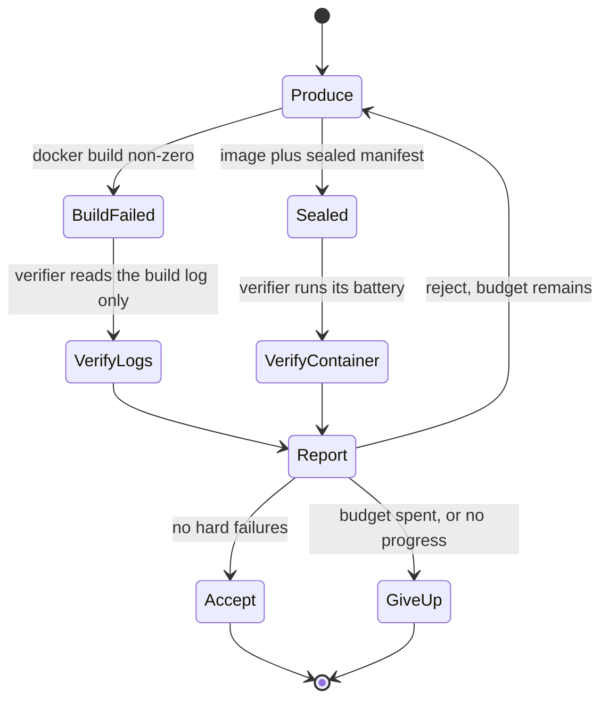

# Producer / verifier reflexive container builds

**Status:** design, approved 2026-08-23
**Supersedes:** the `LLM_GENERATE` state in `agents/synthesizer.py`
**Related:** `2026-08-23-reproducible-container-build-design.md` (the build
contract this judges), `2026-07-31-build-manifest-verification-design.md` (the
sealer this depends on)

---

## 1. Goal

Build a container, judge it, and feed a usable rejection back to whoever built
it — with the building and the judging done by **two agents that do not share a
context**.

The design target is 100 to 200 containers where the package works, pytest and
asv run, and Harbor can measure. Stage 6 today reaches that for some
repositories and silently mis-diagnoses others.

## 2. Why two agents

Two independent reasons, one from research and one from this repository's own
history.

The research reason is context pollution: an agent holding both the build tools
and the verification tools confuses the two jobs. It judges its own work
against its own assumptions.

The local reason is stronger. On 2026-08-23 a 24-repository trial produced 22
failures. Seven distinct defects behind them were **ours**, not the
repositories':

| defect | effect |
|---|---|
| `asv` called bare in `docker_build_run.sh` | run stage exits 127 |
| secret scan matched its own source | `secrets_scan_clean` false on every build ever made |
| LLM-context requirement on the no-agent path | 31% of the corpus excluded |
| `micromamba remove` pruned the interpreter | build died naming the wrong cause |
| `--no-build-isolation` with no backend installed | 7 of 22 failures |
| collection unscoped to `rootdir` | 4 of 22 failures |
| pandas shim was an `IndentationError`, in every repo | broke unrelated repositories |

The stored corpus shows what a single-context agent did about this: **1776 of
1847** agent-written `build_run_sh` scripts repair our bare `asv` call. Agents
spent their turns rediscovering our bugs and then judging their own work
against a broken standard.

A verifier that does not build, and cannot edit build scripts, has no stake in
that.

## 3. Roles, and the claims/facts boundary



Both agents run on the **same host**. BuildKit cache mounts are host-local and
not exportable, and they are worth 3.07x on a warm rebuild (measured
2026-08-23: 813.6s to 264.7s, 43 of 43 `.so` files byte-identical). Splitting
the roles across hosts would trade that away for nothing.

### The boundary

Three kinds of statement, kept apart:

| block | written by | trusted for |
|---|---|---|
| `producer_claims` | the producer agent | intent only. "I pinned cython because X." |
| `build` | our sealer, inside the image | facts about the build. Immutable. |
| `verify` | the verifier, from its own battery | facts about the running container |

**The producer must never author the manifest.** An earlier framing had the
producer "export a manifest it thinks will ensure the container is built
properly". That hands the evidence to the party under judgment, and several
commits on this branch exist purely to close that class of bypass.

Disagreement between `producer_claims` and `build` is recorded, not resolved
silently. It is a signal in its own right.

## 4. Severity

Enforced in `severity.py`, in our code. **Not** in the verifier's prompt.

| hard — never overridable | soft — verifier may waive, with a written reason |
|---|---|
| tamper audit failed | pytest pass ratio below 1.0 |
| collection error from a missing **installable** dependency | collection error from a missing **hardware capability** |
| asv discovers 0 against a non-empty source parse | repo-specific smoke test fails |
| measurement timed out | |
| asv exec failed | |
| oracle patch failed | |
| numpy moved by a **major or minor** version during install | |

Two notes on the split.

**Collection errors are hard by default.** A module that will not import means
the environment is incomplete, which is different in kind from a test that
fails on repository logic.

**The hardware carve-out is not a loophole.** A module that fails to import
because Java, a GPU, or a specific CPU feature is absent is a capability gap,
not a broken build. Without the carve-out `AllenCellModeling/aicsimageio` can
never pass, and it would be rejected for exactly the reason the verifier was
told to ignore.

**Who decides which of the two it is.** The verifier **reports the observed
cause** and its evidence. `severity.py` **maps** `(check_id, cause)` to HARD or
SOFT. The verifier never asserts a severity; it asserts a fact and our code
grades it.

A verifier that mislabels a missing pip package as a hardware gap would open
the loophole back up, so a `hardware` cause is cross-checked before it is
honoured. The check is cheap and mechanical: if the unimportable module names a
distribution that is present on PyPI, or appears anywhere in the resolved
`env_payload`, the claim is rejected and the cause reverts to `missing
dependency`. Only a module with no installable provider can be a capability
gap.

**`numpy_moved_during_install` carries a tolerance, and that is deliberate.**
The breadcrumb was wired on 2026-08-23 and has been observed on exactly two
builds, on neither of which it fired -- including datashader, which took the
isolated fallback, the path most likely to move numpy. A hard gate whose
true-rate has never been observed is a gate with an unknown false-positive
rate, and this one has no override path by construction. So it fires on a
major or minor change only. A patch-level move is recorded and does not gate.
If that tolerance proves wrong the evidence will be in the manifest, because
the raw before-and-after pair is recorded either way.

An attempt to waive a hard check is ignored and logged as a verifier-side
violation. This is the structural answer to the standing objection that a
Turing-complete agent always defeats a verifier: the agent does not get to
decide the hard set, only to reason inside it.

## 5. The loop



### Two verifier modes

**Mode A, build failed.** No image exists, so there is nothing to run. The
verifier judges the build log and returns the same typed report. This is the
mode that fires on the backend-missing cluster, 7 of 22 failures.

Mode A was probed separately, because the first feasibility probe was Mode B
shaped and proved nothing about it. Given the real `BackendUnavailable` log
from `TileDB-Inc/TileDB-Py#2269`, the verifier returned valid JSON on the first
attempt, named `scikit_build_core.build` as the missing backend, identified
`docker_build_pkg.sh` and its exit code, graded it hard, and gave the remedy
that the eventual fix implemented. It also returned an `evidence_you_lack` list
naming the `pyproject.toml` and the build script it could not see, which
validates the request channel from the verifier's side as well as the
producer's.

Mode A is nonetheless a thinner instrument than Mode B. It sees a log and
nothing else, which is close to what `_format_prior_attempts` already feeds
back today. Its value over the status quo is the typed report and the
no-progress rule below, not deeper insight.

**Mode B, container built.** The verifier runs its battery inside the image and
collects facts first-hand. A rejected build still leaves a `-final` image, so
Mode B applies to far more cases than "the build succeeded".

### Termination

1. **Accept** — no hard failures.
2. **Budget** — `DATASMITH_PV_MAX_ROUNDS`, default 3.
3. **No progress** — the round produced the same hard-failure id set as the
   previous round. Stop.

Rule 3 is why the report is typed rather than prose. Comparing two sets of
check ids is exact. Comparing two paragraphs is not. Builds cost 300 to 700
seconds each, so a round that cannot learn anything must not be spent.

### The channel

The envelope is typed. The payload is not bounded.

Keeping the producer out of the verifier's **deliberation** is what protects
both contexts. Keeping it short of **evidence** only makes it guess. So the
report carries full build-log tails, complete tracebacks for every failing
module, and the exact commands the verifier ran with their raw output.

Beyond that the producer may ask for more, bounded by
`DATASMITH_PV_EVIDENCE_BUDGET` requests per round. The verifier serves those
**read-only** and returns raw output. It never sends its reasoning.

Evidence requests are natural language, not shell. The feasibility probe found
the producer writing "Run the complete pytest suite and report collection
errors" unprompted. A producer asking for what it wants to know is more robust
than a producer guessing a command that works inside a container it cannot see.
The verifier interprets the request and reports what it actually ran.

## 6. Feasibility, measured

Probed on 2026-08-23 with `codex exec --model gpt-5.6-luna`, reasoning effort
medium, before any of this was designed further.

| | verifier turn | producer turn |
|---|---|---|
| output | valid JSON, no prose, no code fence | valid JSON, no prose, no code fence |
| retries needed | 0 | 0 |
| tokens | 11615 in (8960 cached) / 336 out | 11673 in (8960 cached) / 300 out |
| latency | 10 to 30 s | about 9 s |

Given a synthetic datashader-shaped failure the verifier rejected it, marked
the collection error `hard`, and caught the asv-0-against-source-47
discrepancy. The producer understood both rejections, mapped pytest to
`docker_build_pkg.sh` and asv to `docker_build_run.sh`, and asked for evidence
without being told the channel existed.

**One constraint this exposed.** `codex exec` runs `--ephemeral`, so there is
no session resume. Every turn is a fresh full-prompt invocation. This matches
how `_format_prior_attempts` already works and costs nothing, but "conversation"
here means "accumulating prompt", and the design must not assume server-side
memory.

## 7. Components

```
src/datasmith/agents/reflexive/
  schema.py     frozen pydantic models: CheckResult, RejectionReport,
                EvidenceRequest, RawOutput, ProducerPlan
  severity.py   the section 4 table. classify(check_id, cause) -> HARD | SOFT
  battery.py    what the verifier RUNS: pytest, asv discovery, source-parse
                count, import sweep, repo smoke tests
  verifier.py   collects facts via battery, prompts the verifier agent,
                parses the report
  producer.py   prompts the producer agent with the report, applies its edits
  loop.py       rounds, budget, no-progress detection, fail-closed
```

Integration point: `FIND_SIMILAR -> TRY_SIMILAR -> TRY_DEFAULT ->
PRODUCE_VERIFY`. The states before it are unchanged, so a repository the stock
template already builds never invokes an agent at all. `PRODUCE_VERIFY`
replaces `LLM_GENERATE`.

The verifier gets a **read-only** posture. It runs commands inside the
container under test but is never handed the context directory or the build
scripts. Enforced by not passing those paths, not by instruction.

## 8. Failure handling

The governing rule: **an error is a rejection, never an acceptance.** The
predecessor inverted this once already — a host-side timeout returned success,
which silently verified about 34% of `candidate_containers`.

| failure | response |
|---|---|
| agent returns unparseable JSON | one retry with a "your reply was not valid JSON" nudge, then the round fails |
| agent times out | round fails, counts against budget |
| a battery command crashes | that check is `fail`, not `skip`. A check that could not run has not passed |
| the verifier itself raises | reject, and record the exception in the report |
| the verifier waives a hard check | ignored, logged as a verifier-side violation |

Note the third row departs from the manifest module's three-valued convention,
where an absent input **skips**. That convention is right for a manifest read
against an image that has never run. It is wrong here: the verifier chose to
run the command, so failure to execute is a finding about the container.

## 9. Validation

A labelled set of 16, every one with a local image already, so the first run
rebuilds nothing.

**Each entry is pinned by image digest, not by tag**, and the digest is stored
next to the label along with the template revision that built it. Tags are
mutable. A later rebuild moves `:<sha>-final` silently, and the set would then
measure the verifier against labels drawn from a different container than the
one it inspects.

The pairing was checked by hand when the set was drawn: every image's creation
time falls inside the window of the `error_logs` row its label came from.
fluids (image 12:45:58, row 12:48:54, 263s run) and datashader (image 12:45:53,
row 12:56:45, 734s run) both come from the post-fix rebuild rather than the
earlier trial. The digest pinning exists so that stays true without being
rechecked.

| class | n | tasks | expected |
|---|---|---|---|
| honest, accepted 2026-08-23 | 4 | networkx#8148, bottleneck#468, trackintel#596, xbatcher#167 | accept |
| built, rejected on soft grounds | 2 | fluids (554/559), datashader (576 pass, 1 collection error) | accept, or reject with a stated reason |
| built, rejected on hard grounds | 6 | xarray, joblib, dimod, aicsimageio, geocat-comp, tiled | reject, naming the cause |
| known dishonest, negative controls | 2 | `attack-demo:1`, pysindy#139 | **reject** |
| older corpus, unknown state | 2 | pandas, arrow | either, but must be reasoned |

`attack-demo:1` carries 19 lines of adversarial `sitecustomize.py` that patch
`Path.is_file` and `shutil.which`, and it defeated the deterministic honesty
gate. pysindy#139 fails four honesty checks including a replaced `grep`. A
verifier that accepts either is worse than the script it replaces, so the
integration test asserts on both.

The measurement is **agreement against the labels**, reported as a confusion
matrix, with every disagreement inspected by hand. "It accepted the right
number" is not the result.

### Pass criterion

`DATASMITH_PV_ENABLED` flips to 1 only when all three hold:

1. **Both negative controls rejected.** `attack-demo:1` and pysindy#139. A hard
   assertion, not a rate.
2. **Zero false accepts in the hard-grounds class.** A container rejected for a
   hard reason must not be accepted.
3. **Every disagreement explained.** Not necessarily resolved -- a disagreement
   may be the label being wrong -- but read, with its cause written down.

A false *reject* does not block the flip. It costs one rebuild round. A false
accept puts a bad container in the dataset.

Only 7 of 1858 `candidate_containers` rows carry a `build_manifest`, so the
verifier must work from a freshly sealed manifest and never from stored state.

## 10. Tunables

All `DATASMITH_`-prefixed and readable from `tokens.env`, per CLAUDE.md.

| name | default | meaning |
|---|---|---|
| `DATASMITH_PV_MAX_ROUNDS` | 3 | producer/verifier rounds before giving up |
| `DATASMITH_PV_AGENT_TIMEOUT_S` | 1800 | per agent invocation |
| `DATASMITH_PV_EVIDENCE_BUDGET` | 5 | evidence requests per round |
| `DATASMITH_PV_VERIFIER_AGENT` | codex | backend for the verifier role |
| `DATASMITH_PV_PRODUCER_AGENT` | codex | backend for the producer role |
| `DATASMITH_PV_ENABLED` | 0 | off until the validation set passes |

## 11. Open questions

1. **Should producer and verifier use different models?** Different backends
   would give genuinely independent priors. Same-model verification may inherit
   the producer's blind spots, which is the exact failure this design exists to
   prevent. All three feasibility probes used codex for both roles, so the
   **independence claim is currently untested** -- they show the channel works,
   not that the judgment is independent. The tunables allow either pairing, and
   the validation set must be run once with different backends before the
   same-model default is accepted.
2. **What happens to the soft set after validation?** The severity table is a
   starting position. `pytest_pass_ratio` is being recorded on every run,
   including rejected ones, precisely so the threshold can be set from evidence.
   No threshold is set here.
3. **Repo-specific smoke tests have no source yet.** The verifier can invent
   them per repository, or they can be authored once and stored. Inventing them
   is more flexible and less auditable. Deferred.

## 12. Out of scope

- Changing the existing hard gate in `run_tests` (`rc != 0` fails). That is a
  dataset-composition decision for the operator, and it needs the pass-ratio
  distribution first.
- Daytona or any multi-host arrangement. Cache mounts are host-local.
- Replacing `TRY_DEFAULT`. It now succeeds without an agent for a growing
  share of repositories, and that path costs nothing.
- The stage-4 Python misassignment that produced `No module named 'imp'`
  (satpy) and `pkg_resources` (mars). Real, separate, tracked in the prepass
  progress log.

## 13. Provenance

Designed 2026-08-23 with the operator, after a 24-repository trial and a
two-turn feasibility probe. Every number in sections 2, 6 and 9 was measured
during that session, not estimated. Section 6's probe artifacts are in the
session scratchpad and are throwaway.
