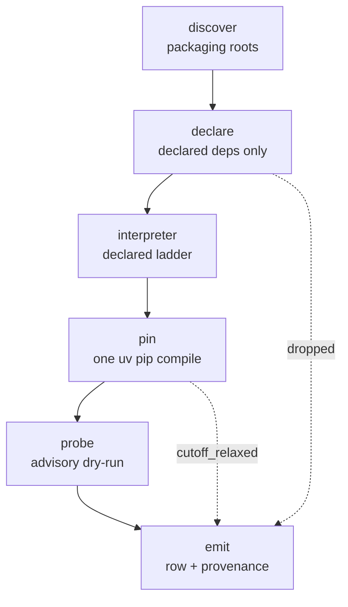

# Stage 4 (resolve_packages) — resolution redesign

Date: 2026-08-23
Branch: `spec/stage4-redesign`
Status: design approved, pending implementation plan

## 1. Why

Stage 4 resolves Python dependencies for every classified performance commit. It
was written under deadline. An audit on 2026-08-23 profiled all 13,016 rows of
`packages` and re-ran the resolver on 13 January-2026 commits, one per repository.
The audit found 13 defects. Five are fatal to corpus yield or to correctness, and
fall into the four groups below.

Full evidence: `/mnt/sdd1/atharvas/formulacode/stage4-audit-2026-08-23/`
(report, 13 raw artifacts, repro script).

### Corpus state

| Metric | Value |
|---|---|
| rows in `packages` | 13,016 |
| `can_install = false` | 3,245 (24.9%) |
| never compiled — `unresolved(pass-through)` | 2,903 (22.3%) |
| zero version pins (floating environment) | 1,603 (12.3%) |
| pass-through **yet** `can_install = true` | 462 |
| perf PRs blocked from any container by the gate | 3,217 |
| repos whose commits disagree on `python_version` | 129 of 147 (88%) |
| rows whose `primary_root` is ignored at build time | 733 |

Of 13 freshly resolved commits, 3 failed: numpy, scipy and apache/arrow — the most
benchmark-valuable repositories in the corpus.

### The groups that drive this redesign

**B1 — a regex corrupts every standard PEP 508 marker.** `fix_marker_spacing`
substitutes `or` and `and` unanchored. `or` occurs inside `platform`; `and` occurs
inside `standard`. Verified:

```
"numpy; platform_system=='Windows'" -> "numpy; platf or m_system=='Windows'"
"bar;   sys_platform=='linux'"      -> "bar; sys_platf or m=='linux'"
"qux;   extra=='standard'"          -> "qux; extra=='st and ard'"
```

uv's own error on apache/arrow: `Expected a quoted string or a valid marker name,
found 'sys.platf'`. One malformed string aborts the whole compile **and** the whole
dry-run — there is no per-requirement isolation. The damage is invisible in stored
rows (compile output carries no markers) and shows up only as silently excluded
repositories.

**B2 — the self-healing blocklist is one global, append-only file** read at filter
time (`package_filters.py:256`). 268 entries shared by every repository and every
commit: numpy's own submodules (`arraypad`, `multiarray`, `umath`, `mtrand`), stdlib
(`tomllib`, `annotationlib`), real installable projects (`black`, `codecov`, `rdkit`,
`umap`), conda names (`blas`, `openblas`, `qhull`) and bare tokens (`setup`, `basic`,
`compute`). Resolving repository A changes repository B's answer.

**B7/B8 — the interpreter is an accident, and nothing is reproducible.**
`orchestrator.py:603-607` assigns `python_version` unconditionally before checking
success; candidates are tried newest-first and the loop breaks on the first non-ABI
error. The result is "the newest interpreter that did not crash". `requires-python`
is parsed and discarded. Re-running the same 13 SHAs kept the dependency sets
(jaccard 1.00 on 10 of 13) but changed `python_version` on 7 of 13.

**B13 — per-commit interpreter, per-repo image.** `get_repo_image_name(owner, repo)`
returns `:latest` with no interpreter in the tag (`images.py:40-44`), while
`build_repo_image` bakes `PY_VERSION` in (`images.py:98-99`) and
`_ensure_prerequisite_images` builds only when the tag is absent. One image per
repository is therefore built from whichever commit ran first, and 88% of
repositories then run an interpreter that does not match the one their `env_payload`
was pinned against.

The remaining defects (B3–B6, B9–B12) are catalogued in the audit report.

## 2. Contract

`env_payload` is a **seed for an environment in which the repository builds and asv
runs**. It is not a record of the environment as it existed at commit time. The
commit-date cutoff stays, as a preference that cheaply yields era-appropriate
versions — never as a rule that can fail a commit.

**Stage 4 gates nothing.** Stage 6 is the sole arbiter of buildability, because it is
the only stage that builds in the real container and iterates on failure. Its agent
can already replace the seed through `env_payload_override.json`
(`sandbox.py:62`, `synthesizer.py:726-727`).

Stage 4 emits five things: the interpreter, a pinned seed, an advisory probe result,
provenance, and an explicit record of everything it dropped and why.

Two accepted consequences, stated rather than discovered:

- **The seed may legitimately be empty.** Where a repository declares no
  dependencies, stage 4 emits `[]` and says so. Today it fabricates a list by
  inferring PyPI names from import names, which is where `arraypad`, `umath`,
  `version` and `plex` come from. An honest empty seed beats a confident wrong one.
- **Removing the gate lands cost in two stages.** `can_install` is read at
  `pipeline.py:627` (stage 5, LLM problem rendering) and `synthesize_images.py:273`
  (stage 6). Unblocking 3,217 PRs means paying for LLM rendering on all of them, so
  `probe_status` becomes the **queue ordering key**: everything is eligible,
  confidently-installable seeds run first, and `--tasks-per-repo` caps a run.

## 3. Unit of work

Stage 4 keeps its per-commit unit. B13 is fixed where it belongs, in `images.py`.

`get_repo_image_name(owner, repo, py_version)` produces `owner-repo:py3.11`. All six
call sites go through that one helper, including stage 8's publish path; nothing
hardcodes `:latest` elsewhere. This is a contained naming change plus a cache key.

Making the interpreter a per-repository decision instead would accept the broken
naming as a constraint. It also has no defensible answer for a corpus spanning
2019–2026 commits of the same repository — scipy rows sit at 3.8, napari at 3.12.
One image per `(repository, interpreter)` does.

Two signals that are computed and then dropped get reconnected:

- **`primary_root`** — `Dockerfile.repo` hardcodes `WORKDIR /workspace/repo`, so
  apache/arrow's `python/` subdirectory is discovered correctly and ignored. 733 rows
  are affected, 385 of them arrow. Needs a `BUILD_ROOT` build arg.
- **`requires_python`** — parsed, then hardcoded to `None` at
  `resolve_packages.py:104`.

These are bugs, the opposite fix from the columns that really are write-only.

## 4. Architecture

Six units replace the 669-line orchestrator. Each has one purpose, a defined
interface, and is testable alone.



### 4.1 discover

Keeps `metadata_parser.discover_candidates` / `select_primary_candidate`. Fixes an
instability the audit exposed: scipp resolved to `python`, `binder` and `scippy` on
different commits, and `binder` is a Binder configuration directory, not a package.
Adds a deterministic tie-break and records the reason for the choice.

### 4.2 declare

Reads **declared** dependencies only:

- pyproject `[project].dependencies` and `[project.optional-dependencies]`
- setup.cfg `install_requires` and `options.extras_require`
- static setup.py parse (existing)
- `[build-system].requires`
- ASV `matrix.req` — a genuine statement of what the benchmarks need

It does **not** read `requirements*.txt` globs, does **not** infer names from
imports, and does **not** read `environment.yml`. This removes B3 and B4 at source:
no `sphinx`, `conda-build`, `torch`, `cupy` or `plex` in a runtime environment, and
no `boost-cpp` or `libprotobuf` from conda files.

Every string is parsed with `packaging.requirements.Requirement`. A string that does
not parse is dropped and recorded — never rewritten. This is B1's real lesson:
**per-requirement isolation**. One bad string must never abort the batch.

### 4.3 interpreter

A declared ladder, evaluated per commit. Take the newest version that satisfies the
declaration and existed at commit date. Measured coverage over 155 cached repos:

| Rung | Source | Coverage |
|---|---|---|
| 1 | `requires-python` / `python_requires` | 84% |
| 2 | trove classifiers `Programming Language :: Python :: 3.x` | cumulative 91% |
| 3 | `asv.conf.json` `pythons` | cumulative 99% |
| 4 | newest release <= commit date | 1% (NVIDIA/physicsnemo) |

The rung that fired is stored in `interpreter_source`. This replaces control-flow
accident with a decision that can be explained and reproduced.

### 4.4 pin

One `uv pip compile` over exactly two things: the project's declared runtime
dependencies and its `[build-system].requires`. **Benchmark tooling is deliberately
excluded.**

That exclusion closes B6, and in the opposite direction from the obvious reading.
The two current paths disagree — the fallback path injects `pytest`, `setuptools`
and `hypothesis` into `env_payload`, and the pyproject path returns before reaching
it — but the base image **already installs** that tooling: `hypothesis<5`, `pytest`
and `versioneer` at `docker_build_base.sh:769`, `asv` at `:771`, and
`pip setuptools wheel` at `docker_build_env.sh:262`.

So the harm is not that h5py's `numpy==2.4.1` seed lacks a test runner — the
container has one. The harm is that `env_payload` and the base image both claim
ownership of the same packages, and can pin them differently: an unconstrained
`hypothesis` in `env_payload` fights the base image's deliberate `hypothesis<5`.
The base image is the single owner of tooling; the seed carries project
dependencies only, and both paths then mean the same thing.

**One caveat this design accepts.** The base image owns tooling *when its install
succeeds*, and nothing currently checks that it did. Both branches of
`docker_build_base.sh:769-777` install `hypothesis`, `pytest` and `versioneer` with
`>/dev/null 2>&1 || true` — best-effort, output discarded, failure swallowed. Only
the `asv` install can fail the build.

Making the seed a second, redundant source of tooling is not the fix for that; a
build-manifest invariant asserting the tooling is importable is, and the manifest
machinery for exactly this already exists (`docker/manifest.py`). Recorded here so
the plan does not quietly re-add tooling to the seed to compensate.

`--exclude-newer` at commit date first. On failure, retry without it and record
`cutoff_relaxed`. **No `--all-extras`** (B5: PostHog 412 packages, napari 291).

Dropping `--all-extras` is the one change that can silently degrade the seed: if a
benchmark imports an optional dependency, the install still succeeds and only stage
6 or 7 discovers the gap, expensively. `formulacode_task_overrides.pip_pins` — which
already exists — becomes the per-repository extras declaration, so the reduction is
not a one-way bet.

### 4.5 probe

The advisory signal. A dry-run install against **the same interpreter the container
will run**, which is only well-defined once §3's tag fix lands. Records status and
log. It never gates.

The host-side `uv_install_real` is deleted: it proves nothing about the container
(different interpreter, different base image, no compilers) and dominates runtime.

### 4.6 emit

One row per `(owner, repo, sha)`, carrying provenance.

## 5. Deletions

| Module / function | Lines | Reason |
|---|---|---|
| `blocklist.py` | 145 | Global mutable state; order-dependent results (B2) |
| `import_analyzer.py` | 66 | Invents PyPI names from import names (B3) |
| `fix_marker_spacing` | — | Replaced by `packaging.requirements.Requirement` (B1) |
| host-side `uv_install_real` | — | Proves nothing about the container |
| dual-path branch in `orchestrator.py` | ~250 | Two paths, different semantics (B6) |
| requirements-glob + env-yaml harvest | ~150 | B4 |

The table deletes roughly 760 lines outright. Rewriting `orchestrator.py` as the six
units in §4 removes roughly 400 more, and `constants.py` loses the hand-maintained
allow/deny name sets that only `import_analyzer` needed. `git_utils.py` (378),
`metadata_parser.py` (412), `cache.py` (120), `python_manager.py` (114) and
`models.py` (41) are largely retained.

Estimate: the `resolution/` package goes from 2,838 lines to roughly 1,500 — a
reduction of about 45%. This is an estimate, not a target; the plan should not trade
clarity to hit it.

## 6. Schema

**Added**

| Column | Type | Purpose |
|---|---|---|
| `dropped_requirements` | JSONB | `[{req, reason}]` — makes failure diagnosable without a re-run, replacing the `dry_run_log` that is currently computed and discarded |
| `probe_status` | text | advisory, and the stage 5 queue ordering key. Ordered best-first: `installable` (compiled and dry-ran clean), `unresolved` (compile relaxed or partial, dry-run clean), `failed` (dry-run failed), `empty` (nothing declared). No value excludes a PR — it only decides who runs first |
| `probe_log` | text | dry-run output |
| `interpreter_source` | text | which ladder rung fired |
| `cutoff_used` | timestamptz | the date actually applied; null when relaxed |
| `resolver_version` | text | provenance |
| `uv_version` | text | provenance |
| `resolved_at` | timestamptz | provenance |

**Fixed** — `requires_python` stores the parsed value instead of `None`.
`primary_root` becomes load-bearing through `BUILD_ROOT`.

**Retired** — `can_install` stays for compatibility but stops being read.
`build_commands`, `install_commands` and `resolution_strategy` are dropped,
superseded by the explicit columns above.

Migration numbering: check other branches before claiming a number (the sequence has
gaps at 00018 and 00024). Grant nothing to `anon`.

**Existing rows.** All 13,016 came from the defective resolver and carry no
provenance. Stamp them `resolver_version = 'legacy'` rather than deleting, and
re-resolve lazily.

## 7. Testing

- **Golden artifacts.** The 13 audited commits become checked-in fixtures asserting
  exact output. They span pure-Python, C-extension, monorepo, extras-heavy and
  previously-failing shapes.
- **One regression test per fatal bug.**
  - B1: a requirement carrying `platform_system`, `sys_platform`, `platform_machine`
    and `extra` survives unchanged; an unparseable requirement is dropped and
    recorded while its siblings still resolve.
  - B2: resolve repository A, then B; assert B's output is byte-identical whether or
    not A failed first. No file outside the row is written.
  - B6: no seed contains `pytest`, `asv`, `hypothesis`, `setuptools`, `wheel` or
    `pip` — the base image owns those. Both former paths produce the same seed for
    the same input.
  - B7/B8: the same commit resolved twice, in different orders, produces identical
    output; `interpreter_source` is populated.
  - B13: two commits of one repository declaring different interpreters produce two
    distinct image tags; arrow's `primary_root` reaches `BUILD_ROOT`.
- **Determinism property test** over the fixture set.
- Everything runs under `make check` and `pytest -m "not slow"`.

## 8. Out of scope

- Stage 3 classification, which has not run for April–August 2026 (8,799 PRs
  unclassified). That is why the audit used January 2026.
- Stage 6's synthesis agent and its retry policy.
- Whether the 3,217 newly-unblocked PRs actually build. That is stage 6's answer to
  give, and the point of removing the gate is that it has never been asked.
- **The base image's own unpinned tooling.** Noted here so this spec is not read as
  claiming tooling is handled. On Python >= 3.9 the base image installs asv from
  `git+https://github.com/airspeed-velocity/asv` — **git HEAD, whatever `main` holds
  the day the image is built** (`docker_build_base.sh:776`); on Python < 3.9 it takes
  `--upgrade asv`, the latest release. The conda toolchain (`cython`, `meson-python`,
  `cmake`, `ninja`, `compilers`) is unpinned too.

  This is B8's defect one layer down, and it bites harder: asv is the measurement
  instrument, so two base-image builds can measure the same commit with different
  tooling. Pinning it needs its own change, and probably its own spec, because
  rebuilding the base image invalidates every derived image.
